# UI Analyzer

UI Analyzer is an Electron-based client designed to quickly selecting UI elements and build the corresponding selectors (formatted as several specific dictionary) required for RPA operations.

It needs LiberRPA Local Server to function properly.

> **Note:** The GUI shown here may differ slightly from the newest version.

# Change Log

Since LiberRPA has components across different platforms, all changes will be recorded in [the unified document](https://github.com/HUHARED/LiberRPA/blob/main/docs/CHANGELOG.md).

# Indicate UIA Element

Indicate an element that supports [UI Automation](https://learn.microsoft.com/en-us/dotnet/framework/ui-automation/ui-automation-overview), genereate a [SelectorUia](#selectoruia).

Simply single-click `MouseLeft` to select the target element.

Press `ESC` to exit the indicating.

> It works for many situations, but for HTML elements, [Indicate HTML Element](#indicate-html-element) may better.

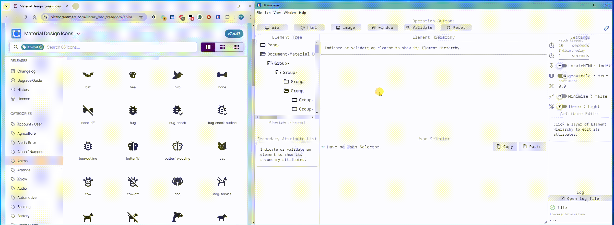

Adjust **Indicate delay** to allow time for you to bring the target window into view.

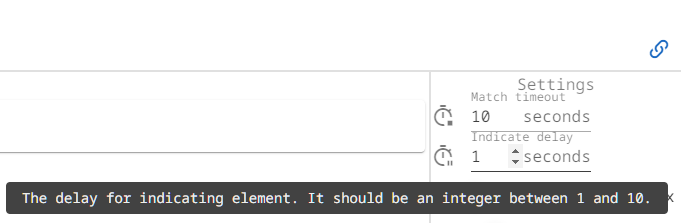

If you want, enable **Minimize** option to make UI Analyzer minimize itself before each indicating operation, and it will restore once a indicating operation completed or exited.

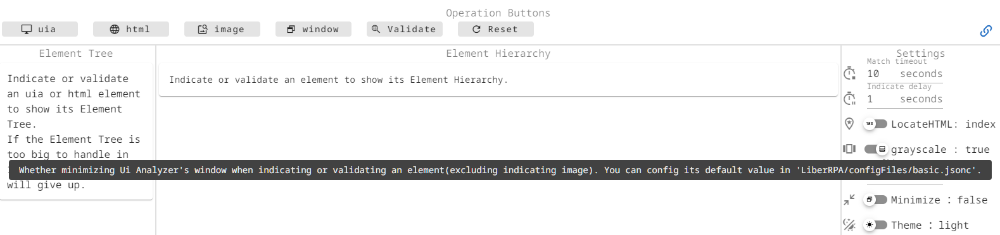

# Indicate HTML Element

Indicate an element in a usual webpage.

If the element is not in viewport, LiberRPA will attempt to scroll it into view.

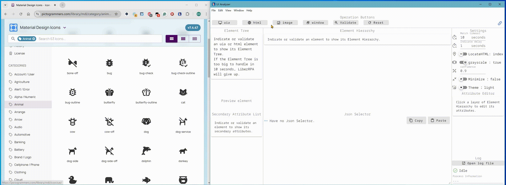

HTML element can be located by **index**(**documentIndex** and **childIndex**, start from 0 and 0 will be ignored) or **path**([CSS selector](https://developer.mozilla.org/docs/Web/CSS/CSS_selectors) with the [:nth-child()](https://developer.mozilla.org/docs/Web/CSS/:nth-child)) if other attributes are not enough.
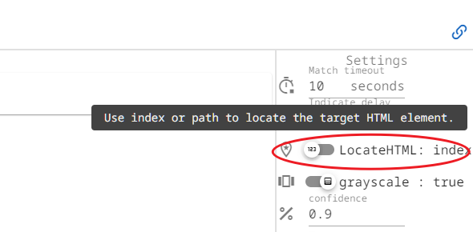

**documentIndex:** The target element's position among all elements on the page having the same primary attributes.

**childIndex:** The target element's position among the children of its parent that having the same primary attributes.

# Indicate Image Element

Indicate an element by image—useful when both UIA and HTML selectors fail.

To select an image, drag and drop it while holding `Ctrl` and clicking the left mouse button.

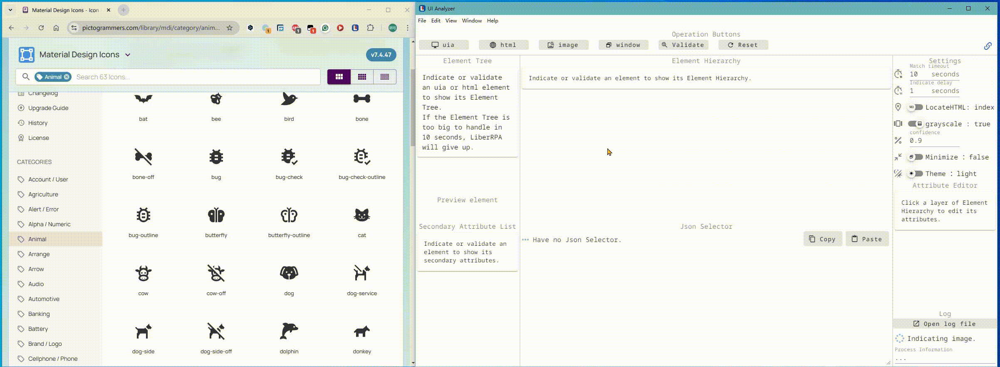

You can configure the default confidence level for image matching and choose between grayscale or colorscale modes.

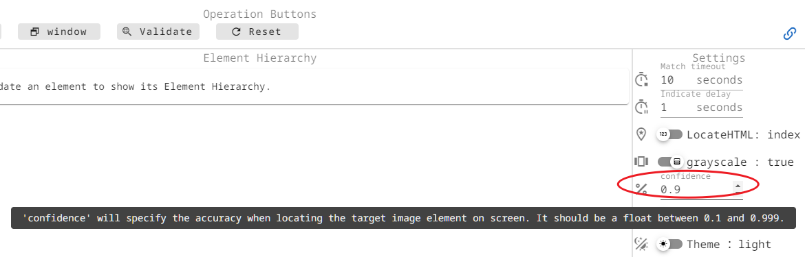

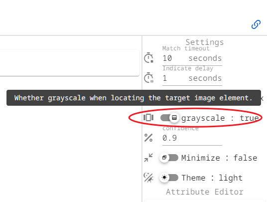

# Indicate Window Element

Indicate a window element.

Note that All selector (UIA, HTML, Image) must have a window section—UI Analyzer adds it automatically.

LiberRPA will try to locate the "window" then search the "specification" section.


# Modify Selector

Adjust a selector by click a layer in **Element Hierarchy**.

Then, check or uncheck attributes in **Attribute Editor**.

Use regular expressions (regex) to make the selector more suitable when the attribute may different.

The changement will update **JSON Selector**.

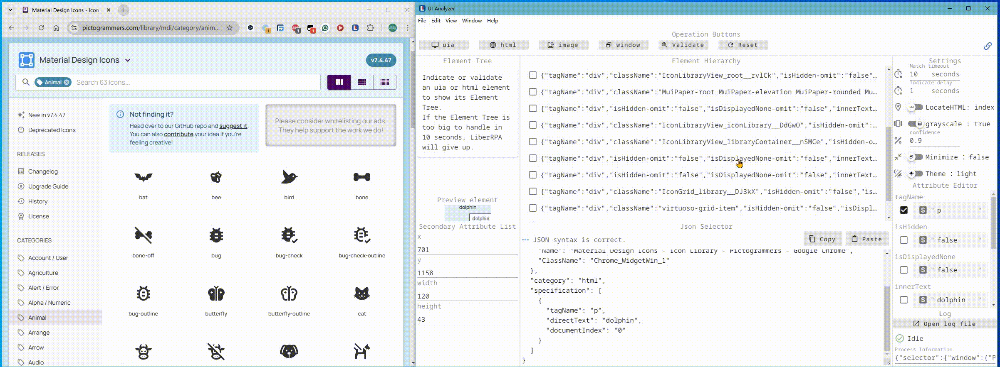

Alternatively, you can directly edit them in **JSON Selector**—note that it will not update **Attribute Editor**.

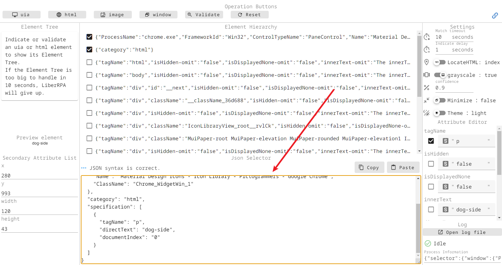

# Validate Element

Test whether the element can be located by the current data in **JSON Selector**.

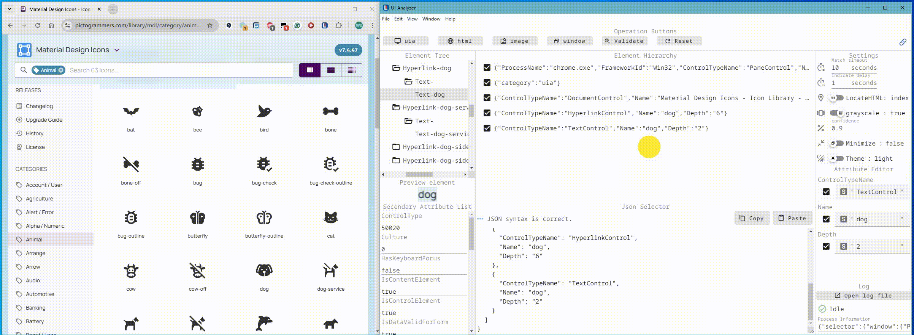

Set **Match timeout** to specify how long the validation should attempt to find a match.

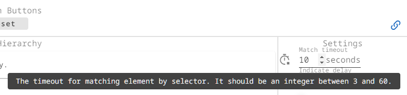

# Element Tree

You can utilize the element tree structure to view and locate all elements within a window.

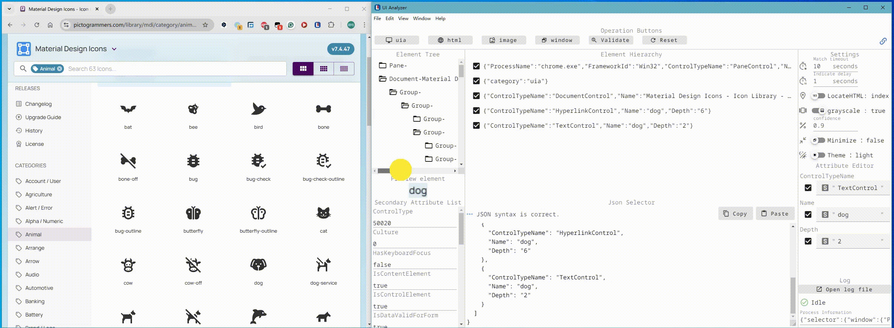

# Resize

Adjust the width of the left and right panels by dragging the dividers.

The overall window size of UI Analyzer can also be modified.


# Reset

Reset the current selector data to the default states.

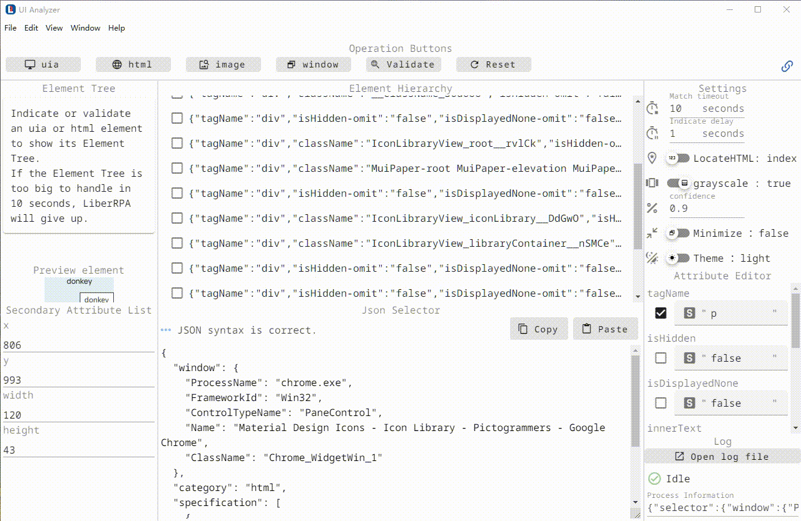

# Check Status

View UI Analyzer's status in **Status** area.

> **Note:** It called **Log** before, and the button "Open log file" has been removed.

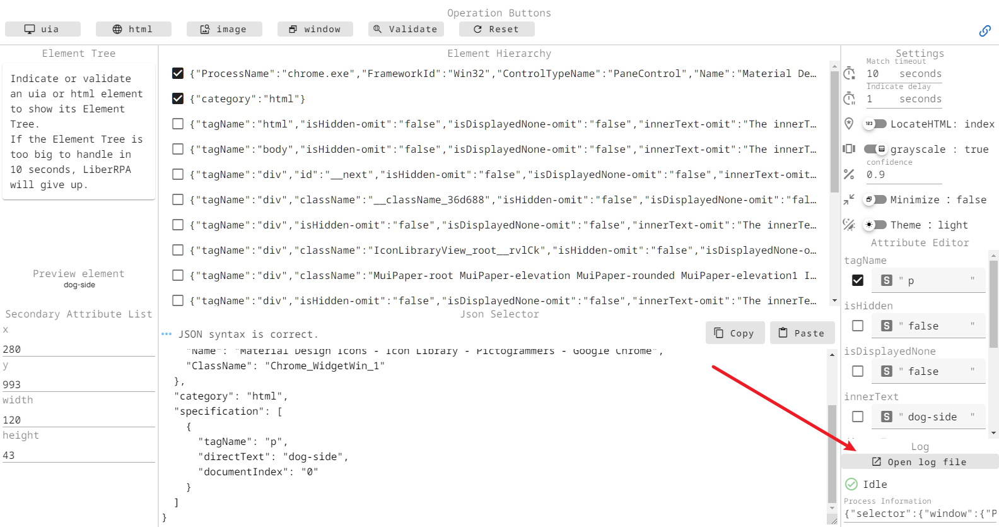

# Secondary Attribute List

It displays attributes that are not used in selectors.
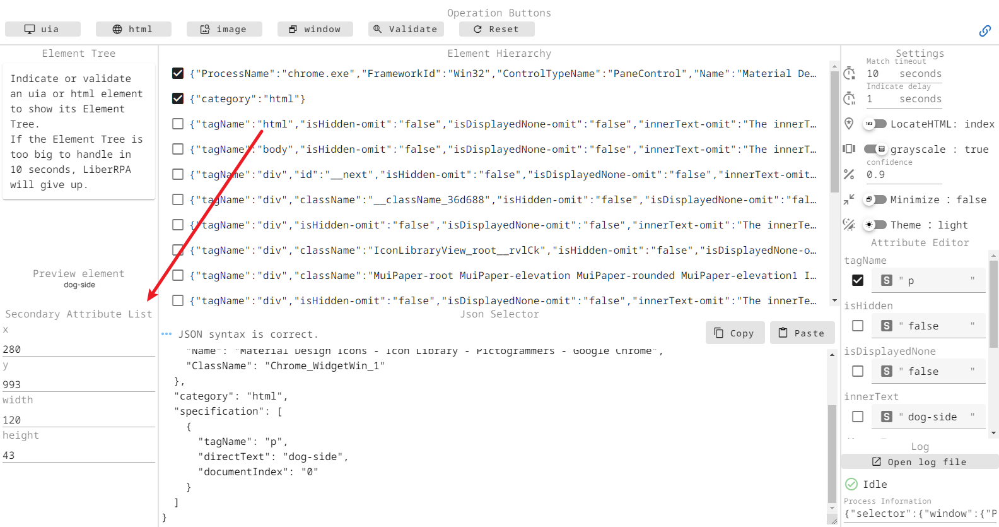

# Theme

Customize the **Theme** settings to suit your preferences.

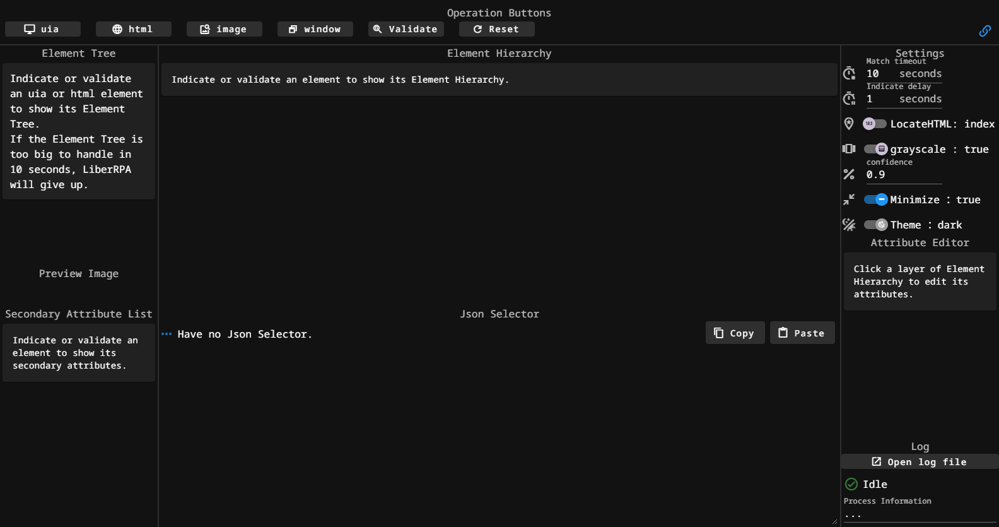

# Selector

> **Note:** The **Definitions** provided here are simplified explanations and do not represent the actual, complete format.

## SelectorUia

It will search the "window" value first, then sequentially search through each layer in the "specification."

Definition:

```json
{
  "window": {
    "ControlTypeName": str,
    "Name": NotRequired[str],
    "Name-regex": NotRequired[str],
    "AcceleratorKey": NotRequired[str],
    "AcceleratorKey-regex": NotRequired[str],
    "AccessKey": NotRequired[str],
    "AccessKey-regex": NotRequired[str],
    "AriaProperties": NotRequired[str],
    "AriaProperties-regex": NotRequired[str],
    "AriaRole": NotRequired[str],
    "AriaRole-regex": NotRequired[str],
    "ClassName": NotRequired[str],
    "HelpText": NotRequired[str],
    "HelpText-regex": NotRequired[str],
    "Depth": NotRequired[str],
    "Index": NotRequired[str],
    "Index-regex": NotRequired[str],
    "FrameworkId": NotRequired[str],
    "FrameworkId-regex": NotRequired[str],
    "ProcessName": NotRequired[str],
    "ProcessName-regex": NotRequired[str]"
  },
  "category": 'uia',
  "specification": list[
    {
      "ControlTypeName": str,
      "Name": NotRequired[str],
      "Name-regex": NotRequired[str],
      "AcceleratorKey": NotRequired[str],
      "AcceleratorKey-regex": NotRequired[str],
      "AccessKey": NotRequired[str],
      "AccessKey-regex": NotRequired[str],
      "AriaProperties": NotRequired[str],
      "AriaProperties-regex": NotRequired[str],
      "AriaRole": NotRequired[str],
      "AriaRole-regex": NotRequired[str],
      "ClassName": NotRequired[str],
      "HelpText": NotRequired[str],
      "HelpText-regex": NotRequired[str],
      "Depth": NotRequired[str],
      "Index": NotRequired[str],
      "Index-regex": NotRequired[str]
    }
  ]
}
```

Example:

```json
{
  "window": {
    "ProcessName": "chrome.exe",
    "FrameworkId": "Win32",
    "ControlTypeName": "PaneControl",
    "Name": "Material Design Icons - Icon Library - Pictogrammers - Google Chrome",
    "ClassName": "Chrome_WidgetWin_1"
  },
  "category": "uia",
  "specification": [
    {
      "ControlTypeName": "ToolBarControl",
      "Name": "Bookmarks",
      "Depth": "5"
    },
    {
      "ControlTypeName": "ButtonControl",
      "Name": "chat"
    }
  ]
}
```

## SelectorHtml

It will search the "window" value first, then sequentially search through each layer in the "specification."

Definition:

```json
{
  "window": {
    "ControlTypeName": str,
    "Name": NotRequired[str],
    "Name-regex": NotRequired[str],
    "AcceleratorKey": NotRequired[str],
    "AcceleratorKey-regex": NotRequired[str],
    "AccessKey": NotRequired[str],
    "AccessKey-regex": NotRequired[str],
    "AriaProperties": NotRequired[str],
    "AriaProperties-regex": NotRequired[str],
    "AriaRole": NotRequired[str],
    "AriaRole-regex": NotRequired[str],
    "ClassName": NotRequired[str],
    "HelpText": NotRequired[str],
    "HelpText-regex": NotRequired[str],
    "Depth": NotRequired[str],
    "Index": NotRequired[str],
    "Index-regex": NotRequired[str],
    "FrameworkId": NotRequired[str],
    "FrameworkId-regex": NotRequired[str],
    "ProcessName": NotRequired[str],
    "ProcessName-regex": NotRequired[str]"
  },
  "category": 'html',
  "specification": list[
    {
      "tagName": NotRequired[str],
      "tagName-regex": NotRequired[str],
      "id": NotRequired[str],
      "id-regex": NotRequired[str],
      "className": NotRequired[str],
      "className-regex": NotRequired[str],
      "type": NotRequired[str],
      "type-regex": NotRequired[str],
      "value": NotRequired[str],
      "value-regex": NotRequired[str],
      "name": NotRequired[str],
      "name-regex": NotRequired[str],
      "aria-label": NotRequired[str],
      "aria-label-regex": NotRequired[str],
      "aria-labelledby": NotRequired[str],
      "aria-labelledby-regex": NotRequired[str],
      "checked": NotRequired[Literal["true", "indeterminate", "false"]],
      "checked-regex": NotRequired[str],
      "disabled": NotRequired[Literal["true", "false"]],
      "disabled-regex": NotRequired[str],
      "href": NotRequired[str],
      "href-regex": NotRequired[str],
      "src": NotRequired[str],
      "src-regex": NotRequired[str],
      "alt": NotRequired[str],
      "alt-regex": NotRequired[str],
      "isHidden": NotRequired[Literal["true", "false"]],
      "isHidden-regex": NotRequired[str],
      "isDisplayedNone": NotRequired[Literal["true", "false"]],
      "isDisplayedNone-regex": NotRequired[str],
      "innerText": NotRequired[str],
      "innerText-regex": NotRequired[str],
      "directText": NotRequired[str],
      "directText-regex": NotRequired[str],
      "parentId": NotRequired[str],
      "parentId-regex": NotRequired[str],
      "parentClass": NotRequired[str],
      "parentClass-regex": NotRequired[str],
      "parentName": NotRequired[str],
      "parentName-regex": NotRequired[str],
      "isLeaf": NotRequired[Literal["true", "false"]],
      "isLeaf-regex": NotRequired[str],
      "tableRowIndex": NotRequired[str],
      "tableRowIndex-regex": NotRequired[str],
      "tableColumnIndex": NotRequired[str],
      "tableColumnIndex-regex": NotRequired[str],
      "tableColumnName": NotRequired[str],
      "tableColumnName-regex": NotRequired[str],
      "childIndex": NotRequired[str],
      "childIndex-regex": NotRequired[str],
      "documentIndex": NotRequired[str],
      "documentIndex-regex": NotRequired[str],
      "path": NotRequired[str],
      "path-regex": NotRequired[str]
    },
  ]
}
```

Example:

```json
{
  "window": {
    "ProcessName": "chrome.exe",
    "FrameworkId": "Win32",
    "ControlTypeName": "PaneControl",
    "Name": "Material Design Icons - Icon Library - Pictogrammers - Google Chrome",
    "ClassName": "Chrome_WidgetWin_1"
  },
  "category": "html",
  "specification": [
    {
      "tagName": "p",
      "directText": "dolphin",
      "documentIndex": "0"
    }
  ]
}
```

## SelectorImage

It will search the "window" value first, then search **the only one layer** in "specification".

Definition:

```json
{
  "window": {
    "ControlTypeName": str,
    "Name": NotRequired[str],
    "Name-regex": NotRequired[str],
    "AcceleratorKey": NotRequired[str],
    "AcceleratorKey-regex": NotRequired[str],
    "AccessKey": NotRequired[str],
    "AccessKey-regex": NotRequired[str],
    "AriaProperties": NotRequired[str],
    "AriaProperties-regex": NotRequired[str],
    "AriaRole": NotRequired[str],
    "AriaRole-regex": NotRequired[str],
    "ClassName": NotRequired[str],
    "HelpText": NotRequired[str],
    "HelpText-regex": NotRequired[str],
    "Depth": NotRequired[str],
    "Index": NotRequired[str],
    "Index-regex": NotRequired[str],
    "FrameworkId": NotRequired[str],
    "FrameworkId-regex": NotRequired[str],
    "ProcessName": NotRequired[str],
    "ProcessName-regex": NotRequired[str]"
  },
  "category": 'image',
  "specification": list[
    {
      'FileName': str,
      'Grayscale': str,
      'Confidence': str',
      'Index': NotRequired[str]
    }
  ]
}
```

Example:

```json
{
  "window": {
    "ProcessName": "chrome.exe",
    "FrameworkId": "Win32",
    "ControlTypeName": "PaneControl",
    "Name": "Material Design Icons - Icon Library - Pictogrammers - Google Chrome",
    "ClassName": "Chrome_WidgetWin_1"
  },
  "category": "image",
  "specification": [
    {
      "FileName": "Material Design Icons - Icon Library - Pictogrammers_20250222_144024.png",
      "Grayscale": "true",
      "Confidence": "0.9"
    }
  ]
}
```

## SelectorWindow

It will search the "window" value, **have no other sections**.

Definition:

```json
{
  "window": {
    "ControlTypeName": str,
    "Name": NotRequired[str],
    "Name-regex": NotRequired[str],
    "AcceleratorKey": NotRequired[str],
    "AcceleratorKey-regex": NotRequired[str],
    "AccessKey": NotRequired[str],
    "AccessKey-regex": NotRequired[str],
    "AriaProperties": NotRequired[str],
    "AriaProperties-regex": NotRequired[str],
    "AriaRole": NotRequired[str],
    "AriaRole-regex": NotRequired[str],
    "ClassName": NotRequired[str],
    "HelpText": NotRequired[str],
    "HelpText-regex": NotRequired[str],
    "Depth": NotRequired[str],
    "Index": NotRequired[str],
    "Index-regex": NotRequired[str],
    "FrameworkId": NotRequired[str],
    "FrameworkId-regex": NotRequired[str],
    "ProcessName": NotRequired[str],
    "ProcessName-regex": NotRequired[str]"
  }
}
```

Example:

```json
{
  "window": {
    "ProcessName": "chrome.exe",
    "FrameworkId": "Win32",
    "ControlTypeName": "PaneControl",
    "Name": "Material Design Icons - Icon Library - Pictogrammers - Google Chrome",
    "ClassName": "Chrome_WidgetWin_1"
  }
}
```
