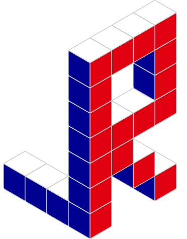

<div align="center">
  
</div>

# LiberRPA

LiberRPA is an RPA toolkit designed for practical, hands-on engineers.

# Features

* **Open Source**

  * LiberRPA is released under the AGPLv3 license—this means that developers are obligated to share the source code of any project built on LiberRPA with its users, even if the service is provided via the web.
* **Free**

  * LiberRPA is completely free for both personal and commercial use.
* **Comprehensive Functionality**

  * Comparable to popular commercial RPA software, LiberRPA will consist of three core components:
    * **Editor** (fully developed and available)

      * A desktop client for writing and running RPA projects.
      * Already includes most local features found in popular commercial RPA software.
      * It would add more features after Console completed.
    * **Executor** (fully developed and available)

      * A desktop client for scheduled execution of RPA projects.
      * It would add more features after Console completed.
    * **Console** (planned)

      * A web server for managing Executors, data assets, and more.
      * Supports internal network deployment without relying on public internet services.
* **Core Features Built on Python (3.12) and VS Code (1.95+)**

  * Leverage the ecosystems of Python and VS Code to extend functionality beyond LiberRPA's built-in features.
  * With a simple `Ctrl+MouseLeft` click, you can jump directly to the corresponding LiberRPA source code. If you encounter difficulties, besides contacting the developer, you can also send the source code to an AI for help.

  > Note: There are currently no plans to integrate popular AI-assisted programming features into LiberRPA.
  >
* **Code-Driven Approach Over Graphical Interfaces**

  * LiberRPA is not marketed as a low-code or no-code solution—it prioritizes a seamless coding experience for engineers.
  * LiberRPA will not for the sake of the limited convenience that a graphical interface might offer, to accept the consequence below:

    * Waste your time,
    * Reduce program efficiency,
    * Increase maintenance complexity.
  * LiberRPA acknowledges the benefits of graphical interfaces in some scenarios, so it offers features like a snippets tree,  UI analyzer, and flowchart to help engineers develop projects with less effort.
* **Security**

  * LiberRPA can run offline and does not actively collect any of your information.

    * Please note that because LiberRPA uses many open-source projects from conda-forge, PyPI, and npm, it cannot guarantee the security of these dependencies. For more details, please see [Dependencies and Acknowledgments](#dependencies-and-acknowledgments).
    * If, in the future, LiberRPA needs to collect your information (for example, if a free public Console service is launched), a detailed explanation of the scope and purpose will be provided, and your data will be handled with care.
  * In addition to the open-source code on GitHub, browser extensions and VS Code extensions will also be published on the official marketplaces for review.
  * Due to the requirements of the AGPLv3 license, you have the right to request the source code of any project implemented with LiberRPA—even if you access the service via the web.

# Limitations

* Only supports Windows 10+ (Windows Server 2016+) platforms.
* Many mouse and keyboard operations may only work properly if your computer's screen scale is set to 100%.
* Still in development and not yet extensively tested—stability and bugs will be optimized based on user feedback.

# Components

<div style="text-align: center;">
  
</div>

## Python Library

A conda library named "liberrpa" with the following purposes:

* Execute [Specific operations](./condaLibrary/liberrpa) for RPA projects.
* [Initialize](./condaLibrary/exe/InitLiberRPA) LiberRPA on computers that do not have it installed.
* Communicate with [the Chrome extension](./condaLibrary/exe/ChromeGetLocalServerPort) to pass WebSocket initialization information.
* Create [a local Flask server](./condaLibrary/exe/LiberRPALocalServer) to accomplish tasks that are difficult to achieve in a standalone Python project.

## LiberRPA Local Server

A Flask-based client that will start automatically on boot.

If you do not want it to start automatically, you can delete the file at this path: `C:/Users/<username>/AppData/Roaming/Microsoft/Windows/Start Menu/Programs/Startup/LiberRPALocalServer.exe - shortcut`

Since LiberRPA is still in development, you might encounter some instability. If that happens, you can locate its icon in the system tray, right-click to exit, and then reopen `LiberRPA/exeFiles/LiberRPALocalServer/LiberRPALocalServer.exe` to restart it.

> Note:
>
> You must run LiberRPA Local Server as administrator when It needs to interact with applications that are running with administrator privileges.

## LiberRPA Chrome Extension

A [Chrome extension](./browserExtensions/liberrpa-chrome-extension/README.md) that must be installed and enabled to perform operations on browsers and HTML elements.

## [UI Analyzer](./electronApplications/ui-analyzer/README.md)

An Electron-based client designed to quickly select elements and build the selectors (a specific dictionary format) required for RPA operations.

## VS Code(LiberRPA Editor)

LiberRPA [Editor](./Editor) is essentially a modified version of [the official portable VS Code](https://code.visualstudio.com/docs/editor/portable)—with altered default settings, added plugins, and custom resources. This means you can deploy LiberRPA on your familiar VS Code or modify the LiberRPA Editor according to your own preferences.

You can see [VS Code User Guide](./Editor/UserGuide.md) to learn how to use LiberRPA Editor.

## [LiberRPA Flowchart](./vscodeExtensions/liberrpa-flowchart/README.md)

A VS Code extension used to manage the overall flow of RPA project, including project arguments and settings.

## [LiberRPA Project Manager](./vscodeExtensions/liberrpa-project-manager/README.md)

A VS Code extension for creating new RPA projects.

It offers multiple templates to choose from, and you can customize the templates to suit your needs.

It also could package the project to a `rpa.zip` file, then import it in Executor

## [LiberRPA Snippets Tree](./vscodeExtensions/liberrpa-snippets-tree/README.md)

A VS Code extension that displays built-in and user-defined code snippets. You can add [code snippets](https://code.visualstudio.com/docs/editor/userdefinedsnippets) to your Python files in the editor using these methods:

* Click on an item in the LiberRPA Snippets Tree with your mouse.
* Drag an item from the LiberRPA Snippets Tree with your mouse.
* Type the corresponding code snippet prefix in the editor.

## [Executor](./electronApplications/executor/README.md)

An Electron-based client designed to import and run packages that generated by LiberRPA Project Manager.

# Getting Started

## Download Compressed Package

If you're unfamiliar with creating conda environments and setting up VS Code,  it's recommended that download the latest version of the main program's compressed package from [this page](https://1drv.ms/f/c/255c282c1c484a30/QjBKSBwsKFwggCW5SRQAAAAAbPY2_oNz1XhPGg). After downloading, extract it to your target folder. The final name of the LiberRPA root directory should be `LiberRPA_vX.X.X.7z`.

## Initialization

Extract the files to your target folder, then execute the `InitLiberRPA.exe` in the root directory to complete the initialization setup.

The LiberRPA Editor only creates data in the following locations (the file paths created by dependencies are not guaranteed):

* **LiberRPA root folder**

  * You can move it to different directories or computers as needed. Simply follow the [Initialization](#initialization) steps again, and your current VS Code settings will be preserved.
* **`C:/Users/<username>/Documents/LiberRPA`**

  * Stores logs, screenshots, custom code snippets, and more.
* **`C:/Users/<username>/AppData/Roaming/Microsoft/Windows/Start Menu/Programs/Startup/`**

  * Contains the shortcuts for automatically starting LiberRPA Local Server(`LiberRPALocalServer.exe - shortcut`) and LiberRPA Executor(`Executor.exe - shortcut` ).
* **`C:/Users/<username>/Desktop`**

  * Contains the shortcuts of LiberRPA Tools (Editor, Local Server, Executoer, UI Analyzer).
* **Regedit** :

  * `HKEY_CURRENT_USER\SOFTWARE\Google\Chrome\NativeMessagingHosts\com.liberrpa.chrome.msghost`
  * Used for Chrome extension initialization.

> Note: Related to uninstallation, currently, there is no uninstaller for LiberRPA. If you wish to uninstall it, you can simply clean the data from the 5 locations mentioned above.

> Note: Related to copy, if you want copy an existing LiberRPA folder to another computer(so you can use the same settings of Editor and Executor, etc.), you should run `InitLiberRPA.exe` on the new computer to ensure the essential config is complete.

## Install Chrome Extension

The LiberRPA Chrome Extension has uploaded to Chrome Web Store, and you can [install it](https://chromewebstore.google.com/detail/liberrpa-chrome-extension/cffobgimbemkfgjmcedebofkfcamnajb) on your existing Chrome.

## Create Project

You can open `LiberRPA/Editor/Code.exe`, press the shortcut `Ctrl+Shift+P` to open the Command Palette, and run `LiberRPA:Create a New Project` to create a new RPA project.

For more details, check [LiberRPA Project Manager](./vscodeExtensions/liberrpa-project-manager/README.md).

## Configuration

You can modify some config of LiberRPA in `LiberRPA/configFiles/basic.jsonc`.

```json
// FileName: basic.jsonc
{
  /* 
  Predefined variables:
        ${LiberRPA}: The value of "LiberRPA" in your computer's User Environment Variables. Since LiberRPA has a portability mechanism, so you should run the "InitLiberRPA.exe" in the LiberRPA root folder. It will add a "LiberRPA" variable in your computer's User Environment Variables.
        ${UserName}: The name of the user currently logged into the system.
        ${HostName}: The computer's hostname.
        ${ToolName}: Don't delete it, it is a flag to control subfolder name in "OutputLog".
  
        */

  // The basic log path for LiberRPA tools.
  "outputLogPath": "C:\\Users\\${UserName}\\Documents\\LiberRPA\\OutputLog\\${ToolName}\\",

  // The port of LiberRPA Local Server.
  "localServerPort": 52000,

  // The default settings of UI Analyzer.
  "uiAnalyzerTheme": "light", // "light" or "dark"
  "uiAnalyzerMinimizeWindow": false
}

```

# Dependencies and Acknowledgments

LiberRPA relies on many open-source projects to deliver its functionality.

You can check them in the dependency files:

[Python](./condaLibrary/setup.py)

[LiberRPA Chrome Extension](./browserExtensions/liberrpa-chrome-extension/package.json)

[UI Analyzer](./electronApplications/ui-analyzer/package.json)

[LiberRPA Flowchart](./vscodeExtensions/liberrpa-flowchart/package.json)

[LiberRPA Project Manager](./vscodeExtensions/liberrpa-project-manager/package.json)

[LiberRPA Snippets Tree](./vscodeExtensions/liberrpa-snippets-tree/package.json)

[Executor](./electronApplications/executor/package.json)

# Get in Touch

[Issues](https://github.com/HUHARED/LiberRPA/issues)

[Discussions](https://github.com/HUHARED/LiberRPA/discussions)

[Telegram](https://t.me/+U6oCH5Vs6CcxOTg9)

Email：`mailwork.hu@gmail.com`

# Change Log

Since LiberRPA has components across different platforms, all changes will be recorded in [the unified document](./docs/CHANGELOG.md).

# License

This project is licensed under the GNU Affero General Public License v3.0 or later (AGPL-3.0-or-later).
Copyright (C) 2025 Jiyan Hu.
For more details, see the [LICENSE](./LICENSE) file.
