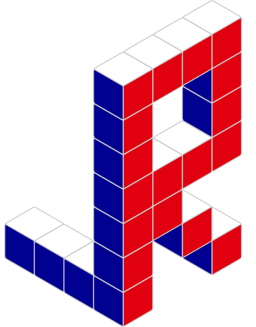
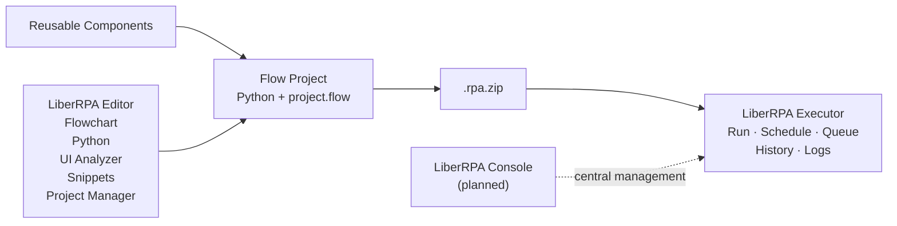

<div align="center">
  
</div>

# LiberRPA

**Open-source, code-first RPA toolchain for Windows, built for professional automation developers with Python, visual process design, reusable Components, and local execution.**

> **Production automation is software. Build it like software.**

LiberRPA combines the specialised tooling of an RPA platform with familiar software-engineering practices. It provides visual process orchestration, UI inspection, automation APIs, reusable Components, debugging, packaging, logging, scheduling, and execution while keeping detailed automation logic in Python.

**[Download](TODO_SOURCEFORGE_DOWNLOAD_URL) · [Getting Started](#getting-started) · [Documentation](#documentation) · [Community](#community--support)**

> **Current release: 0.3.0 — Alpha**
>
> LiberRPA is under active development and has not yet been validated across a large external production user base.

## Contents

* [Why LiberRPA](#why-liberrpa)
* [Who It Is For](#who-it-is-for)
* [How It Works](#how-it-works)
* [Key Capabilities](#key-capabilities)
* [Getting Started](#getting-started)
* [Comparison](#comparison)
* [Current Limitations](#current-limitations)
* [Roadmap](#roadmap)
* [Documentation](#documentation)
* [Community & Support](#community--support)
* [License & Dependencies](#license--dependencies)

---

## Why LiberRPA

RPA developers usually start from one of two directions.

Commercial RPA platforms provide useful specialised tooling, but often introduce product-specific workflow models, configuration layers, development environments, and licensing constraints.

Using individual automation libraries preserves normal programming freedom and can be ideal for small scripts. As requirements grow, however, developers often accumulate independently designed libraries for desktop UI automation, browsers, Excel, OCR, email, databases, and other tasks — each with its own APIs, abstractions, dependencies, and usage patterns.

LiberRPA combines the useful infrastructure of an RPA platform with a Python-based development model.

### Visualize the process. Code the logic.

Visual tools are useful when they make a complex process easier to understand.

LiberRPA uses its Flowchart for high-level process structure — major steps, branches, exception paths, and subprocesses — while detailed implementation remains Python.

> **The flowchart is a map, not the programming language.**

Developers can therefore use normal functions, modules, classes, exception handling, debugging, refactoring, and source-code tools without losing a visual overview of the automation.

### Integrated RPA tooling. Ordinary Python.

LiberRPA brings commonly needed RPA capabilities into one environment instead of requiring every project to assemble them independently.

Its development tools, automation APIs, selector model, Components, project packaging, logging, and execution workflow are designed to work together with relatively consistent conventions.

When LiberRPA's built-in APIs are not enough, the project is still Python. Developers can use compatible Python libraries or implement specialised logic directly.

### Version control should show your logic, not your editor.

Detailed automation logic is stored as normal Python source.

A small implementation change can therefore remain a small Git diff:

```diff
- timeout = 10
+ timeout = 20
```

The visual process is stored separately in `project.flow`. This keeps high-level process representation separate from detailed implementation logic and allows normal source-control tools to remain useful for code review and maintenance.

### AI-friendly by architecture

LiberRPA does not require a proprietary AI layer for AI-assisted development.

Its automation logic is Python, its source is open, and development takes place in VS Code. General-purpose coding assistants can therefore work directly with project code for tasks such as explanation, debugging, refactoring, testing, and documentation.

LiberRPA does not assume that AI removes the need for software-engineering knowledge. It simply avoids placing unnecessary proprietary abstractions between developers, their code, and the tools they choose to use.

---

## Who It Is For

### Automation developers

LiberRPA is primarily designed for professional RPA developers and software developers building automation.

It provides:

* Python-based implementation;
* visual high-level process design;
* standard VS Code editing and debugging;
* UI element inspection;
* reusable Components;
* discoverable Snippets;
* integrated automation APIs;
* Git-friendly source code.

### RPA delivery teams and consultancies

Small RPA teams often need to deliver many different client requirements with limited engineering capacity.

LiberRPA is designed to help such teams:

* reuse common automation logic across client projects;
* handle unusual requirements directly with Python when built-in APIs are insufficient;
* keep project structure and development practices more consistent across engineers;
* review, maintain, and hand over projects using ordinary source-code tools;
* use broadly available Python skills instead of depending entirely on expertise in one proprietary RPA platform;
* package projects for deployment into client environments;
* reduce RPA platform licensing costs.

### Organisations using automation

For organisations operating automation, LiberRPA provides:

* transparent project source code;
* locally controlled execution;
* easier technical review and handover;
* reduced dependence on proprietary workflow formats;
* access to the Python and general software-development ecosystem;
* no per-developer or per-robot LiberRPA license fee.

### Not a no-code product

LiberRPA is designed for developers and technically capable automation practitioners.

If the main requirement is for non-technical users to build automation entirely through a no-code interface, LiberRPA is not designed for that use case.

---

## How It Works

LiberRPA is organized around three main product areas:

* **Editor** — develop, debug, test, manage, and package RPA Projects.
* **Executor** — install versioned Project Packages, run them manually or on schedules, and inspect local execution history.
* **Console** — planned central management for multiple Executors and shared resources.


```mermaid
flowchart LR
    A["LiberRPA Editor<br/>Flowchart<br/>Python<br/>UI Analyzer<br/>Snippets<br/>Project Manager"]
    B["Flow Project<br/>Python + project.flow"]
    C["Reusable Components"]
    D[".rpa.zip"]
    E["LiberRPA Executor<br/>Run · Schedule · Queue<br/>History · Logs"]
    F["LiberRPA Console<br/>(planned)"]

    C --> B
    A --> B
    B --> D
    D --> E
    F -. central management .-> E
```

### Editor

LiberRPA Editor is based on portable VS Code. During initialization, LiberRPA attempts to install the selected Editor extensions from the Visual Studio Marketplace. Once installed, the extensions are stored inside the portable Editor data directory and normal Python development features such as IntelliSense, source navigation, breakpoints, variable inspection, refactoring, and Git integration can be used offline.

Its LiberRPA-specific tools include:

* [Flowchart](./vscodeExtensions/liberrpa-flowchart/README.md) — high-level process orchestration;
* [Project Manager](./vscodeExtensions/liberrpa-project-manager/README.md) — project creation, Components, dependencies, and packaging;
* [Snippets Tree](./vscodeExtensions/liberrpa-snippets-tree/README.md) — discover and insert automation APIs;
* [UI Analyzer](./electronApplications/ui-analyzer/README.md) — create and validate UI selectors.

### Flow Projects and Components

A Flow Project combines a visual top-level process with Python implementation files.

Reusable logic can be developed as Components and shared between Projects. The Component system supports Wheel packages, PEP 440 version requirements, transitive dependency resolution, exact dependency locks, integrity validation, and a local Component Repository.

### Executor

[LiberRPA Executor](./electronApplications/executor/README.md) installs `.rpa.zip` Packages produced by Project Manager.

It currently supports:

* Package validation and versioned installation;
* per-version Run Settings and Custom Arguments;
* manual execution;
* Cron-based Schedules;
* Skip, Wait, and Concurrent conflict policies;
* Pending and Waiting Run Queue states;
* Run History, cancellation, and timeouts;
* local log and recording access;
* retention settings and an optional RDP Session helper.

### Supporting services

LiberRPA also includes:

* a Python 3.13 automation environment;
* [LiberRPA Chrome Extension](./browserExtensions/liberrpa-chrome-extension/README.md) for DOM-aware browser automation;
* LiberRPA Local Server for local communication between tools and integrations.

For the internal architecture, see [Architecture](./docs/Architecture.md).

---

## Key Capabilities

| Capability                    | What LiberRPA provides                                                                                                                          |
| ----------------------------- | ----------------------------------------------------------------------------------------------------------------------------------------------- |
| **Process design**      | Visual Flowchart for high-level process structure with Python Blocks for implementation.                                                        |
| **Desktop automation**  | Windows UI Automation, window matching, keyboard/mouse operations, and image-based automation.                                                  |
| **Browser automation**  | DOM-aware HTML selectors and browser operations through the Chrome Extension.                                                                   |
| **Element selection**   | UIA, HTML, image, and window selectors with editable attributes, hierarchy, regex matching, and validation where supported.                     |
| **Automation APIs**     | Integrated APIs for UI, browsers, files, Excel, data, databases, HTTP, email, OCR, images, FTP, credentials, and other common automation tasks. |
| **Debugging**           | Standard VS Code/Python debugging, individual Block execution, full Flow execution, breakpoints, stepping, and variable inspection.             |
| **Reusable logic**      | Versioned Components with dependency management, exact locks, local repositories, and generated Snippets.                                       |
| **Logging**             | Human-readable and structured machine-readable logs with runtime context.                                                                       |
| **Execution recording** | Optional execution video with log-derived subtitles for troubleshooting.                                                                        |
| **Packaging**           | Flow Projects can be packaged as `.rpa.zip` files for Executor.                                                                               |
| **Local operation**     | Development and execution can operate locally without a LiberRPA-hosted cloud service.                                                          |
| **Portability**         | An initialized LiberRPA environment can be copied between compatible Windows computers.                                                         |

---

## Getting Started

LiberRPA 0.3.0 targets Windows and includes its standard Python 3.13 environment in the official release package.

1. Download the latest release from SourceForge:
   **[Download LiberRPA](TODO_SOURCEFORGE_DOWNLOAD_URL)**
2. Extract the archive and run:
   ```text
   InitLiberRPA.exe
   ```
3. Open:
   ```text
   Editor/Code.exe
   ```
4. Press `Ctrl+Shift+P`, run:
   ```text
   LiberRPA: Create a New Project
   ```

   and create a **Minimalist Flow Project**.

For the complete first-Project walkthrough, including running and debugging a Flow, see [Getting Started](./docs/GettingStarted.md).


For initial Editor extension setup, portable/offline use, moving LiberRPA, system changes, and uninstallation, see [Installation, Portability & Uninstallation](./docs/Installation.md).

HTML/DOM browser automation additionally requires the [LiberRPA Chrome Extension](https://chromewebstore.google.com/detail/liberrpa-chrome-extension/cffobgimbemkfgjmcedebofkfcamnajb).

---

## Comparison

The table below compares broad development approaches. Individual RPA products and automation libraries vary.

| Area                              | Visual workflow-centric RPA platform                           | Direct automation libraries   | LiberRPA                                       |
| --------------------------------- | -------------------------------------------------------------- | ----------------------------- | ---------------------------------------------- |
| **Detailed implementation** | Primarily visual activities and product-specific configuration | Source code                   | Python source code                             |
| **High-level process view** | Usually integrated                                             | Usually absent                | Flowchart                                      |
| **Code editing**            | Product-specific                                               | Standard development tools    | VS Code                                        |
| **Debugging**               | Product-specific                                               | Standard language tools       | Python debugger + Flow execution               |
| **Version-control review**  | Depends on workflow format and platform tooling                | Standard source diff          | Standard source diff for Python implementation |
| **UI inspection**           | Usually integrated                                             | Separate tools or custom work | UI Analyzer                                    |
| **Selector strategies**     | Product-dependent                                              | Library-dependent             | UIA, HTML, image, and window selectors         |
| **Unusual requirements**    | Depends on platform extension mechanisms                       | Directly programmable         | Direct Python and compatible Python libraries  |
| **Reusable logic**          | Product-specific libraries/components                          | Packages or modules           | Versioned Components                           |
| **Project packaging**       | Usually integrated                                             | Must be designed as needed    | `.rpa.zip`                                   |
| **Execution & scheduling**  | Usually integrated                                             | External or custom            | Executor                                       |
| **Central orchestration**   | Common in enterprise platforms                                 | External or custom            | Console planned                                |
| **Licensing model**         | Product-dependent; commonly proprietary/commercial             | Library-dependent             | AGPL-3.0-or-later; no LiberRPA license fee     |

---

## Current Limitations

LiberRPA 0.3.0 is alpha software. Important current limitations include:

* **Limited external production validation.** The project has not yet been tested across a large external user base.
* **No central Console yet.** Development, packaging, scheduling, and execution are available locally, but central management of multiple Executors is not yet implemented.
* **Browser edge cases.** HTML automation currently has limited support for iframes and Shadow DOM, and Chrome-controlled internal pages cannot be automated through the extension.
* **Display-dependent automation.** Coordinate- and image-based operations can be affected by Windows resolution, DPI scaling, and application rendering. A 100% display scale is recommended where maximum consistency is required.
* **Integrated environment size.** The standard distribution contains a broad Python environment and several development and execution tools, so it is larger than a minimal project-specific Python setup.

Component-specific limitations are documented in the corresponding documentation.

---

## Roadmap

### LiberRPA Console

The main planned product area is **LiberRPA Console**, intended for scenarios requiring central management beyond a single Executor.

Its scope is expected to include areas such as:

* Executor management;
* shared resources;
* deployment coordination;
* task and execution monitoring;
* other central orchestration requirements.

### Continued improvement

Editor, Executor, automation APIs, selector strategies, and developer tooling will continue to evolve from practical use cases and user feedback.

New functionality should solve a clear engineering or automation problem rather than being added only because a technology or feature is fashionable.

---

## Documentation

### Start here

* [Getting Started](./docs/GettingStarted.md)
* [Installation, Portability & Uninstallation](./docs/Installation.md)
* [Python Environment](./docs/Environment.md)

### Development

* [LiberRPA Editor](./docs/Editor.md)
* [Flowchart](./vscodeExtensions/liberrpa-flowchart/README.md)
* [Project Manager](./vscodeExtensions/liberrpa-project-manager/README.md)
* [Component Snippet Configuration](./vscodeExtensions/liberrpa-project-manager/ComponentSnippetConfiguration.md)
* [Example Component](./vscodeExtensions/liberrpa-project-manager/ExampleDelayComponent.md)
* [Snippets Tree](./vscodeExtensions/liberrpa-snippets-tree/README.md)
* [UI Analyzer](./electronApplications/ui-analyzer/README.md)
* [Code Reference](./docs/Reference.md)

### Runtime

* [Chrome Extension](./browserExtensions/liberrpa-chrome-extension/README.md)
* [Executor](./electronApplications/executor/README.md)
* [Local Server](./docs/LocalServer.md)

### Reference

* [Architecture](./docs/Architecture.md)
* [Change Log](./docs/CHANGELOG.md)

---

## Community & Support

LiberRPA is currently maintained by one developer.

Technical feedback therefore has a short path to the person designing and implementing the project, although no support response time or SLA can be guaranteed.

If another RPA product or automation library handles a particular workflow, selector, API, or execution scenario better, concrete examples are especially useful. They can be analyzed directly against LiberRPA's implementation and may influence future releases.

* **GitHub Issues** — reproducible bugs and concrete feature requests
  https://github.com/HUHARED/LiberRPA/issues
* **GitHub Discussions** — technical questions, design discussions, and longer-form ideas
  https://github.com/HUHARED/LiberRPA/discussions
* **Reddit** — releases, use cases, community discussion, and broader RPA topics
  TODO_REDDIT_URL
* **Telegram** — lightweight and real-time community communication
  https://t.me/+U6oCH5Vs6CcxOTg9
* **Email** — direct or private contact
  `mailwork.hu@gmail.com`

Feedback from people building real automation is one of the most useful inputs for LiberRPA's development.

---

## License & Dependencies

LiberRPA is licensed under the **GNU Affero General Public License v3.0 or later (AGPL-3.0-or-later)**.

Commercial use is permitted subject to the license terms.

See [LICENSE](./LICENSE) for the complete legal terms.

### Python environment

The full LiberRPA distribution uses a standard Python 3.13 environment containing dependencies required by its supported automation modules.

The complete dependency list and reproducible environment information are documented in:

[Python Environment](./docs/Environment.md)

The `liberrpa` package metadata should not be interpreted as the complete dependency manifest of the full LiberRPA distribution.

### Other dependencies

LiberRPA also relies on open-source projects from the VS Code, Electron, Chromium, Node.js, Python, conda-forge, PyPI, and related ecosystems.

Their dependency declarations are maintained with the corresponding components.

LiberRPA does not independently guarantee the security, compatibility, or continued availability of every upstream dependency. Dependencies are reviewed and updated as the project evolves.

---

## Acknowledgments

LiberRPA is built on the work of many open-source projects and communities.

Thanks to their maintainers and contributors, and to everyone who tests LiberRPA, reports problems, proposes improvements, or shares real automation requirements.
