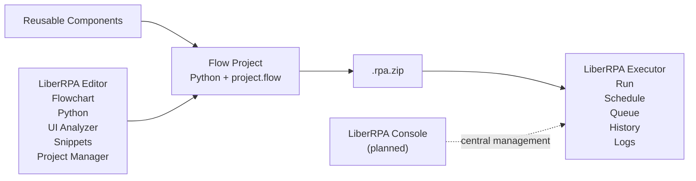
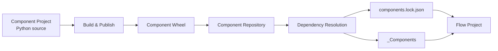
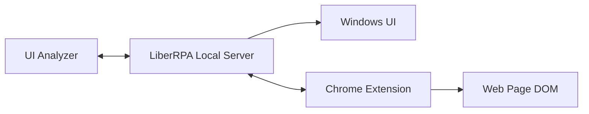
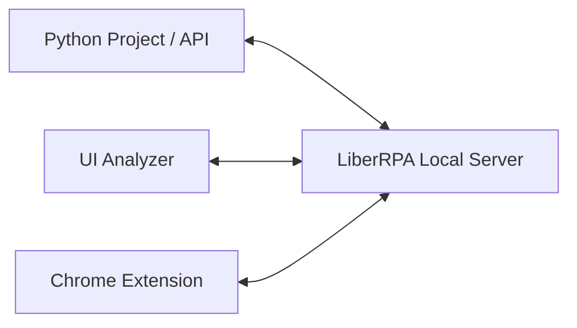

# Architecture

This document describes how the major parts of LiberRPA work together.

It focuses on the architecture of LiberRPA itself rather than the internal implementation of every automation API.

For a first-use tutorial, see [Getting Started](./GettingStarted.md).

---

## Contents

- [Architecture Overview](#architecture-overview)
- [Editor](#editor)
- [Flow Project Model](#flow-project-model)
- [Flow Execution](#flow-execution)
- [Reusable Components](#reusable-components)
- [UI and Browser Automation](#ui-and-browser-automation)
- [Local Server](#local-server)
- [Packaging](#packaging)
- [Executor](#executor)
- [Initialization and Local Integration](#initialization-and-local-integration)
- [Important Files and Boundaries](#important-files-and-boundaries)
- [Console](#console)

---

## Architecture Overview

LiberRPA separates **development**, **Project source**, and **execution** while keeping them part of one toolchain.

At the user level, the main workflow is:



The main design separation is:

```text
Flowchart
    ↓
High-level process structure

Python
    ↓
Detailed implementation logic
```

This is why LiberRPA uses the principle:

> **Visualize the process. Code the logic.**

The Flowchart is not the primary programming language of the automation. It describes how Python implementation steps are connected and executed.

---

## Editor

LiberRPA Editor is a portable VS Code-based development environment prepared for LiberRPA Projects. Its program files, portable configuration, keybindings, and installed extensions are kept under `Editor/` and `Editor/data/`.

The main development components are:

```text
LiberRPA Editor
│
├── VS Code / Python tooling
│   ├── source editing
│   ├── IntelliSense
│   ├── debugging
│   ├── navigation
│   └── formatting / linting
│
├── LiberRPA Flowchart
├── LiberRPA Project Manager
├── LiberRPA Snippets Tree
└── UI Analyzer
    └── separate Electron application
```

Project Manager can initialize a new Project as a Git repository when Git is installed and the selected template contains `.gitignore`. The bundled Editor disables VS Code's built-in Git interface by default, but command-line Git and external clients remain available; users can enable the VS Code interface in Editor settings.

The standard Python interpreter is:

```text
<LiberRPA root>\envs\pyenv\default\python.exe
```

For VS Code preparation, extensions, Workspace Trust, Git behavior, and customization, see [LiberRPA Editor](./Editor.md).

For download verification, offline preparation, moving the installation, and system integration, see [Installation, Portability & Uninstallation](./Installation.md).

For the standard Python environment, see [Python Environment](./Environment.md).

### Flowchart extension

`project.flow` is registered as a VS Code custom editor.

The Flowchart extension is responsible for:

- reading and writing the visual Flow;
- creating and opening Block Python files;
- launching individual Blocks;
- launching the complete Flow Project;
- integrating Flow execution with the Python debugger.

When a complete Project is run from the Editor, the extension launches:

```text
python -m liberrpa.FlowControl.Run
```

through VS Code's `debugpy` integration.

The Project directory becomes the working directory.

The Python import path includes:

```text
<Project root>
<Project root>\_Components
```

This allows Project source files and installed Components to be imported normally by Python.

---

## Flow Project Model

A Flow Project separates several different kinds of information.

### `project.flow`

`project.flow` stores the high-level executable process model.

It contains information including:

- Flowchart nodes;
- Flowchart edges;
- built-in Project arguments;
- Custom Project Arguments;
- Flow execution settings.

The Flowchart supports the following node types:

- `Start`
- `SubStart`
- `Block`
- `Choose`
- `End`

### Python Block files

A Block points to a Python file inside the Project.

The file must expose:

```python
def main() -> None:
    ...
```

When the Flow reaches that Block, LiberRPA imports the Python Module and calls its `main()` function.

Detailed business logic therefore remains normal Python.

### `flow.json`

`flow.json` stores Flow Project metadata and direct Component dependency requirements.

It is used by Project Manager for operations such as Component management and Project packaging.

### Separation of concerns

The architecture intentionally keeps:

```text
project.flow
→ process structure and execution settings

*.py
→ implementation logic

flow.json
→ Project metadata and direct Component requirements

components.lock.json
→ exact resolved Component state
```

separate.

This prevents a single visual workflow representation from having to act simultaneously as:

- process diagram;
- implementation language;
- dependency manifest;
- editor layout;
- source-code review format.

---

## Flow Execution

The same Flow runtime is used to interpret `project.flow` whether the Project is being developed in the Editor or executed as a deployed automation.

The main runtime entry point is:

```text
liberrpa.FlowControl.Run
```

### Initialization

Before execution, LiberRPA reads:

```text
project.flow
```

and builds runtime representations for:

- node types;
- node descriptions;
- Python file mappings;
- Choose conditions;
- normal paths;
- exception paths;
- true and false branches.

Project arguments are also initialized at this stage.

### Main process

The normal Flow starts from:

```text
LiberRPA_Start
```

and follows the configured edges.

For a normal Block:

```text
Flow reaches Block
        ↓
Resolve Block Python file
        ↓
Import Python Module
        ↓
Call module.main()
        ↓
Follow Normal path
```

If the Block has no next Normal path, that process ends automatically.

### Exception paths

If an uncaught exception leaves a Block, LiberRPA records the error.

If the Block has an Exception Line:

```text
Block raises uncaught exception
        ↓
Store exception in Project arguments
        ↓
Follow Exception Line
```

If no Exception Line exists, the current process stops its Flow path. An unhandled error in MainProcess produces an error result for the Project. A SubStart error remains local to that auxiliary process, as described below.

This allows normal Python exception handling to be used inside the Block while the Flowchart can still provide process-level recovery paths.

### Choose nodes

A Choose node evaluates its configured condition and follows either:

```text
True
```

or:

```text
False
```

when the corresponding path exists.

### SubStart processes

A `SubStart` represents a separate parallel process.

LiberRPA creates it through Python multiprocessing.

Each SubStart therefore runs in an independent process rather than sharing the main process memory directly.

Conceptually:

```text
Flow Project
│
├── MainProcess
│   └── Start → ...
│
├── SubProcess_0
│   └── SubStart → ...
│
└── SubProcess_1
    └── SubStart → ...
```

Because these are separate processes, normal Python in-memory objects are not automatically synchronized between them.

SubStart processes are **auxiliary processes**, not parallel tasks whose results are automatically combined with the MainProcess result. An uncaught Block exception is recorded in the affected subprocess's logs. The subprocess follows its Exception Line when one exists; otherwise, it stops without automatically failing MainProcess or changing the Executor Run result.

SubStart processes are created as daemon processes. During normal Project exit, unfinished SubStart processes are terminated rather than allowed to keep the Project open until their Flow paths finish. A SubStart reaching its own End only ends that subprocess.

Do not rely on a SubStart reaching its End node or completing a `finally` block when MainProcess ends. Work that must complete successfully before the Project can be considered successful belongs in the main Flow rather than a SubStart.

### End and cleanup

Only MainProcess performs Project-level Flow cleanup and publishes the final Executor Run State. A SubStart finishing does not complete the Project or publish a terminal Executor Run State. When the main Flow finishes, LiberRPA records one of the Python runtime results:

| Runtime result | Meaning |
| --- | --- |
| `completed` | The Flow reached successful completion. |
| `error` | The Flow ended with an unhandled error. |
| `terminated` | The Python process was stopped externally. |

For Executor-managed Runs, Python publishes runtime state through the temporary Executor Run State file. Executor maps the result into its own Run History:

- `completed` becomes **Completed** when the Python process exits normally;
- `error`, or an unexpected Python process exit, becomes **Error**;
- `terminated` becomes **Canceled** or **Timed Out** according to the Executor termination reason;
- a stale **Running** record found after an unexpected Executor or system termination becomes **Interrupted** during the next Executor startup.

**Interrupted** is therefore an Executor recovery result rather than a Python Flow result.

---

## Reusable Components

LiberRPA Components provide reusable Python logic that can be versioned independently from individual Projects.

A simplified Component lifecycle is:



The architectural responsibilities are separated as follows:

```text
flow.json / component.json
→ direct Component requirements

Component Repository
→ available published Component Wheels

components.lock.json
→ exact resolved versions and integrity information

_Components/
→ materialized Component packages used by the current Project
```

Project Manager resolves direct and transitive requirements against the Component Repository, records the exact result in `components.lock.json`, and materializes the resolved packages under `_Components/`.

During Project execution, `_Components` is added to the Python import path, so reusable Component APIs remain ordinary Python imports.

This separation keeps dependency intent, exact resolution, Repository artifacts, and runtime materialization distinct.

For Component publishing, Repository operations, Add/Update/Remove, Repair, Resolve Dependencies, and other operational workflows, see [LiberRPA Project Manager](../vscodeExtensions/liberrpa-project-manager/README.md).

---

## UI and Browser Automation

LiberRPA supports multiple element-selection strategies because different applications expose different forms of automation information.

The major selector types are:

```text
Window
UIA
HTML
Image
```

### Windows UI Automation

UIA selectors are used for Windows applications that expose Microsoft UI Automation information.

The selector can use application/window context and element hierarchy to locate the target.

### HTML automation

HTML automation uses DOM information provided through the LiberRPA Chrome Extension.

Supported selector information can include:

- element attributes;
- hierarchy;
- parent context;
- regular expressions;
- `documentIndex`;
- `childIndex`;
- CSS path information.

### Image automation

Image selectors provide a fallback for interfaces where semantic UIA or DOM information is unavailable or unsuitable.

### Window selection

All UI selectors use a window section to identify the target application window before locating the more specific element.

### UI Analyzer

UI Analyzer is a separate Electron application for:

- indicating elements;
- inspecting selector information;
- editing selectors;
- validating selectors.

Its high-level relationship to the runtime is:



UIA, image, and window indication are coordinated through LiberRPA Local Server. HTML indication additionally requires the Chrome Extension to be installed, connected, and able to access the target page.

For selector creation and validation, see [UI Analyzer](../electronApplications/ui-analyzer/README.md).

---

## Local Server

LiberRPA Local Server is a persistent local service that coordinates functionality shared across otherwise independent LiberRPA processes.

At the architectural level:



The service is designed for loopback/local-machine communication and accepts authenticated LiberRPA clients.

Its main architectural responsibilities include:

- local request/response communication used by Python APIs;
- UI Analyzer indication and validation services;
- server-side routing between Python and the Chrome Extension;
- persistent graphical/helper services;
- application-launch support;
- execution recording.

For Chrome, Native Messaging is used only to bootstrap the extension with the current local connection information. Normal browser automation then uses the authenticated Chrome Extension ↔ Local Server connection.

For startup, port configuration, authentication, Chrome routing, UI Analyzer integration, Qt Worker, recording, logs, and troubleshooting, see [LiberRPA Local Server](./LocalServer.md).

For browser-side behavior, see [LiberRPA Chrome Extension](../browserExtensions/liberrpa-chrome-extension/README.md).

---

## Packaging

Project Manager converts a development Flow Project into an immutable deployment artifact:

```text
<name>_<version>.rpa.zip
```

Architecturally, packaging is the boundary between the editable development workspace and the Project installed by Executor.

The Package stores the Project content directly at the archive root and includes Package metadata plus the materialized `_Components` required at runtime. Development-only entries and generated caches are handled according to Project Manager's packaging rules.

```text
Development Project
        │
        │ resolve Components and package
        ▼
   .rpa.zip Package
        │
        │ install by Project name and version
        ▼
      Executor
```

A generated Package should not be edited manually. Change the source Project, increase its version, and create another Package instead.

For validation, inclusion/exclusion rules, filename rules, and the packaging workflow, see [Package a Flow Project](../vscodeExtensions/liberrpa-project-manager/README.md#package-a-flow-project).

---

## Executor

LiberRPA Executor is the local operational layer for packaged Flow Projects.

Project Manager resolves Component dependencies and creates an immutable `.rpa.zip` Package. Executor validates and installs that Package by Project name and version, then uses the packaged Project and materialized `_Components` directly at runtime.

```text
Development machine
Component Repository
      │
      │ resolve dependencies
      ▼
Flow Project + components.lock.json + _Components
      │
      │ package
      ▼
.rpa.zip
      │
      ───────── deployment boundary ─────────
      │
      ▼
Executor
```

Executor does not access the development Component Repository, resolve dependencies, repair `_Components`, or modify the packaged source Project.

The local execution layer provides:

- manual and Cron-based scheduled Runs;
- per-version Run Settings and Custom Arguments;
- Run Queue conflict policies;
- Run History;
- cancellation and timeout handling;
- access to Project logs and recordings.

The Python Flow runtime reports:

```text
running
completed
error
terminated
```

Executor presents those results through its own lifecycle states:

| Executor state | Meaning |
| --- | --- |
| **Running** | The Run is active. |
| **Completed** | Python reported successful completion and exited normally. |
| **Error** | Python reported an error or exited unexpectedly. |
| **Canceled** | Executor terminated the Run in response to cancellation. |
| **Timed Out** | Executor terminated the Run after its timeout expired. |
| **Interrupted** | Executor started with a stale Run still recorded as running from a previous session. |

Executor keeps installed Packages, Project metadata, Schedules, Run History, active-run coordination, and settings in separate local stores according to their responsibilities.

For the complete Package limits, Run Settings, Scheduler and Run Queue behavior, status handling, logs, retention, data paths, and known issues, see [LiberRPA Executor](../electronApplications/executor/README.md).

---

## Initialization and Local Integration

LiberRPA is primarily portable, but a copied or moved installation still requires machine- and user-specific integration.

`InitLiberRPA.exe` configures:

- the active `LiberRPA` user environment variable;
- local authentication information;
- Chrome Native Messaging;
- the tested portable Editor and selected extensions when needed;
- Startup and desktop shortcuts;
- the default Component Repository;
- the bundled current-user font.

Re-run initialization after moving or copying the LiberRPA root so that local paths, authentication, and integrations point to the active installation.

See [Installation, Portability & Uninstallation](./Installation.md) for the complete procedure and cleanup locations.

---

## Important Files and Boundaries

The following files and directories represent different architectural responsibilities.

| File or directory | Responsibility |
| --- | --- |
| `project.flow` | High-level Flow structure and execution defaults. |
| `flow.json` | Flow Project metadata and direct Component requirements. |
| `component.json` | Component identity, version, compatibility, and direct requirements. |
| `*.py` | Detailed automation implementation. |
| `_Components/` | Materialized resolved Component dependencies. |
| `components.lock.json` | Exact Component resolution and integrity information. |
| Component Repository | Authoritative local collection of Component Wheels. |
| `.liberrpa-package.json` | Package-only metadata, including the Version Summary. |
| `.rpa.zip` | Immutable deployment Package passed from Project Manager to Executor. |
| `envs/pyenv/default/` | Standard LiberRPA Python runtime environment. |
| `configFiles/basic.jsonc` | Common local LiberRPA configuration. |
| `WebSocketAuth.json` | Local communication authentication tokens. |
| `ExecutorPackage/` | Installed versioned Flow Project Packages. |
| `ExecutorData.db` | Installed Project metadata, Schedules, and Run History. |
| `ExecutorRunState/` | Temporary coordination state for active Executor-managed Runs. |
| `configFiles/Executor.jsonc` | Local Executor configuration. |

The architecture deliberately keeps these responsibilities separate instead of storing the entire automation lifecycle in one Project file.

---

## Console

LiberRPA Console is planned but is not part of LiberRPA 0.3.0.

Editor and Executor currently support a complete local workflow:

```text
Develop
    ↓
Test / Debug
    ↓
Resolve Components
    ↓
Package
    ↓
Import
    ↓
Run / Schedule
```

Console is intended for scenarios where local Executor management is no longer sufficient, particularly central management involving multiple Executors and shared automation resources.

The exact Console architecture should be documented once its design and implementation are sufficiently stable.

Until then, Console should be treated as a future product boundary rather than an existing dependency of Editor or Executor.
