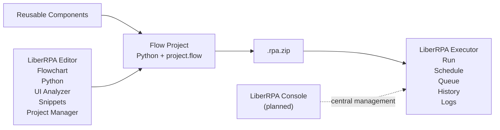
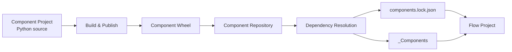
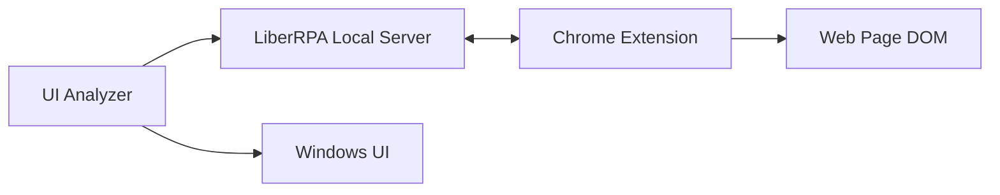
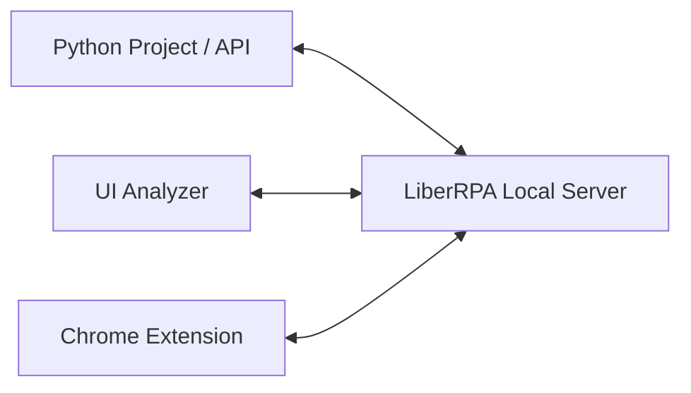

# Architecture

This document describes how the major parts of LiberRPA work together.

It focuses on the architecture of LiberRPA itself rather than the internal implementation of every automation API.

For a first-use tutorial, see [Getting Started](./GettingStarted.md).

---

## Contents

- [Architecture Overview](#architecture-overview)
- [Editor](#editor)
- [Flow Project Model](#flow-project-model)
- [Flow Execution](#flow-execution)
- [Reusable Components](#reusable-components)
- [UI and Browser Automation](#ui-and-browser-automation)
- [Local Server](#local-server)
- [Packaging](#packaging)
- [Executor](#executor)
- [Initialization and Local Integration](#initialization-and-local-integration)
- [Important Files and Boundaries](#important-files-and-boundaries)
- [Console](#console)

---

## Architecture Overview

LiberRPA separates **development**, **Project source**, and **execution** while keeping them part of one toolchain.

At the user level, the main workflow is:



The main design separation is:

```text
Flowchart
    ↓
High-level process structure

Python
    ↓
Detailed implementation logic
```

This is why LiberRPA uses the principle:

> **Visualize the process. Code the logic.**

The Flowchart is not the primary programming language of the automation. It describes how Python implementation steps are connected and executed.

---

## Editor

LiberRPA Editor is based on the portable version of VS Code.

Selected Editor extensions are not bundled with the LiberRPA release. During initialization, `InitLiberRPA.exe` uses the bundled VS Code CLI to install missing extensions from the Visual Studio Marketplace. VS Code stores installed extensions and their dependencies under `Editor/data`, so they remain part of the portable Editor after installation.

It combines ordinary Python development with LiberRPA-specific extensions and tools.

Major development components include:

```text
LiberRPA Editor
│
├── VS Code / Python tooling
│   ├── source editing
│   ├── IntelliSense
│   ├── debugging
│   ├── navigation
│   ├── formatting / linting
│   └── Git integration
│
├── LiberRPA Flowchart
│
├── LiberRPA Project Manager
│
├── LiberRPA Snippets Tree
│
└── UI Analyzer
    └── separate Electron application
```

The standard Python interpreter used by the bundled Editor is located at:

```text
<LiberRPA root>\envs\pyenv\default\python.exe
```

See [Python Environment](./Environment.md) for environment details.

### Flowchart extension

`project.flow` is registered as a VS Code custom editor.

The Flowchart extension is responsible for:

- reading and writing the visual Flow;
- creating and opening Block Python files;
- launching individual Blocks;
- launching the complete Flow Project;
- integrating Flow execution with the Python debugger.

When a complete Project is run from the Editor, the extension launches:

```text
python -m liberrpa.FlowControl.Run
```

through VS Code's `debugpy` integration.

The Project directory becomes the working directory.

The Python import path includes:

```text
<Project root>
<Project root>\_Components
```

This allows Project source files and installed Components to be imported normally by Python.

---

## Flow Project Model

A Flow Project separates several different kinds of information.

### `project.flow`

`project.flow` stores the high-level executable process model.

It contains information including:

- Flowchart nodes;
- Flowchart edges;
- built-in Project arguments;
- custom Project arguments;
- Flow execution settings.

The Flowchart supports the following node types:

- `Start`
- `SubStart`
- `Block`
- `Choose`
- `End`

### Python Block files

A Block points to a Python file inside the Project.

The file must expose:

```python
def main() -> None:
    ...
```

When the Flow reaches that Block, LiberRPA imports the Python Module and calls its `main()` function.

Detailed business logic therefore remains normal Python.

### `flow.json`

`flow.json` stores Flow Project metadata and direct Component dependency requirements.

It is used by Project Manager for operations such as Component management and Project packaging.

### Separation of concerns

The architecture intentionally keeps:

```text
project.flow
→ process structure and execution settings

*.py
→ implementation logic

flow.json
→ Project metadata and direct Component requirements

components.lock.json
→ exact resolved Component state
```

separate.

This prevents a single visual workflow representation from having to act simultaneously as:

- process diagram;
- implementation language;
- dependency manifest;
- editor layout;
- source-code review format.

---

## Flow Execution

The same Flow runtime is used to interpret `project.flow` whether the Project is being developed in the Editor or executed as a deployed automation.

The main runtime entry point is:

```text
liberrpa.FlowControl.Run
```

### Initialization

Before execution, LiberRPA reads:

```text
project.flow
```

and builds runtime representations for:

- node types;
- node descriptions;
- Python file mappings;
- Choose conditions;
- normal paths;
- exception paths;
- true and false branches.

Project arguments are also initialized at this stage.

### Main process

The normal Flow starts from:

```text
LiberRPA_Start
```

and follows the configured edges.

For a normal Block:

```text
Flow reaches Block
        ↓
Resolve Block Python file
        ↓
Import Python Module
        ↓
Call module.main()
        ↓
Follow Normal path
```

If the Block has no next Normal path, that process ends automatically.

### Exception paths

If an uncaught exception leaves a Block, LiberRPA records the error.

If the Block has an Exception Line:

```text
Block raises uncaught exception
        ↓
Store exception in Project arguments
        ↓
Follow Exception Line
```

If no Exception Line exists, the current Flow ends with an error result.

This allows normal Python exception handling to be used inside the Block while the Flowchart can still provide process-level recovery paths.

### Choose nodes

A Choose node evaluates its configured condition and follows either:

```text
True
```

or:

```text
False
```

when the corresponding path exists.

### SubStart processes

A `SubStart` represents a separate parallel process.

LiberRPA creates it through Python multiprocessing.

Each SubStart therefore runs in an independent process rather than sharing the main process memory directly.

Conceptually:

```text
Flow Project
│
├── MainProcess
│   └── Start → ...
│
├── SubProcess_0
│   └── SubStart → ...
│
└── SubProcess_1
    └── SubStart → ...
```

Because these are separate processes, normal Python in-memory objects are not automatically synchronized between them.

### End and cleanup

When execution finishes, LiberRPA performs Flow cleanup and records one of the Python runtime results:

| Runtime result | Meaning |
| --- | --- |
| `completed` | The Flow reached successful completion. |
| `error` | The Flow ended with an unhandled error. |
| `terminated` | The Python process was stopped externally. |

For Executor-managed Runs, Python publishes runtime state through the temporary Executor Run State file. Executor maps the result into its own Run History:

- `completed` becomes **Completed** when the Python process exits normally;
- `error`, or an unexpected Python process exit, becomes **Error**;
- `terminated` becomes **Canceled** or **Timed Out** according to the Executor termination reason;
- a stale **Running** record found after an unexpected Executor or system termination becomes **Interrupted** during the next Executor startup.

**Interrupted** is therefore an Executor recovery result rather than a Python Flow result.

---

## Reusable Components

LiberRPA Components provide reusable Python logic that can be versioned independently from individual Projects.

A simplified Component lifecycle is:



The architectural responsibilities are separated as follows:

```text
flow.json / component.json
→ direct Component requirements

Component Repository
→ available published Component Wheels

components.lock.json
→ exact resolved versions and integrity information

_Components/
→ materialized Component packages used by the current Project
```

Project Manager resolves direct and transitive requirements against the Component Repository, records the exact result in `components.lock.json`, and materializes the resolved packages under `_Components/`.

During Project execution, `_Components` is added to the Python import path, so reusable Component APIs remain ordinary Python imports.

This separation keeps dependency intent, exact resolution, Repository artifacts, and runtime materialization distinct.

For Component publishing, Repository operations, Add/Update/Remove, Repair, Resolve Dependencies, and other operational workflows, see [LiberRPA Project Manager](../vscodeExtensions/liberrpa-project-manager/README.md).

---

## UI and Browser Automation

LiberRPA supports multiple element-selection strategies because different applications expose different forms of automation information.

The major selector types are:

```text
Window
UIA
HTML
Image
```

### Windows UI Automation

UIA selectors are used for Windows applications that expose Microsoft UI Automation information.

The selector can use application/window context and element hierarchy to locate the target.

### HTML automation

HTML automation uses DOM information provided through the LiberRPA Chrome Extension.

Supported selector information can include:

- element attributes;
- hierarchy;
- parent context;
- regular expressions;
- `documentIndex`;
- `childIndex`;
- CSS path information.

### Image automation

Image selectors provide a fallback for interfaces where semantic UIA or DOM information is unavailable or unsuitable.

### Window selection

All UI selectors use a window section to identify the target application window before locating the more specific element.

### UI Analyzer

UI Analyzer is a separate Electron application for:

- indicating elements;
- inspecting selector information;
- editing selectors;
- validating selectors.

Its high-level relationship to the runtime is:



UI Analyzer requires LiberRPA Local Server.

HTML indication also requires the Chrome Extension to be installed and connected.

---

## Local Server

LiberRPA Local Server is a persistent local service that coordinates functionality shared across otherwise independent LiberRPA processes.

At the architectural level:



The service is designed for loopback/local-machine communication and accepts authenticated LiberRPA clients.

Its main architectural responsibilities include:

- local request/response communication used by Python APIs;
- UI Analyzer indication and validation services;
- server-side routing between Python and the Chrome Extension;
- persistent graphical/helper services;
- application-launch support;
- execution recording.

For Chrome, Native Messaging is used only to bootstrap the extension with the current local connection information. Normal browser automation then uses the authenticated Chrome Extension ↔ Local Server connection.

For startup, port configuration, authentication, Chrome routing, UI Analyzer integration, Qt Worker, recording, logs, and troubleshooting, see [LiberRPA Local Server](./LocalServer.md).

For browser-side behavior, see [LiberRPA Chrome Extension](../browserExtensions/liberrpa-chrome-extension/README.md).

---

## Packaging

Project Manager converts a development Flow Project into an immutable deployment artifact:

```text
<name>_<version>.rpa.zip
```

Architecturally, packaging is the boundary between the editable development workspace and the Project installed by Executor.

The Package stores the Project content directly at the archive root and includes Package metadata plus the materialized `_Components` required at runtime. Development-only entries and generated caches are handled according to Project Manager's packaging rules.

```text
Development Project
        │
        │ resolve Components and package
        ▼
   .rpa.zip Package
        │
        │ install by Project name and version
        ▼
      Executor
```

A generated Package should not be edited manually. Change the source Project, increase its version, and create another Package instead.

For validation, inclusion/exclusion rules, filename rules, and the packaging workflow, see [Package a Flow Project](../vscodeExtensions/liberrpa-project-manager/README.md#package-a-flow-project).

---

## Executor

LiberRPA Executor is the local operational layer for packaged Flow Projects.

Its responsibilities include:

```text
Package installation and versioned storage
Per-version Run Settings
Manual execution
Cron-based Schedules
Skip / Wait / Concurrent conflict policies
Pending and Waiting Run Queue states
Run History
Cancellation and timeout handling
Log and recording access
Retention and RDP Session helpers
```

### Package installation and deployment boundary

Executor installs `.rpa.zip` Packages created by Project Manager. It validates archive safety and required Package metadata before extracting the Project into:

```text
%USERPROFILE%\Documents\LiberRPA\ExecutorPackage\<ProjectName>_<Version>\
```

Different Project versions can coexist. An installed name/version pair is never silently overwritten.

Component dependency resolution belongs to Project Manager. The Package already contains the materialized `_Components` selected during development, and Executor uses them directly at runtime. Executor does not access the Component Repository, resolve or repair dependencies, or rebuild packaged Component state.

```text
Development machine
Component Repository
      │
      │ resolve dependencies
      ▼
Flow Project + _Components + lock
      │
      │ package
      ▼
.rpa.zip
      │
      ───────── deployment boundary ─────────
      │
      ▼
Executor installation
```

### Project and Schedule settings

Each installed Project version stores local settings for:

```text
Python Environment
Timeout
Log Level
Record Video
Stop Shortcut
Highlight UI
Custom Arguments
```

The Package provides the initial Run Options and Custom Arguments from `project.flow`. Executor can save different local values without modifying the installed Project source.

When a Schedule is created, its Run Options and Custom Arguments are copied from the selected Project version and then belong to that Schedule. The Python Environment is not copied into the Schedule; scheduled Runs use the environment currently selected for the installed Project version.

### Scheduling and Run Queue

Executor starts Runs manually or from Cron-based Schedules. The main-process Scheduler uses `cron-parser` as the execution parser. Standard 5-field expressions are supported, and the parser also accepts an optional seconds field. Cron calculations use the global Executor IANA Time Zone and the Schedule's Active From / Active Until bounds.

The renderer's visual Cron editor is a convenience layer for common 5-field expressions; it is not the definition of Scheduler execution semantics. Human-readable Cron descriptions are also presentation-only.

For each enabled Schedule, Executor calculates only the nearest future trigger and represents it as one **Pending** item. The Scheduler then checks due work at approximately one-second intervals. After a Pending trigger is handled, Executor calculates the next one. This avoids materializing an unbounded list of future Runs and means scheduling is approximately second-level rather than millisecond-level.

When a Schedule triggers while another Run is starting or running, its conflict policy can:

| Policy | Result |
| --- | --- |
| `skip` | Ignore this trigger. |
| `wait` | Capture a Waiting Run and start it when no other Run is active. |
| `concurrent` | Start immediately alongside existing Runs. |

The Run Queue distinguishes:

- **Pending**: the next calculated future trigger for an enabled Schedule;
- **Waiting**: a trigger that already occurred and captured a Run under the `wait` policy.

Pending items are recalculated when Executor starts or relevant Schedule/Time Zone settings change. Waiting Runs exist only in memory, are not restored after Executor exits, and missed Schedule triggers are not replayed.

### Run lifecycle and local state

Executor records manual and scheduled Runs in Run History and tracks these user-facing states:

```text
Running
Completed
Error
Canceled
Timed Out
Interrupted
```

Operational data is divided by responsibility:

| Data | Location or lifetime |
| --- | --- |
| Installed Package files | `%USERPROFILE%\Documents\LiberRPA\ExecutorPackage\` |
| Project metadata, Schedules, and Run History | `ExecutorData.db` in the user LiberRPA data directory |
| Active Run coordination | temporary files under `ExecutorRunState/` |
| Waiting Runs | in memory while Executor is running |
| Project logs and recordings | the configured Project Log Folder |
| Executor settings | `%LiberRPA%\configFiles\Executor.jsonc` |

Closing the window hides Executor in the Windows notification area. The tray process continues Schedule processing, active Runs, queue handling, and retention checks until the user selects `Exit`.

For the complete workflow, status meanings, Package limits, settings, logs, data migration, and known issues, see [LiberRPA Executor](../electronApplications/executor/README.md).

---

## Initialization and Local Integration

LiberRPA is primarily portable, but several machine- and user-specific integrations must be configured after copying or moving the root directory.

This is the responsibility of:

```text
InitLiberRPA.exe
```

Initialization currently configures areas including:

```text
LiberRPA user environment variable
        │
        ├── points to active LiberRPA root
        │
        ▼
Local configuration

Missing Editor extensions
        │
        ├── installed through bundled VS Code CLI
        ▼
Visual Studio Marketplace → Editor/data/extensions

Chrome Native Messaging
        │
        ▼
Chrome Extension integration

WebSocketAuth.json
        │
        ▼
Local component authentication

Windows Startup shortcuts
        │
        ├── Local Server
        └── Executor

Desktop shortcuts

Default Component Repository

User font
```

This is why a copied LiberRPA directory should be initialized again on the target computer.

See [Installation, Portability & Uninstallation](./Installation.md) for the complete procedure.

---

## Important Files and Boundaries

The following files and directories represent different architectural responsibilities.

| File or directory | Responsibility |
| --- | --- |
| `project.flow` | High-level Flow structure and execution defaults. |
| `flow.json` | Flow Project metadata and direct Component requirements. |
| `component.json` | Component identity, version, compatibility, and direct requirements. |
| `*.py` | Detailed automation implementation. |
| `_Components/` | Materialized resolved Component dependencies. |
| `components.lock.json` | Exact Component resolution and integrity information. |
| Component Repository | Authoritative local collection of Component Wheels. |
| `.liberrpa-package.json` | Package-only metadata, including the Version Summary. |
| `.rpa.zip` | Immutable deployment Package passed from Project Manager to Executor. |
| `envs/pyenv/default/` | Standard LiberRPA Python runtime environment. |
| `configFiles/basic.jsonc` | Common local LiberRPA configuration. |
| `WebSocketAuth.json` | Local communication authentication tokens. |
| `ExecutorPackage/` | Installed versioned Flow Project Packages. |
| `ExecutorData.db` | Installed Project metadata, Schedules, and Run History. |
| `ExecutorRunState/` | Temporary coordination state for active Executor-managed Runs. |
| `configFiles/Executor.jsonc` | Local Executor configuration. |

The architecture deliberately keeps these responsibilities separate instead of storing the entire automation lifecycle in one Project file.

---

## Console

LiberRPA Console is planned but is not part of LiberRPA 0.3.0.

Editor and Executor currently support a complete local workflow:

```text
Develop
    ↓
Test / Debug
    ↓
Resolve Components
    ↓
Package
    ↓
Import
    ↓
Run / Schedule
```

Console is intended for scenarios where local Executor management is no longer sufficient, particularly central management involving multiple Executors and shared automation resources.

The exact Console architecture should be documented once its design and implementation are sufficiently stable.

Until then, Console should be treated as a future product boundary rather than an existing dependency of Editor or Executor.
