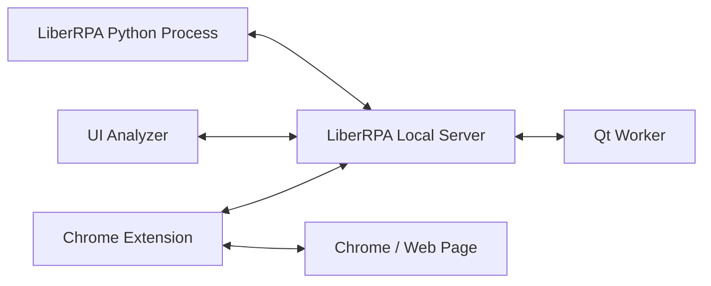

# LiberRPA Local Server

LiberRPA Local Server is a long-running local service used by several LiberRPA development and runtime features.

It is implemented with Flask and Flask-SocketIO and listens only on the local loopback interface.

Its main responsibilities include:

- local communication between LiberRPA Python processes, UI Analyzer, and the Chrome Extension;
- relaying browser commands between Python and Chrome;
- performing UI Analyzer indication and selector validation operations;
- launching applications, URLs, and browser processes independently from an RPA script process;
- providing local Qt-based notifications, overlays, and ScreenPrint areas;
- managing execution screen recording;
- providing supporting services that should remain available across individual Project runs.

For the overall system design, see [Architecture](./Architecture.md).

## Contents

- [How It Fits Together](#how-it-fits-together)
- [Startup and Lifecycle](#startup-and-lifecycle)
- [Configuration](#configuration)
- [Local Communication and Authentication](#local-communication-and-authentication)
- [Chrome Integration](#chrome-integration)
- [UI Analyzer Integration](#ui-analyzer-integration)
- [Application and Qt Services](#application-and-qt-services)
- [Execution Recording](#execution-recording)
- [Administrator Privileges](#administrator-privileges)
- [Logs and Diagnostics](#logs-and-diagnostics)
- [Troubleshooting](#troubleshooting)
- [Implementation Notes](#implementation-notes)

---

## How It Fits Together

At a high level, LiberRPA Local Server provides a local communication layer between several otherwise independent processes:



The Local Server is not the runtime for all LiberRPA automation logic. Normal Flow Project implementation still runs in Python Project processes.

Instead, the Local Server owns or coordinates functionality that benefits from a persistent local process, including browser communication, UI Analyzer operations, local graphical helpers, application launching, and recording.

---

## Startup and Lifecycle

LiberRPA Local Server is distributed as part of the `liberrpa` Python package rather than as a separate PyInstaller/Nuitka executable.

The standard release starts it with the Python interpreter included in the LiberRPA environment.

### Standard release startup

`InitLiberRPA.exe` creates a Windows Startup shortcut named:

```text
LocalServer-LiberRPA.lnk
```

under:

```text
%APPDATA%\Microsoft\Windows\Start Menu\Programs\Startup\
```

The shortcut uses:

```text
Target:
"%LiberRPA%\envs\pyenv\default\pythonw.exe" -m liberrpa.LiberRPALocalServer.LiberRPALocalServer

Start in:
%LiberRPA%\exeFiles\LiberRPALocalServer\
```

`pythonw.exe` is used for the normal release startup so that the persistent Local Server can run without opening a console window.

The server therefore normally starts when the current Windows user signs in.

The working directory:

```text
%LiberRPA%\exeFiles\LiberRPALocalServer\
```

is intentionally retained even though it does not contain a separate Local Server executable.

### Manual startup

The same Local Server can be started manually from the standard LiberRPA environment with:

```bat
"%LiberRPA%\envs\pyenv\default\python.exe" -m liberrpa.LiberRPALocalServer.LiberRPALocalServer
```

Using `python.exe` instead of `pythonw.exe` is useful when a visible console is helpful for troubleshooting.

### Development startup

When developing `liberrpa` from source, the Local Server can be started directly from the development environment.

For example:

```bat
conda activate <development-environment>
cd /d <LiberRPA repository>\condaLibrary
python -m liberrpa.LiberRPALocalServer.LiberRPALocalServer
```

The exact development environment name and repository path are developer-specific; the important part is that the `liberrpa` source tree is importable and the module is started with:

```text
python -m liberrpa.LiberRPALocalServer.LiberRPALocalServer
```

For details about initialization and Startup integration, see [Installation, Portability & Uninstallation](./Installation.md).

### System tray

While running, LiberRPA Local Server creates a system-tray icon named:

```text
LiberRPA Local Server
```

The tray menu currently provides an **Exit** command.

During UI Analyzer indication, the tray icon temporarily changes to indicate that an element-selection operation is active.

### Qt Worker

When the Local Server starts, it also creates a separate `QtWorker` process.

The Qt Worker is used for local graphical functionality such as:

- notifications;
- temporary overlays;
- ScreenPrint display areas.

The Local Server and Qt Worker are therefore separate processes even though they are part of the same local service layer.

### Existing Local Server instance

Before starting its Socket.IO server, LiberRPA checks whether the configured port is already in use.

If the port responds to:

```text
/verify
```

with the expected LiberRPA verification response, the new process reports that a LiberRPA Local Server is already running instead of starting another server on the same port.

If the port is occupied by another application, startup fails and the user is prompted to either close the conflicting application or change the LiberRPA Local Server port.

---

## Configuration

The Local Server port is configured in:

```text
<LiberRPA root>\configFiles\basic.jsonc
```

The default value is:

```json
"localServerPort": 52000
```

LiberRPA Local Server binds to:

```text
127.0.0.1
```

rather than a LAN-facing interface.

With the default configuration, its local address is therefore:

```text
http://127.0.0.1:52000
```

### Verification endpoint

The Local Server exposes a small verification endpoint:

```text
GET /verify
```

which returns:

```text
LiberRPA Local Server Verification
```

LiberRPA uses this endpoint to distinguish an already-running Local Server from another application that happens to occupy the configured port.

---

## Local Communication and Authentication

LiberRPA Local Server uses Socket.IO for its main local communication protocol.

Three client types are currently recognized:

```text
python
chrome
uiAnalyzer
```

A Socket.IO client must provide both:

- its client type;
- the corresponding authentication token.

The Local Server compares the supplied token with the configured token before accepting the connection.

### Authentication tokens

`InitLiberRPA.exe` creates local authentication information at:

```text
%USERPROFILE%\Documents\LiberRPA\WebSocketAuth.json
```

Separate tokens are maintained for:

```text
python
chrome
uiAnalyzer
```

Do not publish, commit, or share this file.

Running `InitLiberRPA.exe` again refreshes these tokens. Any LiberRPA processes that were already running should then be restarted so that all components use the current authentication information.

### Origin checks

When a Socket.IO client supplies an HTTP `Origin` header, the Local Server also validates it according to the client type.

The expected origins are deliberately local or LiberRPA-specific, including:

- the configured loopback Local Server origin for Python clients;
- local UI Analyzer origins used by its packaged/development UI;
- recognized LiberRPA Chrome Extension origins.

The Local Server is therefore designed as a local-only service rather than a network API intended to be exposed to other machines.

---

## Chrome Integration

LiberRPA browser automation uses the Chrome Extension together with LiberRPA Local Server.

The Chrome Extension first obtains the current Local Server connection information through LiberRPA's Native Messaging bootstrap, then connects directly to the loopback Local Server with Socket.IO/WebSocket as the authenticated `chrome` client.

After the extension connects, Local Server registers the active Chrome Socket.IO connection used for browser-command routing.

From the Local Server side, the command path is:

```text
Python browser/UI API
        │
        ▼
LiberRPA Local Server
        │
        │ assign ServerWaitId
        ▼
Active Chrome Extension connection
        │
        ▼
Chrome result
        │
        ▼
Match ServerWaitId
        │
        ▼
Waiting Python caller
```

Each relayed command receives an internal `ServerWaitId` so that the asynchronous Chrome response can be returned to the correct Python request.

A communication timeout prevents a missing Chrome response from blocking the Local Server indefinitely.

### Active Chrome connection

Local Server tracks one active Chrome Extension connection for command routing.

The connection most recently registered through `chrome_extension_connect` is used for subsequent browser commands.

If no Chrome Extension connection is available, browser commands return an error rather than waiting indefinitely.

For the browser-side architecture, including Native Messaging bootstrap details, background/content responsibilities, active-tab behavior, DOM operation semantics, extension icon states, permissions, and Chrome-specific limitations, see the [LiberRPA Chrome Extension documentation](../browserExtensions/liberrpa-chrome-extension/README.md).

For installation-side Native Messaging registration and system paths, see [Installation, Portability & Uninstallation](./Installation.md).

---

## UI Analyzer Integration

UI Analyzer communicates with LiberRPA Local Server rather than implementing all indication behavior inside its Electron process.

The Local Server currently handles UI Analyzer commands for:

- UIA indication;
- HTML/Chrome indication;
- image indication;
- window indication;
- selector validation.

Only one UI Analyzer command is handled at a time.

If another indication or validation operation is already running, a second request is rejected until the current operation finishes.

### UIA, image, and window indication

These operations are performed locally by the LiberRPA Python/Windows automation code hosted through the Local Server process.

### HTML indication

For HTML elements, the Local Server combines local UI/window information with data obtained through the Chrome Extension.

This is why HTML indication requires all of the following to be available:

```text
UI Analyzer
LiberRPA Local Server
Chrome
LiberRPA Chrome Extension
```

### Selector validation

UI Analyzer can send an existing selector to the Local Server for validation against the current desktop/browser state.

For selector formats and UI Analyzer behavior, see [UI Analyzer](../electronApplications/ui-analyzer/README.md).

---

## Application and Qt Services

LiberRPA Local Server also exposes several local services used by Python automation code.

### Application launching

The Local Server can:

- start an application;
- open a URL or local file through the system shell;
- start a browser with a selected executable and command-line parameters.

Browser processes started through this service are created independently from the calling RPA script process. This prevents the browser process from being automatically tied to the lifetime of one Project process.

### Notifications and overlays

The Local Server's Qt Worker provides functionality used for:

- notifications;
- temporary screen overlays;
- UI indication highlighting;
- ScreenPrint display areas.

### ScreenPrint cleanup

ScreenPrint areas are associated with the Socket.IO client that created them.

If a Python client disconnects while it still owns open ScreenPrint areas, the Local Server closes those areas and removes their cached state.

This prevents abandoned display areas from remaining on screen after the originating automation process exits unexpectedly.

---

## Execution Recording

LiberRPA Local Server provides the screen-recording service used when **Record Video** is enabled in Flowchart or in an Executor Project/Schedule Run configuration.

Recording runs in a separate thread so that starting the recorder does not block the requesting Python process.

### Recording behavior

The current implementation:

1. identifies the primary monitor;
2. starts FFmpeg using Windows `gdigrab`;
3. records the primary desktop at 5 frames per second;
4. continues while the target Project process ID exists;
5. stops FFmpeg after that process exits;
6. generates log-based subtitles when the expected human-readable Project log is available;
7. attempts a second compression pass and keeps the compressed file only when it is smaller than the original recording.

The main output is:

```text
video_record.mkv
```

When subtitle generation succeeds, LiberRPA also creates:

```text
video_record.srt
```

The subtitle file is derived from timestamped entries in:

```text
human_read_MainProcess.log
```

This allows execution video and Project logs to be viewed together during troubleshooting.

Recording captures the **primary monitor** rather than every monitor connected to the computer.

---

## Administrator Privileges

Do not run LiberRPA Local Server as administrator by default unless the automation scenario requires it.

Windows integrity levels can prevent a non-elevated process from inspecting or interacting with an elevated application.

This is particularly relevant to UI Analyzer because UIA/window indication is executed through the Local Server process.

If UI Analyzer cannot inspect an application that is running as administrator, running LiberRPA Local Server with corresponding privileges may be required.

Normal Flow Project UI automation is executed by the Project's Python process, so privilege requirements for runtime automation are not automatically solved merely by elevating the Local Server.

Use elevated privileges only when required by the target application.

---

## Logs and Diagnostics

LiberRPA Local Server configures its own logging folder name as:

```text
_LiberRPALocalServer
```

The root log directory follows the normal LiberRPA `outputLogPath` configuration in:

```text
configFiles/basic.jsonc
```

With the standard configuration, LiberRPA logs are stored under:

```text
%USERPROFILE%\Documents\LiberRPA\OutputLog\
```

Local Server logs can be useful for diagnosing:

- failed Socket.IO authentication;
- rejected origins;
- Chrome Extension connection state;
- Chrome command timeouts;
- UI Analyzer operations;
- application-launch failures;
- recording failures;
- unexpected client disconnects.

---

## Troubleshooting

### Local Server is not running

Check for the **LiberRPA Local Server** system-tray icon.

If it is not present, start LiberRPA Local Server using the standard LiberRPA shortcut or startup configuration.

If the installation was moved, run `InitLiberRPA.exe` again first.

### Port is already in use

Check the configured value:

```json
"localServerPort": 52000
```

in:

```text
configFiles/basic.jsonc
```

If another application uses the same port, either close that application or select another unused local port and restart the LiberRPA components that depend on the Local Server.

If the port already belongs to another LiberRPA Local Server, starting a second instance is unnecessary.

### Components stop connecting after reinitialization

`InitLiberRPA.exe` refreshes the local authentication tokens.

Restart:

- LiberRPA Local Server;
- LiberRPA Editor / running Python clients;
- UI Analyzer;
- Chrome, when browser integration is affected.

### Browser automation cannot access Chrome

Verify that:

- LiberRPA Local Server is running;
- Chrome is running;
- the LiberRPA Chrome Extension is installed and enabled;
- the current installation has been initialized with `InitLiberRPA.exe`;
- Chrome has been restarted after relevant integration changes.

If LiberRPA was moved to another directory, re-run initialization so that machine-specific browser integration is updated.

### UI Analyzer reports another operation is running

The Local Server intentionally handles one UI Analyzer command at a time.

Wait for the current indication/validation operation to finish or cancel it before starting another one.

### UI Analyzer cannot inspect an elevated application

If the target application is running as administrator, Windows may prevent a non-elevated Local Server from inspecting it.

Run the relevant LiberRPA process with appropriate privileges only when necessary.

### Recording does not appear

Check the Local Server log for FFmpeg-related errors.

Also verify that:

- the configured target Project process remained alive long enough for recording to start;
- the primary monitor could be detected;
- the output log directory was writable.

Subtitle generation additionally requires the expected human-readable main-process log.

---

## Implementation Notes

The main Local Server entry point is:

```text
liberrpa.LiberRPALocalServer.LiberRPALocalServer
```

The service uses:

- Flask for the local HTTP application;
- Flask-SocketIO for local event communication;
- a separate Qt Worker process for graphical helpers;
- FFmpeg for execution recording;
- Windows UI Automation and LiberRPA UI modules for selector indication;
- the LiberRPA Chrome Extension for HTML/browser operations.

Major Socket.IO event groups currently include:

| Area                | Representative event         | Purpose                                             |
| ------------------- | ---------------------------- | --------------------------------------------------- |
| Connection          | `connect`                  | Authenticate and validate local clients             |
| Chrome registration | `chrome_extension_connect` | Register the active Chrome Extension connection     |
| Browser commands    | `chrome_command`           | Relay browser requests from Python to Chrome        |
| Chrome results      | `result_chrome_to_flask`   | Return extension results to waiting commands        |
| UI Analyzer         | `uianalyzer_command`       | Indication and selector validation                  |
| Application         | `application_command`      | Application, URL, and browser launching             |
| Qt                  | `qt_command`               | Notifications, overlays, and ScreenPrint operations |
| Recording           | `record_command`           | Start execution screen recording                    |

These event names are implementation details and may evolve. Normal LiberRPA Projects should use the public LiberRPA Python APIs rather than sending Socket.IO messages directly.
