# Executor Lifecycle Example

[`ExecutorLifecycleExample_1.0.0.rpa.zip`](./Example/ExecutorLifecycleExample_1.0.0.rpa.zip) is a ready-to-install Flow Project Package for learning and testing the common LiberRPA Executor workflow.

The Project opens a blocking text-input dialog. This makes it easy to keep a Run active, cancel it, let a Timeout expire, or observe recovery after an unexpected Executor termination. It is not intended for unattended production use.

## Contents

- [Before You Start](#before-you-start)
- [Example Behavior](#example-behavior)
- [Install the Package](#install-the-package)
- [Test Run Outcomes](#test-run-outcomes)
- [Create and Edit a Schedule](#create-and-edit-a-schedule)
- [Review the Run Queue and Run History](#review-the-run-queue-and-run-history)
- [Clean Up](#clean-up)

## Before You Start

- Run `InitLiberRPA.exe` for the current LiberRPA installation.
- Ensure LiberRPA Local Server is running; the example uses its blocking dialog service.
- Use the `default` Python Environment unless another compatible environment has been prepared.
- Do not perform the optional Interrupted recovery test while other Executor-managed automation is active.

## Example Behavior

| Input or action | Project behavior | Executor result |
| --- | --- | --- |
| Leave the input empty | Follow the **Empty Input** branch and finish normally. | **Completed** |
| Enter ordinary text | Record the text in the Project log and finish normally. | **Completed** |
| Enter `ERROR` | Raise an intentional unhandled exception. | **Error** |
| Enter `WAIT` | Run for about 180 seconds and write a progress message every 10 seconds. | **Completed** if left alone |
| Cancel while the dialog or `WAIT` branch is active | Executor terminates the Run at the user's request. | **Canceled** |
| Keep the Run active beyond its configured Timeout | Executor terminates the Run because the limit was exceeded. | **Timed Out** |
| End Executor unexpectedly while the Run is active, then start Executor again | Executor recovers the stale Running record during startup. | **Interrupted** |

The example does not require Components, external services, or additional resources.

## Install the Package

1. Open LiberRPA Executor.
2. Open **Projects**.
3. Click `Install Package` and select [`ExecutorLifecycleExample_1.0.0.rpa.zip`](./Example/ExecutorLifecycleExample_1.0.0.rpa.zip).
4. Select `ExecutorLifecycleExample` and version `1.0.0` if they are not already selected.
5. Review the Description, Version Summary, Python Environment, Run Options, and Custom Arguments.
   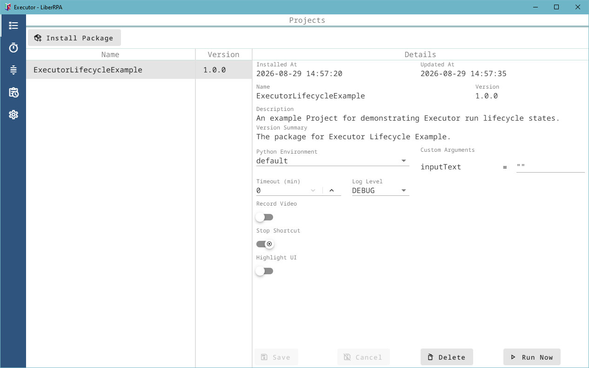
6. Keep the `default` Python Environment unless you have prepared another compatible environment.

## Test Run Outcomes

### Complete a Normal Run

1. In **Projects**, keep `Timeout (min)` set to `0` and click `Run Now`.
2. Enter ordinary text in the dialog and confirm it.
3. Open **Run History**.
   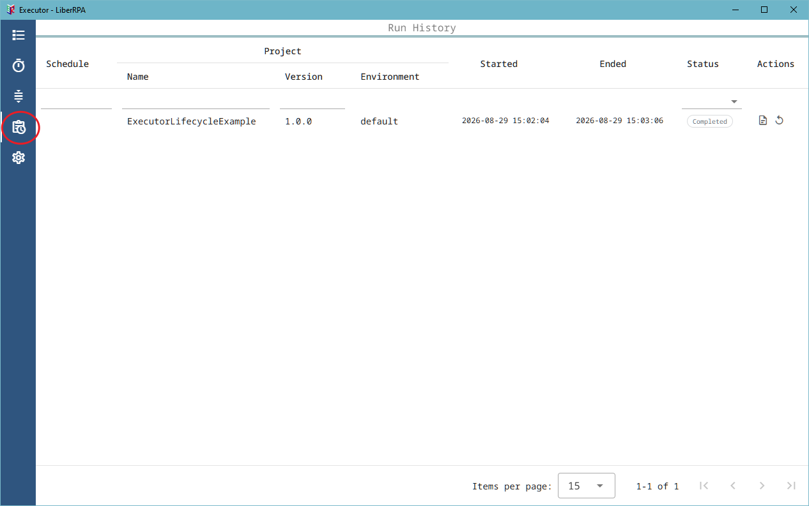
4. Confirm that the status becomes **Completed**.
5. Click `Open Log Folder` in the **Actions** column and inspect the Project log.
   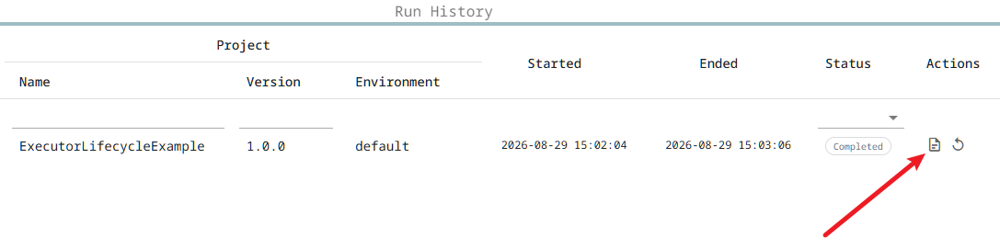

Run the Project again and leave the input empty to observe the other successful Flowchart branch. It also ends with **Completed**.

### Produce an Error

1. Click `Run Now`.
2. Enter:

```text
ERROR
```

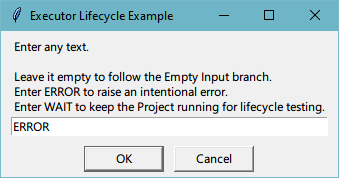

3. Open **Run History** and confirm that the status becomes **Error**.
   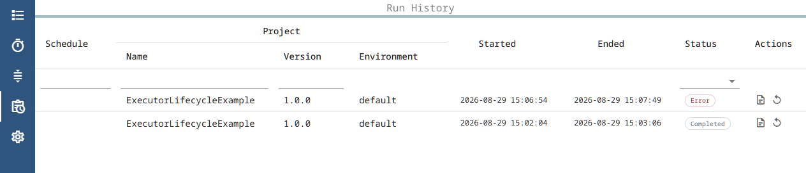
4. Open the Run log folder and review the intentional exception.

### Cancel a Run

1. Click `Run Now`.
2. Keep the Project active by either:
   - leaving the input dialog open; or
   - entering `WAIT`, which runs for about 180 seconds.

   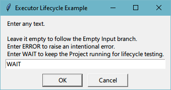
3. While the status is **Running**, click `Cancel Run` in **Run History**.
   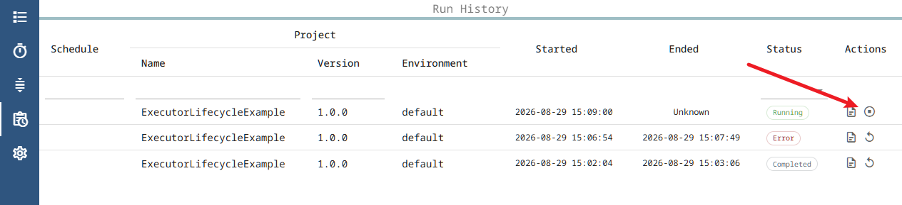
4. Confirm that the final status becomes **Canceled**.
   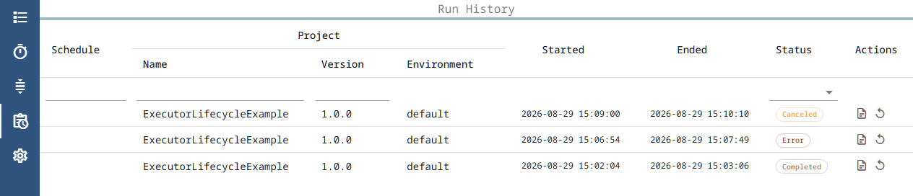

### Test a Timeout

1. In **Projects**, set `Timeout (min)` to `1` and click `Save`.
   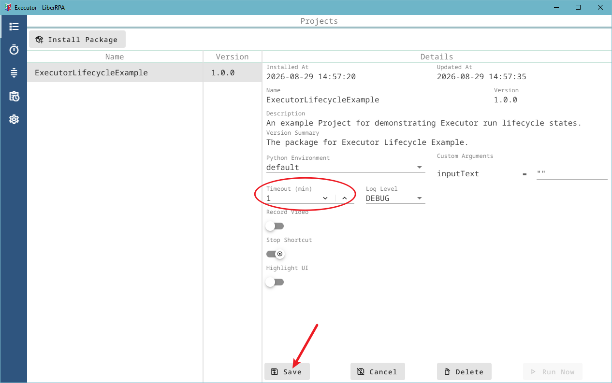
2. Click `Run Now`.
3. Leave the input dialog open or enter `WAIT` so that the Project remains active longer than one minute.
4. Confirm that **Run History** shows **Timed Out** after the limit expires.
   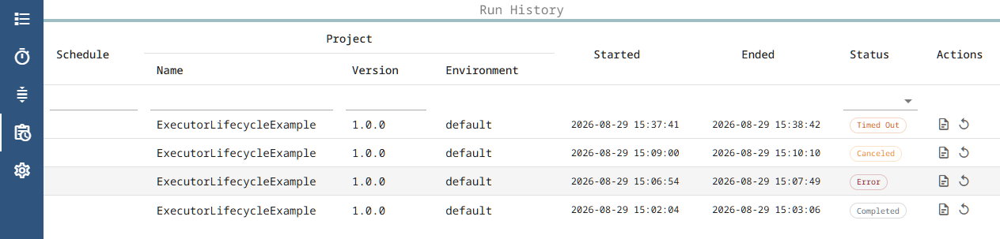
5. Set `Timeout (min)` back to `0` and click `Save` after the test.

### Test Interrupted Recovery (Optional)

Run this test only when no other Executor-managed automation is active.

1. Keep `Timeout (min)` at `0`.
2. Click `Run Now`, enter `WAIT`, and confirm that **Run History** shows **Running**.
3. End `Executor.exe` through Windows Task Manager. Do not use the tray `Exit` action, because normal shutdown finalizes the Run as **Canceled**.
4. Start Executor again.
5. Confirm that the previous Run is now **Interrupted** and its Ended time is `Unknown`.

The example's `WAIT` branch finishes by itself after about 180 seconds. If its Python process remains active after the forced Executor exit, wait for it to finish before continuing with other tests. This procedure demonstrates recovery of Executor's Run History record; it is not a normal shutdown method.

## Create and Edit a Schedule

### Create a Simple Schedule

1. Open **Schedules** and click `New Schedule`.
   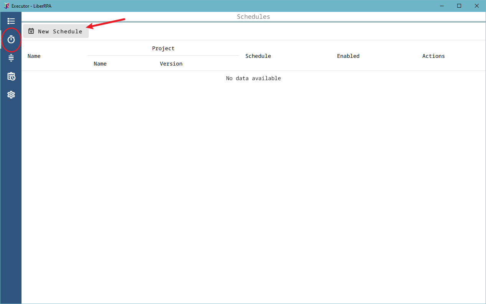
2. Enter a unique Schedule name, for example:

```text
Executor Lifecycle Example
```

3. Select `ExecutorLifecycleExample` and version `1.0.0`.
4. Keep **When Another Run Is Active** set to `Skip This Run` for this first walkthrough.
5. Set **Active From**, **Active Until**, and a Cron Expression that will trigger soon. For a simple test, `* * * * *` triggers once per minute at second `0`. Keep **Active Until** close enough to the test period to avoid repeated dialogs after you finish.
6. Keep **Enabled** on and click `Save`.
   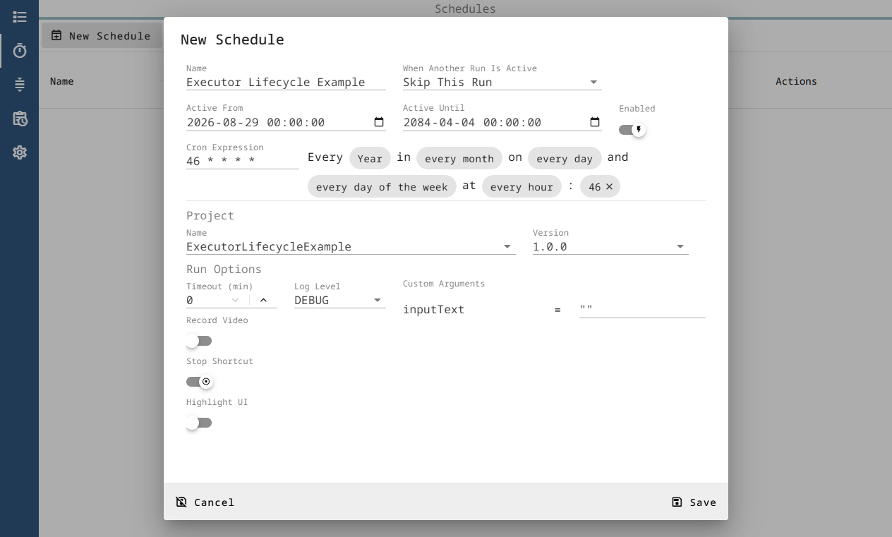
7. Open **Run Queue** and confirm that the next trigger appears as **Pending**.
   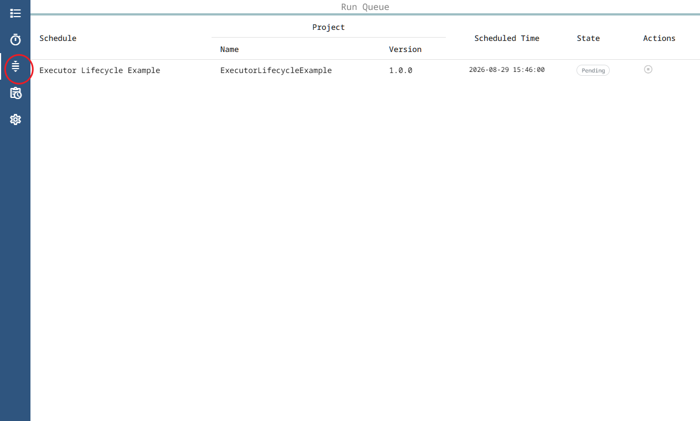

When the Schedule triggers, the example dialog appears. Enter ordinary text to let the scheduled Run complete. The Schedule name is stored in **Run History**.

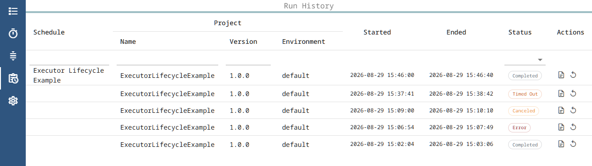

Because this example is interactive, it demonstrates Schedule mechanics rather than a fully unattended automation. See the main [Executor README](./README.md#schedules) for the complete Schedule behavior, including Cron expression formats, Time Zone handling, and the Skip, Wait, and Concurrent policies.

### Observe a Waiting Run (Optional)

1. Edit the Schedule and change **When Another Run Is Active** to `Wait`.
2. Configure the next trigger to occur soon and save the Schedule.
3. Start a manual Run and enter `WAIT` before the Schedule triggers.
4. When the trigger occurs, open **Run Queue** and confirm that a **Waiting** item appears.
5. Either:
   - click `Cancel Waiting Run`; or
   - let the active Run finish, then complete the dialog that appears when the Waiting Run starts.

This demonstrates that a Waiting item is an actual captured Run. It keeps the Project version, Python Environment, Run Options, and Custom Arguments from the trigger time.

### Edit the Schedule

1. Open **Schedules**.
2. Find `Executor Lifecycle Example` and click the `Edit Schedule` pencil icon in the **Actions** column.
   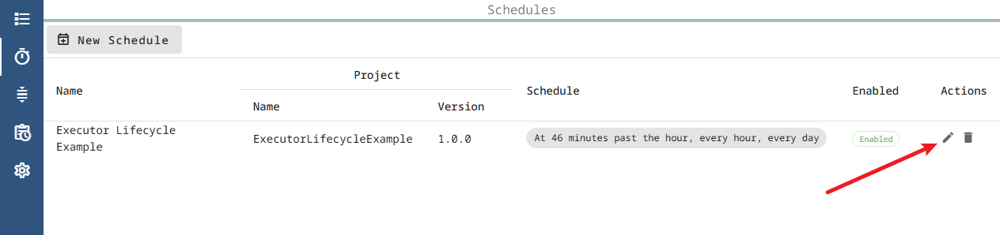
3. Change a setting such as the Cron Expression, active period, Enabled state, conflict policy, or Run Options.
4. Click `Save`.
5. Confirm that the Schedule list reflects the saved settings. If the Schedule remains enabled, **Run Queue** recalculates its next Pending trigger.

## Review the Run Queue and Run History

Use **Run Queue** to inspect Pending and Waiting items. Remember:

- **Pending** is the next calculated future trigger for an enabled Schedule;
- **Waiting** is a trigger that already occurred while another Run was active under the `wait` policy.

In **Run History**:

* type in the filter row below **Schedule**, **Project Name**, or **Project Version**, or select a **Status**;
  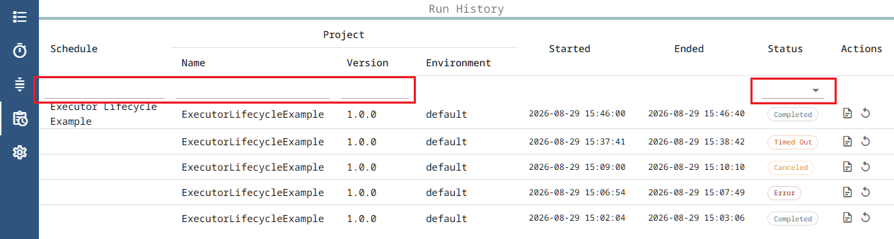
* click a sortable column heading to change the sort order;
* use the table footer to choose the number of rows per page or move between pages;
* open a Run log folder;
* cancel a Running Run;
* run the most recently installed version of the same Project again.
  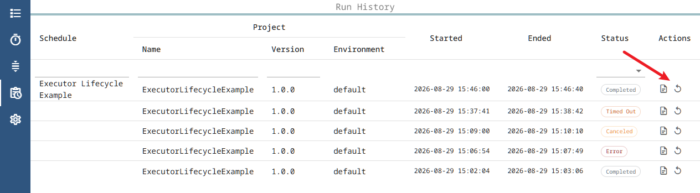

## Clean Up

Delete the example Schedule before deleting the installed Project version. Executor prevents Project deletion while a Schedule uses it or while one of its Runs is starting, running, or waiting.

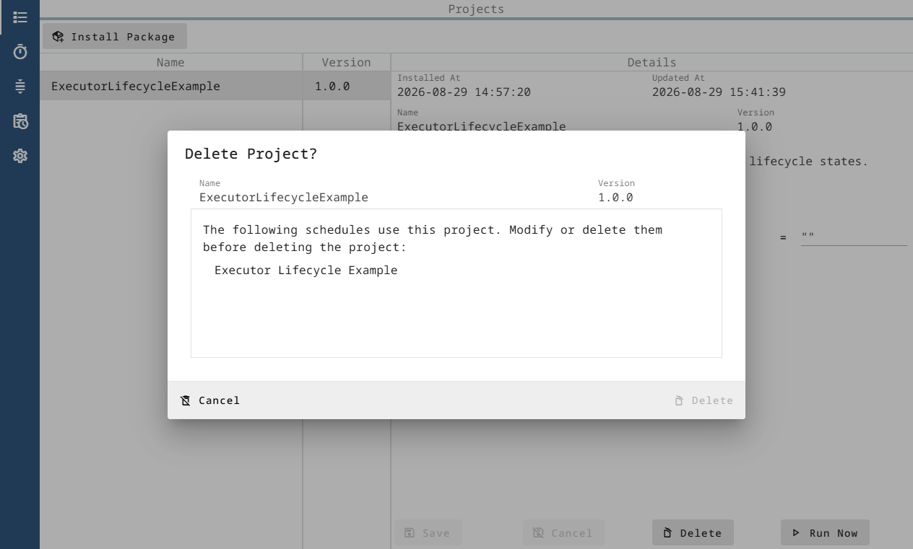

To delete the Schedule:

1. Open **Schedules**.
2. Find `Executor Lifecycle Example` and click the `Delete Schedule` trash-can icon in the **Actions** column.
   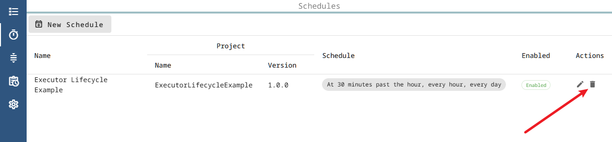
3. Review the confirmation dialog and click `Delete`.
   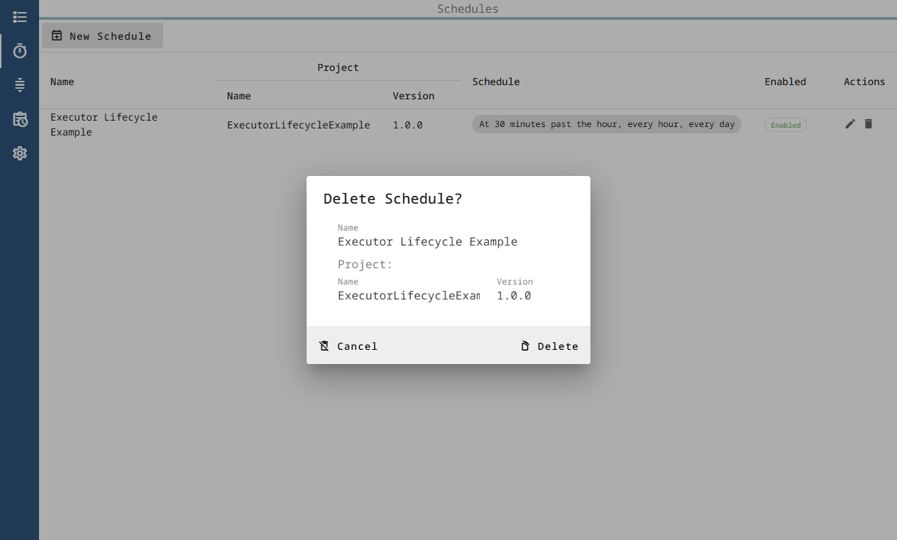
4. Confirm that the Schedule disappears from the list. Its Pending or Waiting Run Queue item is also removed.
   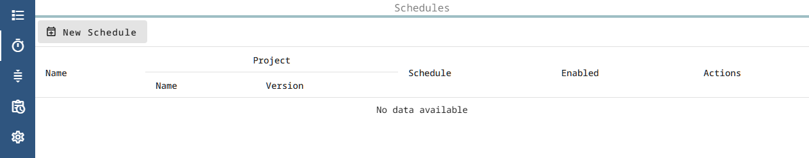
   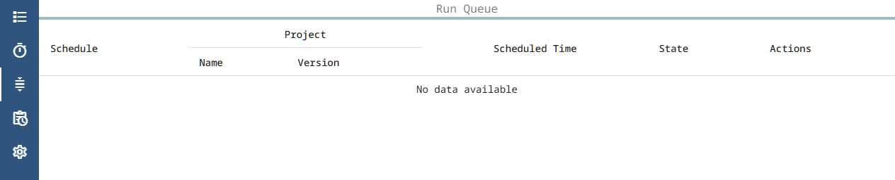

After the Schedule has been removed, delete the installed Project version if it is no longer needed:

1. Return to **Projects** and select `ExecutorLifecycleExample` version `1.0.0`.
2. Click `Delete`, review the confirmation dialog, and confirm the deletion.
   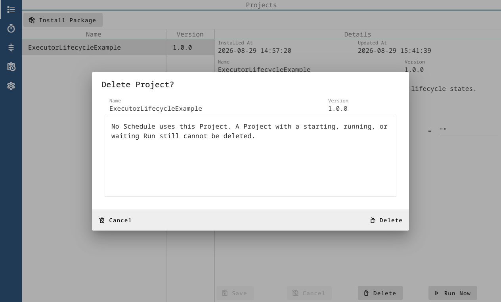
3. Confirm that the Project version disappears from **Projects**.

The same Package can be installed again after the existing `ExecutorLifecycleExample` version `1.0.0` has been deleted.
