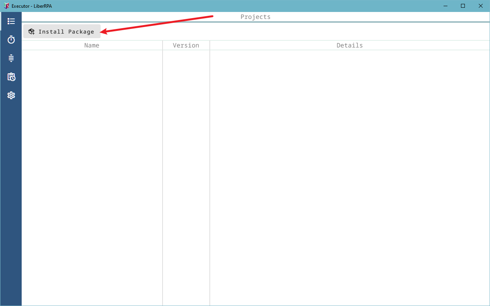
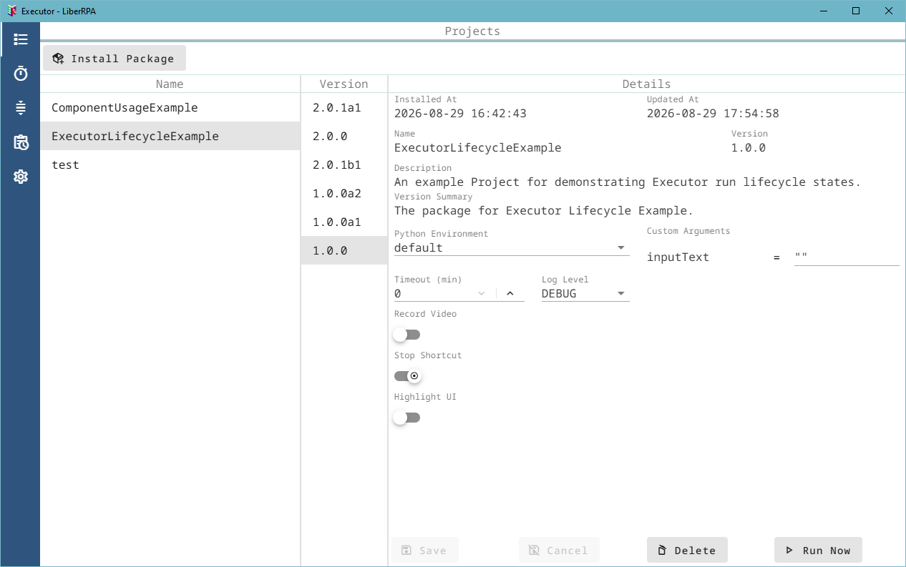
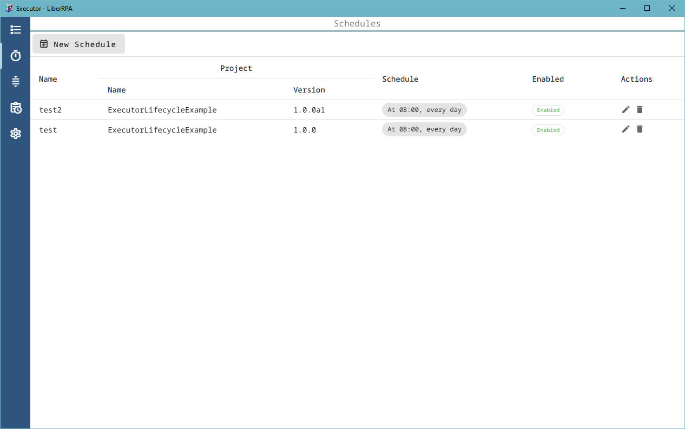
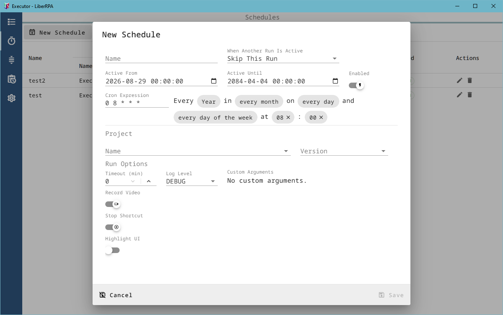
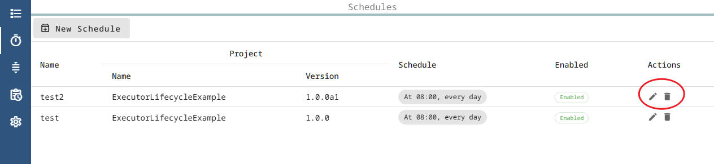
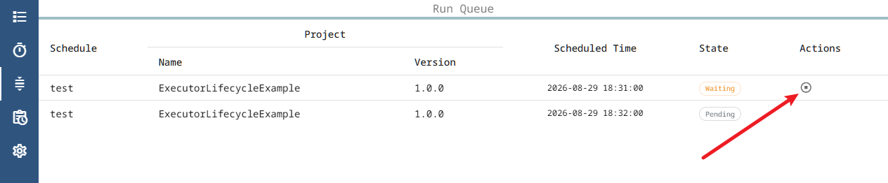
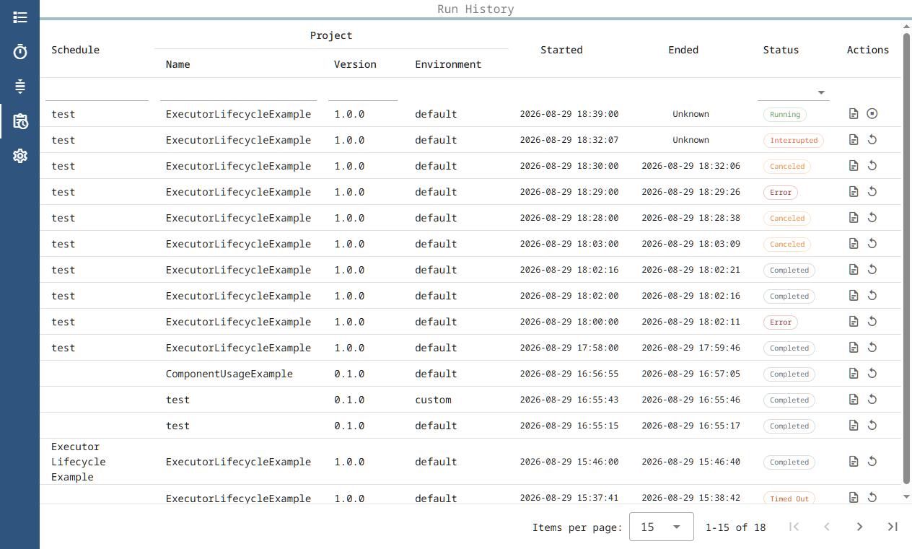
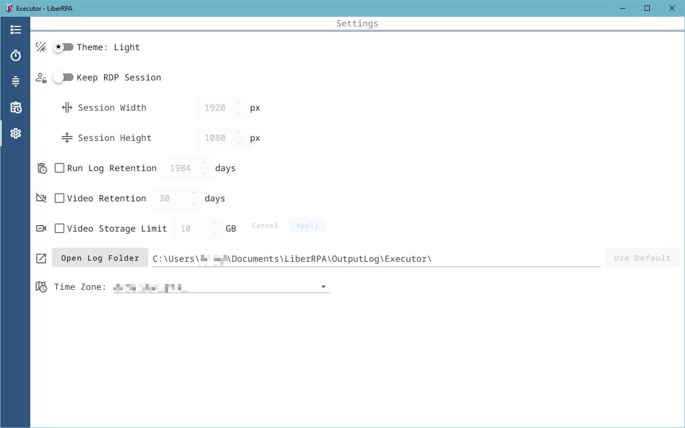

# LiberRPA Executor

**LiberRPA Executor** is the local runtime manager for Flow Project Packages created by [LiberRPA Project Manager](../../vscodeExtensions/liberrpa-project-manager/README.md).

Executor installs versioned `.rpa.zip` Packages and manages:

- per-version Run Settings and Custom Arguments;
- manual Runs;
- Cron-based Schedules;
- Skip, Wait, and Concurrent conflict policies;
- the Run Queue and Run History;
- cancellation, timeouts, logs, recording, and retention;
- an optional Windows RDP Session helper.

Executor does not edit source Projects or resolve Component dependencies. Those operations belong to LiberRPA Editor and Project Manager.

> **Note:**
>
> Screenshots and animations in this document are provided for reference. As LiberRPA evolves, the current interface may differ slightly in appearance or wording, but these minor differences do not affect the documented workflow or functionality.

## Contents

- [Requirements](#requirements)
- [Package Model](#package-model)
- [Main Workflow](#main-workflow)
- [Settings](#settings)
- [Logs and Recording](#logs-and-recording)
- [Example](#example)
- [Data and Recovery](#data-and-recovery)
- [Known Issues](#known-issues)

## Requirements

Run [`InitLiberRPA.exe`](../../docs/Installation.md#initialize-liberrpa) before using Executor. Initialization registers the active LiberRPA root, creates the required user-level data and authentication files, and creates the Executor shortcuts.

The official release already contains the [standard Python environment](../../docs/Environment.md). Executor discovers available environments under:

```text
%LiberRPA%\envs\pyenv\
```

The `default` environment must contain `python.exe`. A custom environment must also contain `python.exe`, use the same `liberrpa` version as `default`, and provide any additional third-party dependencies required by the Project.

Install only Packages created by the current [LiberRPA Project Manager](../../vscodeExtensions/liberrpa-project-manager/README.md#package-a-flow-project).

Executor is Windows-only. Run it as administrator only when:

- a Project must interact with applications running with administrator privileges; or
- **Keep RDP Session** is enabled.

## Package Model

Project Manager creates deployment Packages named like:

```text
<ProjectName>_<Version>.rpa.zip
```

The Project content is stored directly at the archive root. Executor uses the following entries as Package metadata and runtime input:

| Entry                      | Purpose                                                                                               |
| -------------------------- | ----------------------------------------------------------------------------------------------------- |
| `flow.json`              | Project name, version, description, and Component requirements recorded by the source Project.        |
| `.liberrpa-package.json` | Package metadata, including the Version Summary entered during packaging.                             |
| `project.flow`           | Initial Run Options and Custom Arguments.                                                             |
| `_Components/`           | Materialized Component packages used directly at runtime when the Project has Component dependencies. |

Component dependency resolution happens before packaging. Executor does not access the local Component Repository, resolve or repair dependencies, or rebuild `_Components`. Treat the generated Package as an immutable deployment artifact; manual changes may cause installation or execution to fail.

Installing a Package creates a managed directory under:

```text
C:\Users\<UserName>\Documents\LiberRPA\ExecutorPackage\<ProjectName>_<Version>\
```

Multiple versions of the same Project can coexist. Executor does not overwrite an installed name/version pair. After changing Project content, increase `flow.json.version`, create a new Package, and install the new version.

### Package Limits

Executor applies the following limits during installation:

| Item                       |   Limit |
| -------------------------- | ------: |
| `.rpa.zip` archive size  | 512 MiB |
| Total extracted size       |   2 GiB |
| Size of one extracted file | 512 MiB |
| ZIP entries                |  20,000 |

Packages should primarily contain Project code, packaged Components, and reasonably sized runtime resources. Large models, videos, datasets, and other heavyweight resources should normally remain in dedicated storage and be referenced through Project configuration or an absolute storage path.

## Main Workflow

### Window and Tray

Closing the Executor window hides it in the Windows notification area; it does not stop Executor. Schedules, Run Queue processing, active Runs, and retention checks continue while the tray process is running.

Use the tray menu to:

* `Show` the Executor window;
* `Exit` Executor and perform the normal shutdown sequence.

Clicking the tray icon also toggles the window between shown and hidden.

### Install a Package

1. Open **Projects**.
2. Click `Install Package`.
   
3. Select an `.rpa.zip` created by LiberRPA Project Manager.
4. After installation, Executor selects the installed Project name and version automatically.
   

The following metadata is read-only:

- **Installed At**: when this Package version was installed in the current Executor database;
- **Updated At**: when its local Run Settings were last saved;
- **Name**, **Version**, and **Description**: from `flow.json`;
- **Version Summary**: entered when Project Manager created the Package.

Project names and versions are ordered by installation time, with the most recently installed first. Executor does not compare version numbers when ordering these lists.

### Configure and Run a Project

Each installed Project version has its own local Run Settings:

- **Python Environment**;
- **Timeout (min)**: `0` means no limit; maximum `35,791` minutes;
- **Log Level**;
- **Record Video**;
- **Stop Shortcut**;
- **Highlight UI**;
- **Custom Arguments**.

The initial values come from the packaged `project.flow`. Executor displays Custom Argument names as read-only keys. Enter each value as valid JSON; for example, a string must include quotation marks:

```json
"Example text"
```

Executor preserves Custom Argument keys exactly as packaged. Duplicate keys are highlighted as a warning but do not prevent saving or running. At runtime, arguments are applied in their listed order, so the last value with the same key takes effect. Correct duplicate keys in LiberRPA Flowchart and create a new Package when necessary.

For the built-in Run Options and complete Custom Argument rules, see [LiberRPA Flowchart](../../vscodeExtensions/liberrpa-flowchart/README.md#custom-project-arguments).

Use the buttons at the bottom of **Projects**:

- `Save` stores the current local Run Settings;
- `Cancel` restores the saved settings;
- `Delete` removes the selected installed Project version;
- `Run Now` starts the selected Project version immediately.

`Run Now` is disabled while the current settings contain unsaved changes.

A Project version cannot be deleted while:

- one or more Schedules use it;
- one of its Runs is starting or running; or
- one of its Runs is Waiting in the Run Queue.

### Schedules



Open **Schedules** and click `New Schedule`.



A Schedule contains:

* a unique **Name**;
* **Active From** and **Active Until**;
* an **Enabled** switch;
* a **Cron Expression**;
* a Project name and version;
* a Run conflict policy;
* its own Run Options and Custom Arguments.

Selecting a Project version copies its current Run Options and Custom Arguments into the Schedule form. After the Schedule is saved, these values belong to the Schedule and are not automatically changed when the Project Run Settings are edited later.

The Python Environment is not copied into the Schedule. A scheduled Run uses the environment currently selected for its Project version.

#### Cron Expression

Executor uses [`cron-parser`](https://github.com/harrisiirak/cron-parser) to calculate Schedule trigger times.

For common schedules, use the standard 5-field form:

```text
minute hour day-of-month month day-of-week
```

For example:

```cron
*/5 * * * *
```

runs every 5 minutes, with the omitted seconds field treated as second `0`.

The **Cron Expression** field can also use the optional-seconds 6-field form:

```text
second minute hour day-of-month month day-of-week
```

For example:

```cron
*/5 * * * * *
```

runs every 5 seconds.

The visual Cron editor is intended for common 5-field expressions. The text field is the direct Cron string entry, so expressions outside the visual editor's range may still be entered manually. However, the current 0.3.0 form validation and human-readable description do not necessarily cover every advanced expression accepted by `cron-parser`. For predictable behavior, prefer standard 5-field expressions or the optional-seconds 6-field form unless you have verified a more advanced expression in the current build.

The Scheduler calculates the next trigger in advance and keeps only that nearest trigger as **Pending**. Due work is checked at approximately one-second intervals, so Schedule execution is not intended to provide millisecond-level timing. A Schedule generates triggers only within its **Active From** and **Active Until** period.

Cron times are interpreted using Executor's global [Time Zone](#time-zone). Schedules do not store their own time zone. For advanced syntax supported by the execution parser, see the `cron-parser` documentation linked above.

#### Run Conflict Policy

**When Another Run Is Active** controls what happens when a Schedule reaches its trigger time while another Run is starting or running:

| UI value                   | Stored value   | Behavior                                                                       |
| -------------------------- | -------------- | ------------------------------------------------------------------------------ |
| **Skip This Run**    | `skip`       | Skip this trigger. The Schedule remains enabled for later triggers.            |
| **Wait**             | `wait`       | Capture the Run in the Waiting Queue and start it when no other Run is active. |
| **Run Concurrently** | `concurrent` | Start the Run immediately alongside existing Runs.                             |

#### Time Zone

Executor uses one global Time Zone for:

* displayed timestamps;
* Cron evaluation;
* **Active From** and **Active Until**;
* Pending Run calculation.

Schedules do not store separate time zones. Change the global Time Zone in **Settings**. The change recalculates Pending Runs but does not rewrite the stored UTC timestamps of existing Run History records.

#### Edit or Delete a Schedule

Use the icons in the **Actions** column to edit or delete a Schedule. Deleting a Schedule removes its Pending item and any not-yet-executed Waiting Runs from the in-memory queue.



### Run Queue

The **Run Queue** page displays two different kinds of item:

| State             | Meaning                                                                                                |
| ----------------- | ------------------------------------------------------------------------------------------------------ |
| **Pending** | The next calculated future trigger for an enabled Schedule.                                            |
| **Waiting** | A trigger that has already occurred and captured a Run, but is waiting because its policy is `wait`. |

Only Waiting Runs can be canceled. Use `Cancel Waiting Run` in the **Actions** column.



A Waiting Run keeps the Project version, Python Environment, Run Options, and Custom Arguments captured when the Schedule triggered. Editing or renaming the Schedule later does not change that queued Run. Deleting the Schedule removes its Waiting Runs.

> Pending Runs are recalculated when Executor starts and when relevant Schedules or the global Time Zone change. Waiting Runs exist only in memory and are not restored after Executor exits. Schedule triggers missed while Executor is not running are not replayed.

### Run History

The **Run History** page displays manual and scheduled Runs.

- Type in the filter fields below **Schedule**, **Project Name**, or **Project Version**, or select a **Status**. Clear a value to remove that filter.
- Click a sortable column heading to change the sort order.
- Use the table footer to choose `15`, `50`, or `100` rows per page and move between pages.



Run History stores a snapshot of the Schedule name, Project name, Project version, and Python Environment used by the Run. History remains available after the corresponding Project or Schedule is deleted.

| Status                | Meaning                                                                                                                           |
| --------------------- | --------------------------------------------------------------------------------------------------------------------------------- |
| **Running**     | The Project Python process is active.                                                                                             |
| **Completed**   | The Project published successful completion and its Python process exited normally.                                               |
| **Error**       | The Project reported an error, or its Python process exited unexpectedly.                                                         |
| **Canceled**    | The user canceled the Run, or Executor terminated it during a normal shutdown.                                                    |
| **Timed Out**   | The Run exceeded its configured Timeout.                                                                                          |
| **Interrupted** | Executor found a stale**Running** record after an unexpected Executor or system termination. Its Ended time is `Unknown`. |

Available actions include:

* `Open Log Folder` for the selected Run;
* `Cancel Run` while the status is **Running**;
* `Run Most Recently Installed Version` after a Run has ended.

`Run Most Recently Installed Version` selects by installation time, not by version-number comparison.

## Settings

Executor stores its local configuration in:

```text
%LiberRPA%\configFiles\Executor.jsonc
```

Most Settings are saved automatically. Retention changes remain staged until you click `Apply`; click `Cancel` to discard unapplied Retention changes.



### Appearance

Switch between the Light and Dark themes.

### Project Log Folder

The Project Log Folder is the root used for future Run logs.

* Click the path field to select another existing folder.
* Click `Open Log Folder` to open the effective folder.
* Click `Use Default` to follow the `outputLogPath` resolved from `configFiles/basic.jsonc` for Executor.
* Changing this setting does not move existing Run logs.

### Time Zone

Select the global IANA Time Zone used by Executor. A new configuration initially uses the current Windows system time zone when it is available, otherwise `UTC`.

### Keep RDP Session

**Keep RDP Session** is a best-effort Windows helper. After an RDP connection is disconnected, Executor attempts to keep the GUI Session usable, restore the configured resolution for the primary/default display device, and make a minimal mouse movement after 30 seconds of inactivity.

Executor must run as administrator for this option. Behavior may depend on the Windows Session type, display driver, RDP client, and whether multiple users are active. It cannot prevent every type of Session lock.

**Session Width** and **Session Height** configure the target primary/default display resolution after the RDP connection is disconnected. Other displays are not reconfigured by Executor.

### Retention

Retention fields do not change the saved configuration until you click `Apply`. Click `Cancel` to restore the currently saved values. Enabling cleanup or lowering an active threshold displays a confirmation because future cleanup may permanently delete existing logs or videos.

Applying the settings does not start cleanup immediately. Executor checks retention when it starts and every hour while it remains running. Active Runs are excluded.

- **Run Log Retention** deletes complete Run log folders older than the configured number of days. Minimum: 7 days.
- **Video Retention** deletes Run videos older than the configured number of days. Minimum: 1 day.
- **Video Storage Limit** keeps newer videos within the configured total size and deletes older videos after the limit is exceeded. Minimum: 1 GiB.

## Logs and Recording

### Project Run Logs

The Project Python process and `liberrpa` write the normal Project logs, including:

```text
human_read_*.log
machine_read_*.jsonl
```

When **Record Video** is enabled, the Run log folder may also contain:

```text
video_record.mkv
video_record.srt
```

The subtitle file is generated from the human-readable Project log when the required entries are available. Recording captures the primary monitor and is provided by LiberRPA Local Server. See [Execution Recording](../../docs/LocalServer.md#execution-recording) for the recording lifecycle and limitations.

Use **Run History > Open Log Folder** to inspect a specific Run, or **Settings > Open Log Folder** to open the Project Log Folder root.

> **Logging and sensitive information:**
>
> Project logs intentionally include information useful for troubleshooting. `DEBUG` and `VERBOSE` logging can include function calls, Flow transitions, and initial Custom Argument values. The current Python startup also records arguments received from Executor at `INFO` during initialization, before the final Project Log Level is applied.
>
> A less verbose Log Level is not a guarantee that sensitive values will be omitted. Balance diagnostic detail against confidentiality requirements, restrict access to logs and recordings, and inspect them before sharing. Stricter requirements may require customizing the relevant logging statements. See [Flowchart Log Level](../../vscodeExtensions/liberrpa-flowchart/README.md#log-level).

### Executor Diagnostic Log

Executor writes its own diagnostic log below the Built-in Tools output path resolved from `configFiles/basic.jsonc`:

```text
<outputLogPath>/_Executor/YYYY-MM-DD.log
```

Executor continuously consumes Project stdout and stderr so the Python process cannot block on full pipes, but it does not duplicate normal Project output into the Executor diagnostic log. When a Run starts, the log records its Project name, version, full Run ID, and Python process ID. Limited output tails are recorded only for lifecycle failures that the Project logging system may not have captured, such as failure to publish the initial Run state or an unexpected process exit.

## Example

A ready-to-install Package is available at:

[`ExecutorLifecycleExample_1.0.0.rpa.zip`](./Example/ExecutorLifecycleExample_1.0.0.rpa.zip)

See [Executor Lifecycle Example](./ExecutorLifecycleExample.md) for a walkthrough covering Package installation, common Run outcomes, Schedules, the Run Queue, Run History, and logs.

The example is interactive and intended for learning and testing, not unattended production use.

## Data and Recovery

### Data Locations

| Data                        | Location                                                     | Notes                                                                |
| --------------------------- | ------------------------------------------------------------ | -------------------------------------------------------------------- |
| Executor configuration      | `%LiberRPA%\configFiles\Executor.jsonc`                    | Theme, Time Zone, log folder, RDP, and retention settings.           |
| Operational database        | `%USERPROFILE%\Documents\LiberRPA\AppData\ExecutorData.db` | Installed Project metadata, Schedules, and Run History.              |
| Installed Packages          | `%USERPROFILE%\Documents\LiberRPA\ExecutorPackage\`        | Managed extracted Package versions.                                  |
| Temporary Run state         | `%USERPROFILE%\Documents\LiberRPA\ExecutorRunState\`       | Coordination files for active Executor-managed Runs.                 |
| Project logs and recordings | Configured Project Log Folder                                | Stored separately from the Executor database and installed Packages. |

The Waiting Queue exists only in memory and is not part of the database backup.

### Move Executor Data to Another Computer

Close Executor through the tray `Exit` action before copying data.

To preserve installed Projects, Schedules, and Run History, copy:

```text
C:\Users\<UserName>\Documents\LiberRPA\AppData\
C:\Users\<UserName>\Documents\LiberRPA\ExecutorPackage\
```

Copying the complete `AppData` folder keeps `ExecutorData.db` together with SQLite sidecar files such as `ExecutorData.db-wal` and `ExecutorData.db-shm` if they exist.

Copy the configured Project Log Folder separately when historical logs and recordings are also required. On the destination computer, review **Project Log Folder**, **Time Zone**, **Keep RDP Session**, and the available Python Environments before running installed Projects.

### Executor Run State Files

While a Project is running, Python and Executor coordinate through:

```text
C:\Users\<UserName>\Documents\LiberRPA\ExecutorRunState\<RunId>.json
```

Executor normally removes the file after finalizing the Run. An abnormal Executor or system termination may leave stale files. When Executor is closed and no Executor-managed Project is running, stale files in this folder can be removed manually. They do not need to be copied when moving Executor data.

### Reset Executor Settings

Delete:

```text
%LiberRPA%\configFiles\Executor.jsonc
```

Executor recreates it with default values on the next startup. This does not delete installed Packages, Schedules, or Run History.

### Database Schema Updates

When the existing database schema is incompatible with the current Executor schema, Executor renames the previous database and its SQLite sidecar files to:

```text
ExecutorData.backup.<timestamp>.db
```

It then creates a new database. Historical data is not migrated automatically.

### Unexpected Executor Termination

During a normal shutdown, Executor stops Schedule processing and RDP helpers, terminates active Flow Python processes, finalizes their Run History, closes SQLite, and exits.

If Executor terminates unexpectedly and leaves Run History records in the **Running** state, the next startup changes them to **Interrupted**. Their Ended time remains `Unknown` because no reliable completion time is available.

If an Executor-managed Project Python process exits unexpectedly while Executor remains running, Executor finalizes that Run as **Error** instead.

### Disable Start with Windows

Delete the Executor shortcut from:

```text
C:\Users\<UserName>\AppData\Roaming\Microsoft\Windows\Start Menu\Programs\Startup\
```

You can also disable it from the Windows Task Manager **Startup apps** page.

Running `InitLiberRPA.exe` again recreates the standard Executor Startup shortcut.

## Known Issues

* The visual Cron editor is designed for common 5-field expressions. Some advanced expressions supported by `cron-parser` may not be representable or accepted consistently by the current Schedule form validation. Prefer standard 5-field or optional-seconds 6-field expressions unless an advanced expression has been verified in the current build.
* On the **Run Queue** page, row hover highlighting may not display correctly when the Executor window is on a non-primary monitor. Queue data and actions are not affected.
* When using a Hyper-V virtual machine in Enhanced Session mode, **Record Video** may not work correctly:
  * the mouse cursor may not be recorded, especially when the Session is maintained by Executor;
  * recording may stop if the Session is closed manually or replaced by another Session.
