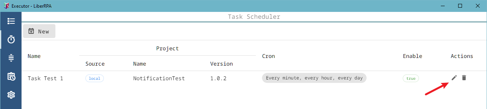

# LiberRPA Executor

**LiberRPA Executor** allows you to import and run packages generated by [LiberRPA Project Manager](../../vscodeExtensions/liberrpa-project-manager/README.md).

You can use it to import a package, then either run it manually or schedule it to run automatically.

> Note: Some sections of the Executor interface are reserved for features related to LiberRPA Console. These features are not yet implemented and will be available once LiberRPA Console is released.

# Usage

## Project Local Package

### Import a Package

On the **Project Local Package** page, Click the `Import` button. A file dialog will open—select a `.rpa.zip` file. The package's data will then appear in Executor, and its code scripts will be stored in: `C:\Users\<username>\Documents\LiberRPA\ExecutorPackage`

### Modify Package Arguments

Click on the `Name` and `Version` of a RPA project to view and edit its details.

### Run a Package

Click the `Run` button to immediately launch the project using the current arguments.

### Delete a Package

Click the `Delete` button, a confirmation dialog will appear.

If any [Task Schedulers](#task-scheduler) depend on this package, remember to update them accordingly.

## Task Scheduler

### Create a New Task Scheduler

On the **Task Scheduler** page, Click the `New` button.

You can configure the task:

* **Task Information**:
  * **Name**: Give the task a short, descriptive name.
  * **When other running**: Choose the strategy when the task should run but another program is running:
    * cancel: Do not run this task.
    * wait: Add to the **[Task Queue](#task-queue)** and run later.
    * run: Run immediately as scheduled.
  * **Datetime Start**, **Datetime End**, **Enable**:
    * Set the time range (`Datetime Start` / `Datetime End`) and `Enable`.
    * The task only runs within this time range and if the `Enable` switch is on.
  * **Cron**:
    * Define when the task should run using a [cron expression](https://en.wikipedia.org/wiki/Cron).
    * You can enter it manually or generate it using the UI tool.
* **Select Project**:
  * **Source**: Currently only `local` is supported. `console` will be added after the LiberRPA Console is released.
  * **Name & Version**: Select a package from the **Project Local Package** list.
  * **Configure arguments**: You can define different arguments for each task.
    * **Timeout**: If set to a non-zero value (in minutes), the process will be forcibly terminated after the timeout.
    * For details on arguments, refer to the [LiberRPA Flowchart](../../vscodeExtensions/liberrpa-flowchart/README.md).

Click `Save` to create the task scheduler.

### Edit or Delete Task Schedulers

Click the buttons in the `Actions` column to `edit` or `delete` tasks.

You can also sort the task scheduler list by click the column headers.

## Task Queue

The **Task Queue** page shows tasks that are waiting to run.

Once a running task ends, Executor checks items in **Task Queue** and run the first task listed.

You can cancel a queued task item using its `cancel` button in `Actions` column.

> Note: The queue is only active while Executor is running. If you close Executor, all items in the Task Queue will be lost.

## Task History

The **Task History** page shows both ended and running tasks.

You can filter them by Task Scheduler Name, Project (Source, Name, Version) and Status.

You can also open a task's log folder, and re-run the **latest imported version** of a project(based on import time, not version number) by clicking its buttons in `Actions` column.

## Setting

The **Setting** page allows you to view and configure Executor settings.

Hover your mouse over each item to see its function.

# Other Notes

* **If Executor was copied from another computer**:

  * Its previous data will not be contained. If you actually need it, you can copy the file `C:\Users\<username>\Documents\LiberRPA\AppData\ExecutorData.db` from the previous computer to the current one.
  * Review the **Setting** page and make sure configurations match your needs - especially `Project Log Folder` and `Time zone`.
  * If you delete the file `<LiberRPA root folder/configFiles/Executor.jsonc>`, Executor will restore default settings on next startup.
* **If you close Executor while tasks are running**:

  * The running programs will be forcefully terminated.
  * Their `End` Time in **Task History** will show as `unknown`.
* **If you don’t want Executor to start with Windows**:

  * Delete the shortcut file at `C:/Users/<username>/AppData/Roaming/Microsoft/Windows/Start Menu/Programs/Startup/`
  * Or disable it by [Task Managers Startup Tab](https://support.microsoft.com/windows/configure-startup-applications-in-windows-115a420a-0bff-4a6f-90e0-1934c844e473).
* **You must run Executor and LiberRPA Local Server as administrator when**:

  * It needs to interact with applications that are running with administrator privileges.
  * The `Keep RDP Session` option is enabled in **Setting**.

# Known Issues

* **When using a Hyper-V virtual machine in Enhanced Session mode**:
  * The `Record Video` functionality may not work correctly:
    * The mouse cursor might not be recorded (especially if the session is maintained by Executor).
    * Recording may stop if the session is closed manually or replaced by another session.
