# UI Analyzer

UI Analyzer is the selector-inspection and selector-authoring tool used by LiberRPA.

It is a separate Electron application that works with **LiberRPA Local Server** to indicate, inspect, edit, and validate automation targets.

UI Analyzer supports four selector categories:

| Selector           | Best suited for                                                                 |
| ------------------ | ------------------------------------------------------------------------------- |
| `SelectorUia`    | Windows applications that expose Microsoft UI Automation information            |
| `SelectorHtml`   | Supported elements in normal Chrome web pages                                   |
| `SelectorImage`  | Screen regions where semantic UIA/HTML information is unavailable or unsuitable |
| `SelectorWindow` | Application-window matching without a more specific child element               |

For HTML indication and validation, the **LiberRPA Chrome Extension** must also be installed, connected, and able to access the target page.

For browser runtime behavior and limitations, see the [Chrome Extension documentation](../../browserExtensions/liberrpa-chrome-extension/README.md).

For the local communication layer used by UI Analyzer, see [LiberRPA Local Server](../../docs/LocalServer.md).

> **Note:**
>
> Screenshots and animations in this document are provided for reference. As LiberRPA evolves, the current interface may differ slightly in appearance or wording, but these minor differences do not affect the documented workflow or functionality.

## Contents

- [Connection Status](#connection-status)
- [Choosing a Selector Type](#choosing-a-selector-type)
- [Indicating Elements](#indicating-elements)
- [Editing Selectors](#editing-selectors)
- [Validating Selectors](#validating-selectors)
- [Element Tree](#element-tree)
- [Other Interface Controls](#other-interface-controls)
- [Selector Reference](#selector-reference)
- [Change Log](#change-log)

---

## Connection Status

UI Analyzer requires LiberRPA Local Server.

If the Local Server is not connected, the window title changes to:

```text
UI Analyzer - No Local Server
```

The icon in the top-right corner also shows the current connection state:


**Connected**


**Not connected**

If the connection is lost after `InitLiberRPA.exe` has been run again, restart UI Analyzer and LiberRPA Local Server so that both use the current local authentication information.

When updating LiberRPA, update the Python library, UI Analyzer, and Chrome Extension together.

Multiple UI Analyzer instances can be opened to compare selectors, but only one instance can run an indication or validation operation at a time. Wait for the active operation to finish before starting another.

Once Local Server detects that an instance has disconnected, it cancels that instance's active operation. Work already in progress may need to return before another instance can start.

---

## Choosing a Selector Type

Prefer the most semantic selector that reliably identifies the target.

A practical order is:

1. **HTML** for supported elements in normal Chrome web pages.
2. **UIA** for Windows applications and browser chrome that expose useful UI Automation information.
3. **Image** when semantic selectors are unavailable or unreliable.
4. **Window** when only the application window itself needs to be identified.

This is not a strict hierarchy. The best selector is the one that remains understandable and stable for the target application.

### HTML vs UIA in Chrome

A Chrome page can expose some information through Windows UI Automation, but HTML indication is usually preferable for normal web-page elements because it works with DOM structure and attributes.

Use UIA when the target is part of the browser UI itself or when HTML automation is not appropriate.

---

## Indicating Elements

UI Analyzer creates selectors by indicating a target and then showing the captured hierarchy and attributes for review.

### Indicate delay

**Indicate delay** waits before the indication operation starts.

Use it when you need time to:

- bring the target application into view;
- switch to another window;
- focus the correct Chrome window and tab.

It is particularly useful for HTML indication because the Chrome Extension operates on the active supported tab in the last-focused normal Chrome window.

`Indicate delay` is not the same as **Match timeout**, which controls selector matching during validation.

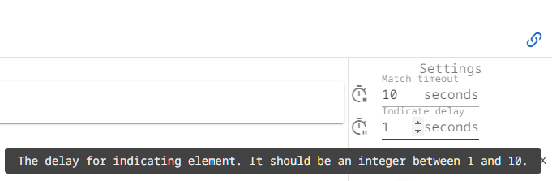

### Minimize UI Analyzer during indication

Enable **Minimize** if UI Analyzer would otherwise cover the target during UIA, HTML, or Window indication, or during validation. UI Analyzer restores itself when the operation finishes, is canceled, or times out.

**Image** indication does not minimize UI Analyzer. Move the window away from the region you want to capture before starting.

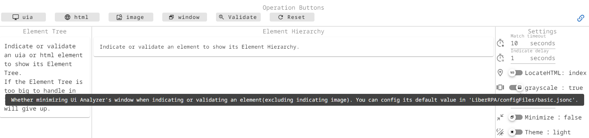

### Indicate UIA Element

Use **UIA** indication for an element that exposes Microsoft UI Automation information.

Single-click the target with the left mouse button.

Press:

```text
Esc
```

to cancel.

After indication starts, UI Analyzer waits for the selection for a limited time. If no target is selected, the operation times out automatically.

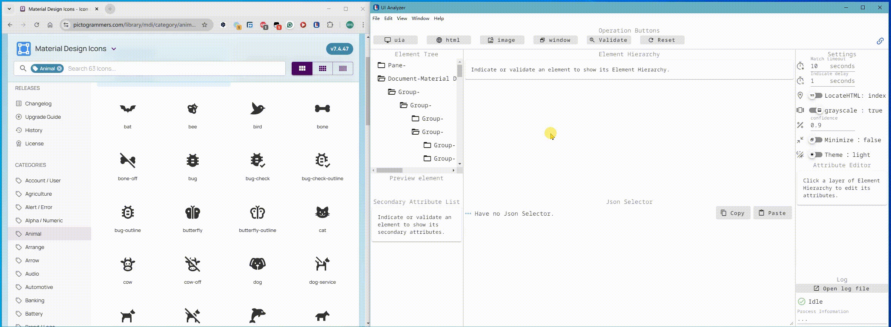

The resulting selector is a [`SelectorUia`](#selectoruia).

UI Analyzer preserves the captured UIA hierarchy and its `Depth` values while selecting a smaller set of attributes by default. `AutomationId` is available as a secondary inspection attribute, not as a generated selector field.

### Indicate HTML Element

Use **HTML** indication for supported elements in a normal Chrome web page.

Requirements:

- LiberRPA Local Server is running;
- Chrome is running;
- LiberRPA Chrome Extension is installed and connected;
- the target page is a supported page that the extension can access.

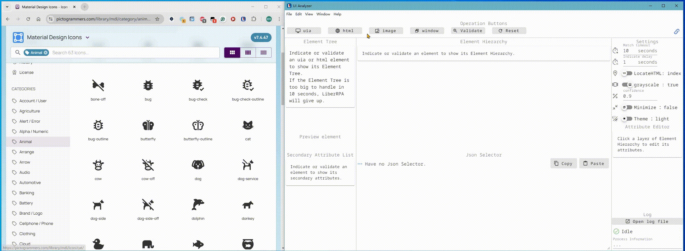

During indication, LiberRPA works with the active supported tab in the last-focused normal Chrome window.

If the target element is outside the viewport, the browser integration can scroll it into view as part of the element operation.

Choose **Index** to use attributes with positional indexes when needed, or **Path** to use a generated CSS path. The default HTML selector uses the final target layer; ancestor layers remain available in Element Hierarchy.

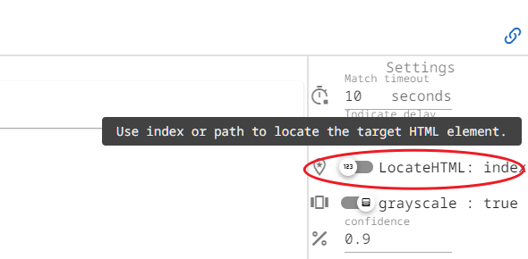

In Index mode, UI Analyzer selects a smaller set of target attributes and includes indexes when needed. In Path mode, it selects `tagName` and `path` by default. Review the result and validate it before using it in an automation.

The resulting selector is a [`SelectorHtml`](#selectorhtml). See that reference for regex, index, and path matching rules.

For iframe, Shadow DOM, restricted-page, `file://`, and other Chrome-specific limitations, see the [Chrome Extension documentation](../../browserExtensions/liberrpa-chrome-extension/README.md#current-limitations).

### Indicate Image Element

Use **Image** indication when UIA and HTML selectors are unavailable or unsuitable.

Once the screen is paused, indicated by a green border around the screen, drag with the left mouse button to select the target region.

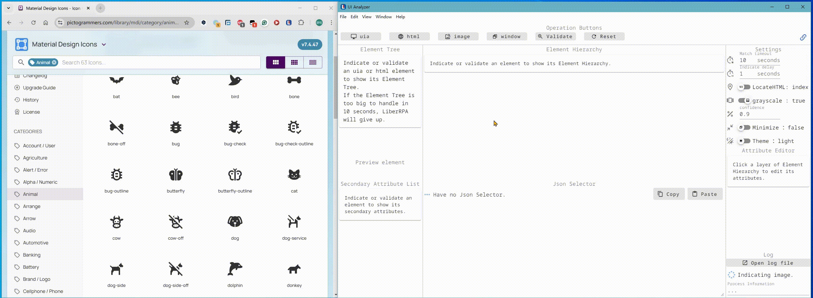

You can configure:

- the default image-matching confidence;
- whether grayscale matching is used.

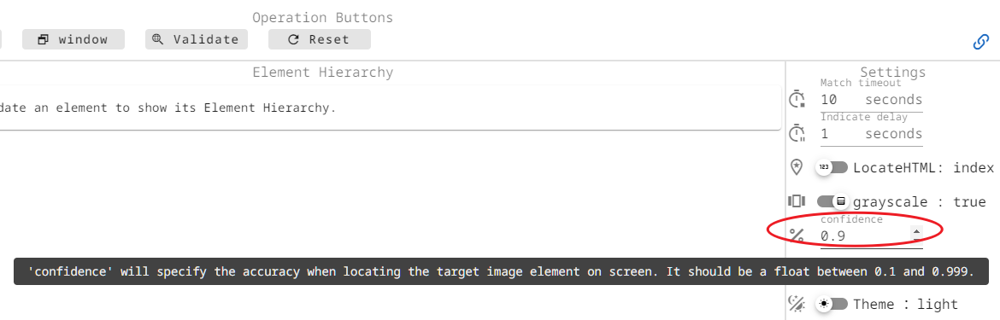

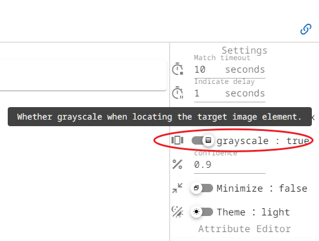

The resulting selector is a [`SelectorImage`](#selectorimage).

The selector stores the PNG filename rather than the image data. When the image is first used by a Python Project, LiberRPA automatically moves the corresponding captured image into the Project's screenshot resources.

Image-based automation is inherently more sensitive than semantic selectors to display scaling, resolution, rendering, and visual changes in the target application.

### Indicate Window Element

Use **Window** indication when the automation needs to identify an application window without selecting a more specific child element.


The resulting selector is a [`SelectorWindow`](#selectorwindow).

Every selector includes a `window` section. UI Analyzer selects a smaller set of window attributes by default; if several windows still match, the result can include an `Index`.

---

## Editing Selectors

After indication, use **Element Hierarchy** and **Attribute Editor** to decide which information should remain in the selector.

UI Analyzer recommends default attribute selections for Window, UIA, and HTML targets. All captured attributes remain available for editing; attributes outside the recommendation are unchecked, not hidden. The recommendation reflects the current target and does not guarantee that a selector will remain stable after the application changes.

Select a hierarchy layer to display its attributes. Changing an attribute or checking or unchecking an attribute or layer regenerates **JSON Selector**.

Indexes depend on the matching attributes and candidate order. After changing attributes on a layer that uses an Index, validate the result and check that it still selects the intended target.

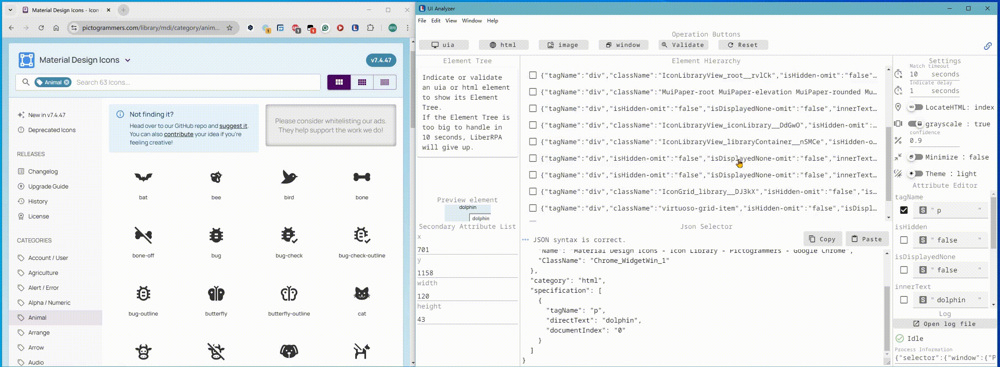

### Prefer stable attributes

A selector should normally use the smallest set of attributes that identifies the intended element reliably.

Prefer values that represent stable application semantics.

For values that change predictably, use a `-regex` field where supported rather than hard-coding a volatile value.

### Edit JSON directly

You can also edit **JSON Selector** directly.

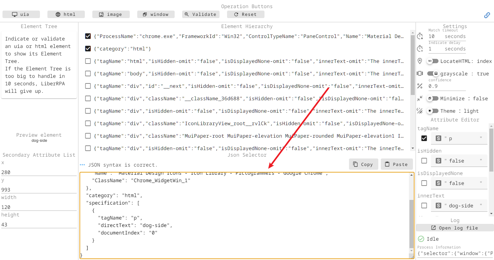

Direct JSON editing accepts:

- standard JSON generated by UI Analyzer;
- JSON-like text with trailing commas, such as selectors copied from Black-formatted Python code.

It does not accept Python syntax such as:

- single-quoted strings;
- `True`, `False`, or `None`;
- `#` comments.

> Direct JSON edits do not update the Attribute Editor representation. Changing an attribute or checking/unchecking a layer afterwards regenerates JSON from Element Hierarchy and replaces the direct JSON edits. Selecting another hierarchy layer only changes which layer is shown in Attribute Editor; it does not regenerate JSON.

Use **Validate** after manual edits.

---

## Validating Selectors

Use **Validate** to test whether the current JSON Selector can locate the intended target.

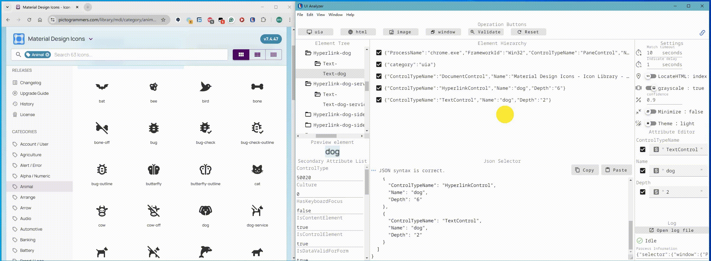

### Match timeout

**Match timeout** controls how long selector validation attempts to find a match.

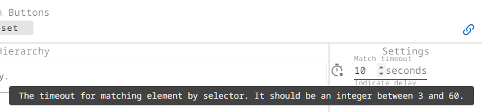

It does not change **Indicate delay**.

If you edit the Selector while validation is running, the returned result is not applied to the edited Selector. Validate the current Selector again.

A red validation result means the Selector is valid, but no matching target was found before the Match timeout. Invalid Selector data, unavailable browser integration, and other operation failures are shown as errors instead of being reported as an ordinary non-match.

Check the highlighted target, not only the validation result: a selector with an outdated Index can match a different element. If matching becomes unreliable, review the window, hierarchy, selected attributes, and index or path values.

---

## Element Tree

The **Element Tree** provides a broader view of elements available under the selected window or target context.

Use the Element Tree to inspect the surrounding hierarchy or select a nearby element without indicating it again. Clicking a tree node replaces the target layers in Element Hierarchy while retaining the current window section.

The Selector may be available before the Element Tree has finished loading. If tree generation fails, the captured Selector remains available for editing and validation.

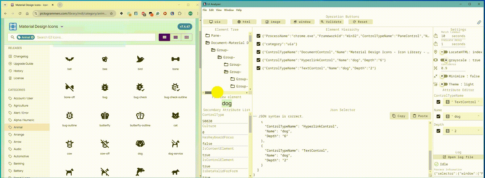

---

## Other Interface Controls

### Secondary Attribute List

The **Secondary Attribute List** displays information collected for inspection or debugging that is not currently used as selector matching data.

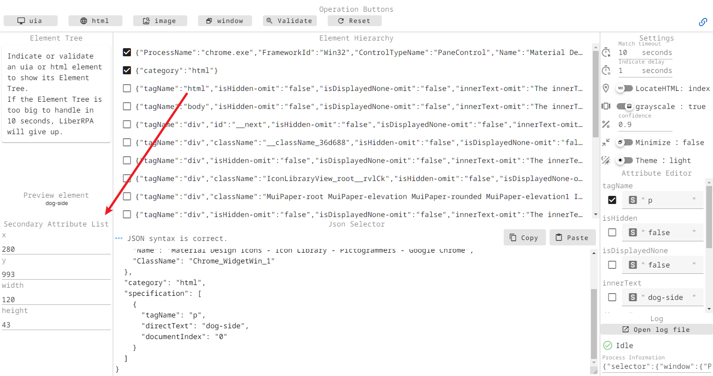

For HTML selectors, screen-position/size values such as `secondary-x`, `secondary-y`, `secondary-width`, and `secondary-height` are examples of secondary information.

### Status

The **Status** area reports the current UI Analyzer operation state.

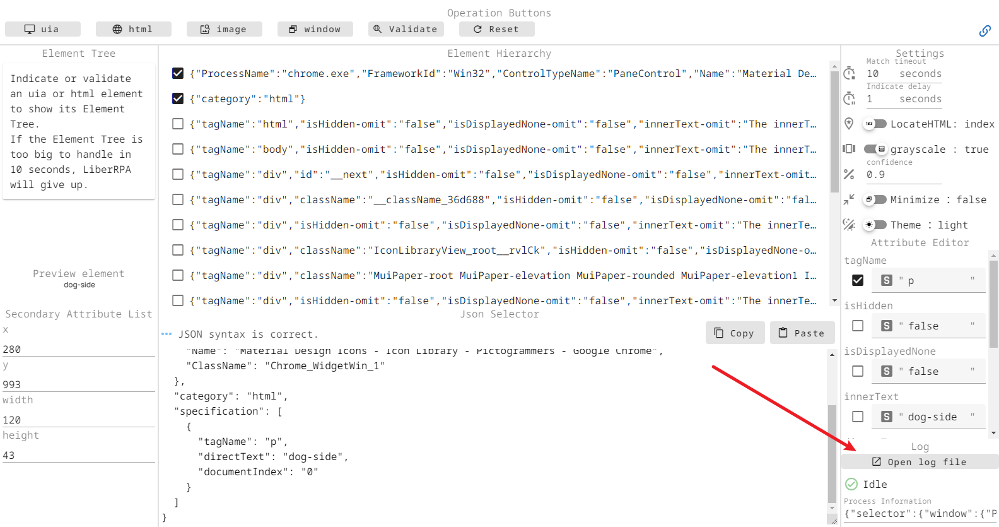

### Reset

Use **Reset** to clear the current selector data and return the UI to its default selector state.

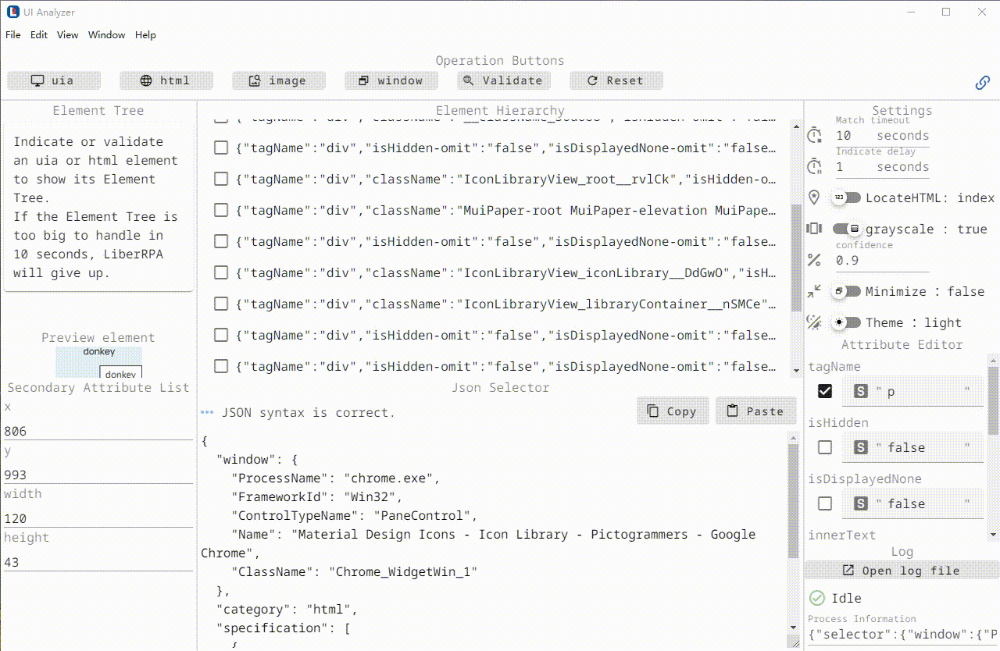

### Resize

The left and right panels can be resized by dragging their dividers.

The main UI Analyzer window can also be resized.


### Theme

Use **Theme** to select the UI Analyzer appearance.

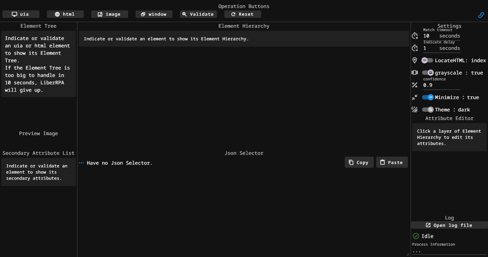

---

## Selector Reference

The selector definitions below are the canonical selector reference for UI Analyzer.

> **Important:** These definitions are simplified pseudo-schemas intended to explain field meanings and structure.
>
> They are not complete runnable JSON, Python `TypedDict`, or TypeScript declarations.
>
> Notations such as `NotRequired[str]` are descriptive only.
>
> Use UI Analyzer to create, edit, and validate real selectors rather than copying the pseudo-schema as executable code.

### SelectorUia

LiberRPA first locates the target window, then searches each layer in `specification` in order.

`Depth` specifies how many UIA levels to search below the previous matched control; when omitted, the search uses one level. `Index` is the zero-based position among matching controls in that search area. Preserve the generated `Depth` when editing attributes, and validate any changed Index.

**Pseudo-schema:**

```text
{
  "window": {
    "ControlTypeName": str,
    "Name": NotRequired[str],
    "Name-regex": NotRequired[str],
    "AcceleratorKey": NotRequired[str],
    "AcceleratorKey-regex": NotRequired[str],
    "AccessKey": NotRequired[str],
    "AccessKey-regex": NotRequired[str],
    "AriaProperties": NotRequired[str],
    "AriaProperties-regex": NotRequired[str],
    "AriaRole": NotRequired[str],
    "AriaRole-regex": NotRequired[str],
    "ClassName": NotRequired[str],
    "HelpText": NotRequired[str],
    "HelpText-regex": NotRequired[str],
    "Index": NotRequired[str],
    "Index-regex": NotRequired[str],
    "FrameworkId": NotRequired[str],
    "FrameworkId-regex": NotRequired[str],
    "ProcessName": NotRequired[str],
    "ProcessName-regex": NotRequired[str]
  },
  "category": "uia",
  "specification": list[
    {
      "ControlTypeName": str,
      "Name": NotRequired[str],
      "Name-regex": NotRequired[str],
      "AcceleratorKey": NotRequired[str],
      "AcceleratorKey-regex": NotRequired[str],
      "AccessKey": NotRequired[str],
      "AccessKey-regex": NotRequired[str],
      "AriaProperties": NotRequired[str],
      "AriaProperties-regex": NotRequired[str],
      "AriaRole": NotRequired[str],
      "AriaRole-regex": NotRequired[str],
      "ClassName": NotRequired[str],
      "HelpText": NotRequired[str],
      "HelpText-regex": NotRequired[str],
      "Depth": NotRequired[str],
      "Index": NotRequired[str],
      "Index-regex": NotRequired[str]
    }
  ]
}
```

**Example:**

```json
{
  "window": {
    "ProcessName": "chrome.exe",
    "FrameworkId": "Win32",
    "ControlTypeName": "PaneControl",
    "Name": "Material Design Icons - Icon Library - Pictogrammers - Google Chrome",
    "ClassName": "Chrome_WidgetWin_1"
  },
  "category": "uia",
  "specification": [
    {
      "ControlTypeName": "ToolBarControl",
      "Name": "Bookmarks",
      "Depth": "5"
    },
    {
      "ControlTypeName": "ButtonControl",
      "Name": "chat"
    }
  ]
}
```

### SelectorHtml

A `SelectorHtml` contains a `window` section and a `specification` list.

The `window` section is used to locate the browser window first. After that, the Chrome extension searches the active web page using the `specification` layers one by one.

Each item in `specification` represents one HTML layer. The search starts from `document`, then each matched layer becomes the search root for the next layer.

In simplified form:

```text
document
  -> match specification[0]
    -> match specification[1] under the previous matched element
      -> ...
        -> final target element
```

Each HTML layer can use three kinds of locating information:

* Basic attributes
* Index attributes
* Path attributes

#### Basic attributes

Basic attributes describe the element itself.

Examples:

```json
{
  "tagName": "button",
  "directText": "Submit"
}
```

```json
{
  "tagName": "input",
  "type": "text",
  "aria-label": "Search"
}
```

Basic attributes include identity and text values such as `id`, `name`, `className`, `aria-label`, and `directText`, as well as state and table attributes. See the pseudo-schema below for the supported fields.

State values such as `value`, `checked`, and `disabled` may change during automation. Use them only when that state is part of what you intend to match.

#### Regex attributes

Most attributes can also be written as a `-regex` field.

For example:

```json
{
  "tagName": "button",
  "directText-regex": "Submit|Save"
}
```

HTML regex fields use JavaScript regular-expression syntax and match the whole attribute value. For example, `Submit|Save` matches `Submit` or `Save`, not `Submit draft` or `AutoSave`.

To match partial text, use `.*` explicitly:

```json
{
  "directText-regex": ".*Submit.*"
}
```

Enter only the pattern string, without JavaScript regex slashes such as `/Submit/`.

#### Index attributes

Index attributes are used when the basic attributes are not enough to uniquely locate an element.

There are two index fields: `childIndex`, `documentIndex`

`documentIndex` is the target element's zero-based position among all elements in the document that match the same selected attributes.

`childIndex` is the target element's zero-based position among matching descendant elements under the target element's parent search area.

It is not limited to direct children.

A `childIndex` value of `"0"` is treated as unnecessary and ignored during matching.

> Index values start from `0`. However, `0` is usually omitted because the first matched element is already selected by default. Index fields are most useful when the target is the second, third, or later matching element.

**Example:**

```json
{
  "tagName": "button",
  "directText": "Delete",
  "documentIndex": "2"
}
```

Index fields also support regex:

```
{
  "tagName": "button",
  "directText": "Delete",
  "documentIndex-regex": "[1-3]"
}
```

An index depends on the other matching attributes. Changing those attributes or the page structure can change which element occupies that index; validate the intended target after editing.

#### Path attributes

When `usePath` is enabled, a `path` field will be generated for each HTML selector layer.

Generated paths are absolute CSS paths that start from `html` and use tag names plus `:nth-of-type()` where needed.

**Example:**

```json
{
  "path": "html>body>div:nth-of-type(2)>button"
}
```

There is also a regex version:

```json
{
  "path-regex": "html>body>.*>button"
}
```

Do not combine `path` / `path-regex` with `childIndex` / `documentIndex` in the same layer. They are different fallback strategies. A layer should normally use either path-based locating or index-based locating, not both.

A generated path beginning with `html` is resolved from the document. In a multi-layer selector, its result must still be a descendant of the previous matched element. A relative path is resolved under the previous matched element. Every `path` value must be a valid CSS selector.

In most cases, users should prefer stable attributes such as `id`, `name`, `aria-label`, text attributes, or index-based locating. Path-based locating is mainly a fallback when normal attributes are not reliable enough.

#### Secondary attributes

Some generated attributes are secondary information and are not used as selector fields:

```text
secondary-x
secondary-y
secondary-width
secondary-height
```

These values describe the element's screen position and size. They are useful for display, preview, debugging, or UI Analyzer panels, but they are not part of the HTML selector matching logic.

#### Recommended selector editing workflow

Start with stable identity attributes and use `-regex` for predictable changes. Add an index or path only when the simpler selector is insufficient, then validate the highlighted target. See [Editing Selectors](#editing-selectors) for the relationship between Attribute Editor and direct JSON edits.

---

**Pseudo-schema:**

```text
{
  "window": {
    "ControlTypeName": str,
    "Name": NotRequired[str],
    "Name-regex": NotRequired[str],
    "AcceleratorKey": NotRequired[str],
    "AcceleratorKey-regex": NotRequired[str],
    "AccessKey": NotRequired[str],
    "AccessKey-regex": NotRequired[str],
    "AriaProperties": NotRequired[str],
    "AriaProperties-regex": NotRequired[str],
    "AriaRole": NotRequired[str],
    "AriaRole-regex": NotRequired[str],
    "ClassName": NotRequired[str],
    "HelpText": NotRequired[str],
    "HelpText-regex": NotRequired[str],
    "Index": NotRequired[str],
    "Index-regex": NotRequired[str],
    "FrameworkId": NotRequired[str],
    "FrameworkId-regex": NotRequired[str],
    "ProcessName": NotRequired[str],
    "ProcessName-regex": NotRequired[str]
  },
  "category": "html",
  "specification": list[
    {
      "tagName": NotRequired[str],
      "tagName-regex": NotRequired[str],
      "id": NotRequired[str],
      "id-regex": NotRequired[str],
      "className": NotRequired[str],
      "className-regex": NotRequired[str],
      "type": NotRequired[str],
      "type-regex": NotRequired[str],
      "value": NotRequired[str],
      "value-regex": NotRequired[str],
      "name": NotRequired[str],
      "name-regex": NotRequired[str],
      "aria-label": NotRequired[str],
      "aria-label-regex": NotRequired[str],
      "aria-labelledby": NotRequired[str],
      "aria-labelledby-regex": NotRequired[str],
      "checked": NotRequired[Literal["true", "indeterminate", "false"]],
      "checked-regex": NotRequired[str],
      "disabled": NotRequired[Literal["true", "false"]],
      "disabled-regex": NotRequired[str],
      "href": NotRequired[str],
      "href-regex": NotRequired[str],
      "src": NotRequired[str],
      "src-regex": NotRequired[str],
      "alt": NotRequired[str],
      "alt-regex": NotRequired[str],
      "isHidden": NotRequired[Literal["true", "false"]],
      "isHidden-regex": NotRequired[str],
      "isDisplayedNone": NotRequired[Literal["true", "false"]],
      "isDisplayedNone-regex": NotRequired[str],
      "innerText": NotRequired[str],
      "innerText-regex": NotRequired[str],
      "directText": NotRequired[str],
      "directText-regex": NotRequired[str],
      "parentId": NotRequired[str],
      "parentId-regex": NotRequired[str],
      "parentClass": NotRequired[str],
      "parentClass-regex": NotRequired[str],
      "parentName": NotRequired[str],
      "parentName-regex": NotRequired[str],
      "isLeaf": NotRequired[Literal["true", "false"]],
      "isLeaf-regex": NotRequired[str],
      "tableRowIndex": NotRequired[str],
      "tableRowIndex-regex": NotRequired[str],
      "tableColumnIndex": NotRequired[str],
      "tableColumnIndex-regex": NotRequired[str],
      "tableColumnName": NotRequired[str],
      "tableColumnName-regex": NotRequired[str],
      "childIndex": NotRequired[str],
      "childIndex-regex": NotRequired[str],
      "documentIndex": NotRequired[str],
      "documentIndex-regex": NotRequired[str],
      "path": NotRequired[str],
      "path-regex": NotRequired[str]
    },
  ]
}
```

**Example:**

```json
{
  "window": {
    "ProcessName": "chrome.exe",
    "FrameworkId": "Win32",
    "ControlTypeName": "PaneControl",
    "Name": "Material Design Icons - Icon Library - Pictogrammers - Google Chrome",
    "ClassName": "Chrome_WidgetWin_1"
  },
  "category": "html",
  "specification": [
    {
      "tagName": "p",
      "directText": "dolphin",
      "documentIndex": "0"
    }
  ]
}
```

### SelectorImage

LiberRPA first locates the target window, then searches the single image layer in `specification`.

**Pseudo-schema:**

```text
{
  "window": {
    "ControlTypeName": str,
    "Name": NotRequired[str],
    "Name-regex": NotRequired[str],
    "AcceleratorKey": NotRequired[str],
    "AcceleratorKey-regex": NotRequired[str],
    "AccessKey": NotRequired[str],
    "AccessKey-regex": NotRequired[str],
    "AriaProperties": NotRequired[str],
    "AriaProperties-regex": NotRequired[str],
    "AriaRole": NotRequired[str],
    "AriaRole-regex": NotRequired[str],
    "ClassName": NotRequired[str],
    "HelpText": NotRequired[str],
    "HelpText-regex": NotRequired[str],
    "Index": NotRequired[str],
    "Index-regex": NotRequired[str],
    "FrameworkId": NotRequired[str],
    "FrameworkId-regex": NotRequired[str],
    "ProcessName": NotRequired[str],
    "ProcessName-regex": NotRequired[str]
  },
  "category": "image",
  "specification": list[
    {
      "FileName": str,
      "Grayscale": str,
      "Confidence": str,
      "Index": NotRequired[str]
    }
  ]
}
```

**Example:**

```json
{
  "window": {
    "ProcessName": "chrome.exe",
    "FrameworkId": "Win32",
    "ControlTypeName": "PaneControl",
    "Name": "Material Design Icons - Icon Library - Pictogrammers - Google Chrome",
    "ClassName": "Chrome_WidgetWin_1"
  },
  "category": "image",
  "specification": [
    {
      "FileName": "Material Design Icons - Icon Library - Pictogrammers_20250222_144024.png",
      "Grayscale": "true",
      "Confidence": "0.9"
    }
  ]
}
```

### SelectorWindow

A `SelectorWindow` contains only the `window` section and does not have a `specification` section.

**Pseudo-schema:**

```text
{
  "window": {
    "ControlTypeName": str,
    "Name": NotRequired[str],
    "Name-regex": NotRequired[str],
    "AcceleratorKey": NotRequired[str],
    "AcceleratorKey-regex": NotRequired[str],
    "AccessKey": NotRequired[str],
    "AccessKey-regex": NotRequired[str],
    "AriaProperties": NotRequired[str],
    "AriaProperties-regex": NotRequired[str],
    "AriaRole": NotRequired[str],
    "AriaRole-regex": NotRequired[str],
    "ClassName": NotRequired[str],
    "HelpText": NotRequired[str],
    "HelpText-regex": NotRequired[str],
    "Index": NotRequired[str],
    "Index-regex": NotRequired[str],
    "FrameworkId": NotRequired[str],
    "FrameworkId-regex": NotRequired[str],
    "ProcessName": NotRequired[str],
    "ProcessName-regex": NotRequired[str]
  }
}
```

**Example:**

```json
{
  "window": {
    "ProcessName": "chrome.exe",
    "FrameworkId": "Win32",
    "ControlTypeName": "PaneControl",
    "Name": "Material Design Icons - Icon Library - Pictogrammers - Google Chrome",
    "ClassName": "Chrome_WidgetWin_1"
  }
}
```

---

## Change Log

LiberRPA components are versioned and documented together.

See the unified [Change Log](../../docs/CHANGELOG.md).
