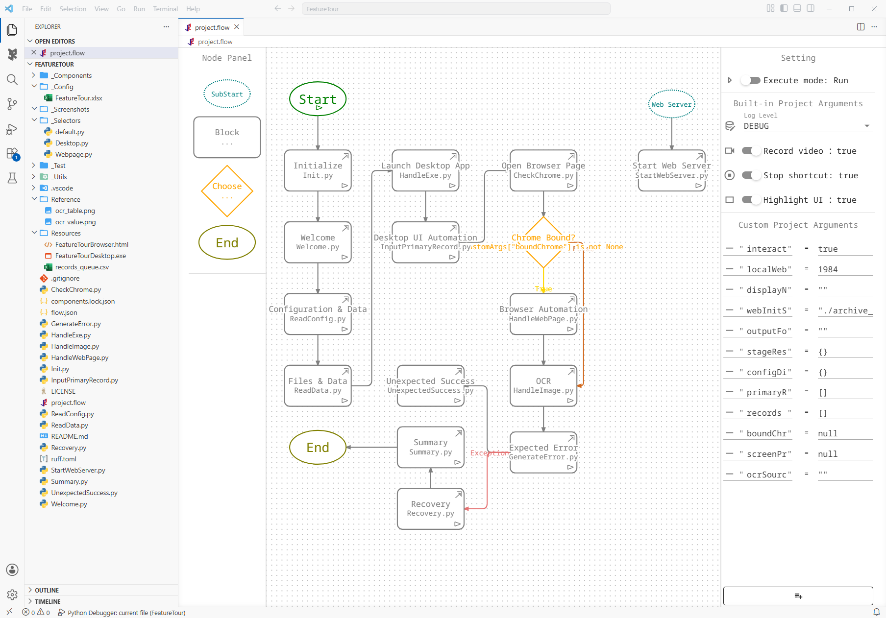

# LiberRPA Feature Tour

> **Visualize the process. Code the logic.**

FeatureTour is a downloadable, editable Flow Project that demonstrates representative LiberRPA development in one local workflow. It combines Excel configuration, CSV processing, Windows UI Automation, Chrome automation, OCR, Components, Custom Project Arguments, logging, and Flow-level exception recovery.

The tour normally completes in a few minutes. With `interactive=false`, the automation itself can finish much faster; the guided run takes longer depending on how much time you spend reading the dialogs and inspecting each stage.

[Download FeatureTour.zip](https://sourceforge.net/projects/liberrpa/files/examples/FeatureTour.zip/download)

`FeatureTour.zip` contains the source Flow Project. Extract it and open it in LiberRPA Editor; it is not an Executor `.rpa.zip` deployment Package.

## Requirements

Before running the example, prepare:

- an initialized LiberRPA 0.3.x environment and the bundled Editor;
- Microsoft Excel;
- TCP port `1984`, or another available value for the `localWebPort` Custom Project Argument.

For Browser Automation, also prepare:

- Google Chrome as the system default browser;
- the [LiberRPA Chrome Extension](../../browserExtensions/liberrpa-chrome-extension/README.md) installed and enabled.

Chrome is optional for the overall tour. If LiberRPA cannot bind to it, the Browser stage is recorded as `SKIPPED` and OCR uses bundled reference images instead.

The example uses a local web page and local files. It does not depend on a public website or an external account.

## Run the Tour

1. Download and extract `FeatureTour.zip`.
2. Open the extracted `FeatureTour` folder in LiberRPA Editor.
3. Open `project.flow`.
4. In the Flowchart settings, set `interactive` to `true` for the guided dialogs, or keep it `false` for an uninterrupted run.
5. Press `Ctrl+F5` to run the complete Flow, or `F5` to debug it.

The extracted Project already contains its resolved `_Components` folder and `components.lock.json`.



## Workflow

```text
                         Web Server (SubStart)
                                  │
                                  ▼
                         Start local server
                                  │
                                  ▼
                        Create readiness file

Start
  │
  ▼
Initialize
  │
  ▼
Welcome
  │
  ▼
Configuration & Data
  │
  ▼
Files & Data
  │
  ▼
Launch Desktop App
  │
  ▼
Desktop UI Automation
  │
  ▼
Open Browser Page
  │
  ▼
Chrome Bound?
 ┌┴────────────────┐
True              False
 │                  │
 ▼                  │
Browser Automation  │
 └─────────┬────────┘
           ▼
          OCR
           │
           ▼
    Expected Error
      │          │
 Exception    Normal
      │          │
      ▼          ▼
  Recovery   Unexpected Success
      │
      ▼
   Summary
      │
      ▼
     End
```

The Flow uses all five node types supported by the Flowchart: `Start`, `SubStart`, `Block`, `Choose`, and `End`. It also demonstrates Normal, True, False, and Exception Lines.

Video recording is enabled by default. After the Flow finishes, LiberRPA Local Server take additional time to compress the recording. This step can use significant CPU, especially for longer recordings or on lower-performance systems.

## Flowchart and Python Blocks

The Flowchart stores the high-level route: major stages, branching, a subprocess, and exception handling. Each Block points to a normal Python file whose `main()` function implements the detailed work.

This follows the same division described in the main LiberRPA README: **the flowchart is a map, not the programming language**.

The Project also shows [Managed Imports](../../vscodeExtensions/liberrpa-snippets-tree/README.md#managed-imports) at the top of each Block. Snippets Tree can insert LiberRPA or Component code and maintain the corresponding imports, while the resulting file remains ordinary Python source.

## Configuration and Data

Separating editable configuration from input data is common in medium- and high-complexity RPA Projects.

FeatureTour uses:

```text
_Config/FeatureTour.xlsx
→ Project settings and review rules

Resources/records_queue.csv
→ records to process

ReadData.py
→ ordinary Python that applies the rules
```

`ExcelHelper` reads the workbook into dictionaries. `DataHelper` removes whitespace from Request IDs. `ReadData.py` then classifies each record as `Ready` or `Review` and selects the record identified by `PrimaryRequestId` for the desktop stage.

The rule result affects later automation:

- `Ready` records can be processed automatically;
- `Review` records remain visible in the data but are skipped by Browser Automation.

## Desktop UI Automation

FeatureTour launches `Resources/FeatureTourDesktop.exe`, waits for its window, and enters the selected record.

The form demonstrates several interaction methods that are commonly combined in desktop RPA:

- direct element text input;
- simulated mouse clicks;
- keyboard input;
- clipboard paste;
- UI Automation combo boxes and list items;
- checkbox state control;
- reading and comparing a dynamic status value.

The selectors are stored under `_Selectors/` and can be inspected or validated with [UI Analyzer](../../electronApplications/ui-analyzer/README.md). The Block closes the desktop target after submission and records `Desktop UIA` as `PASS` or `ERROR` in the final summary.

## Browser Automation

The local web page is served from the Project itself, so the example does not depend on a public site.

When Chrome is available, LiberRPA uses HTML selectors to fill the form, select a Ministry, and submit only the records classified as `Ready`. Records classified as `Review` are skipped.

The browser stage then:

1. captures the first Official-value cell for the small OCR example;
2. captures the complete result table for positioned OCR;
3. sends `Ctrl+S` to Chrome;
4. handles Chrome's native Windows Save As dialog;
5. verifies the saved path through `Browser.get_download_list()` and the local filesystem.

The Save As operation also demonstrates a real transitive Component call:

```text
FeatureTour
→ ChromeHelper
  → KeyboardHelper
```

The HTML page is automated through DOM selectors, while the Save As window is handled as a native Windows interface. This combination is common in browser-based RPA work.

If Chrome cannot be bound, the Flow follows the False branch around Browser Automation and continues to OCR.

## OCR

FeatureTour prepares two OCR images in the current Output folder. Browser Automation overwrites them with live element screenshots when it succeeds; otherwise, the copies from `Reference/` remain in place.

The OCR Block demonstrates:

- `OCR.get_text()` on a small image containing one value;
- `OCR.get_text_with_position()` on the table image, returning recognized text and coordinates.

LiberRPA runs EasyOCR locally on the CPU. The first OCR call may take several seconds while the model initializes.

OCR is inherently less reliable than structured DOM or UI Automation selectors. The same image, model, and parameters should normally produce consistent results, but the live screenshots used by FeatureTour can differ with display scaling, font rendering, browser layout, system theme, and other environment settings.

For that reason, FeatureTour performs only a simple OCR result check and records the outcome in `summary.json` instead of treating every recognition mismatch as a fatal Project error.

Advanced users can train an EasyOCR recognition model and register the resulting model with LiberRPA for specialized use cases. Model training is outside the scope of this example.

## Components and Managed Dependencies

FeatureTour declares four direct Component requirements in `flow.json`:

- `DataHelper`;
- `ExcelHelper`;
- `LogHelper`;
- `ChromeHelper`.

[Project Manager](../../vscodeExtensions/liberrpa-project-manager/README.md#manage-components-in-a-project) resolves the complete dependency closure and records it in `components.lock.json`. `KeyboardHelper` appears in the lock file and `_Components/` because `ChromeHelper` depends on it, even though FeatureTour does not declare it directly.

```text
flow.json
→ direct version requirements

components.lock.json
→ exact resolved versions and integrity information

_Components/
→ materialized Python packages used by the Project
```

Component management is an example of **Integrated RPA tooling. Ordinary Python.** It provides version constraints, locking, integrity checks, transitive resolution, and materialization, while the calling code still uses normal Python imports.

## Custom Project Arguments

`project.flow` declares both user-configurable inputs and shared runtime state.

| Purpose              | Examples                                                         |
| -------------------- | ---------------------------------------------------------------- |
| Run options          | `interactive`, `localWebPort`                                |
| Shared Project state | `outputFolder`, `configDict`, `records`, `primaryRecord` |
| Runtime objects      | `boundChrome`, `screenPrintObj`                              |
| Results              | `ocrSource`, `stageResults`                                  |

Blocks read and update these values through `CustomArgs`. This avoids requiring a separate state module only to share Project-level data between MainProcess Blocks.

A `SubStart` runs in another Python process, so later in-memory changes are not automatically synchronized with MainProcess. FeatureTour uses a small readiness file where cross-process coordination is required.

## Exception Recovery

`GenerateError.py` intentionally reads the `RecoveryCase` worksheet, where `RevisionMode` is declared twice. `ExcelHelper` raises a `KeyError` for the duplicate configuration key.

The Block does not catch that error. The Flow runtime stores it in `PrjArgs.errorObj` and follows the Exception Line to `Recovery.py`, which confirms that the expected error occurred.

The Normal Line leads to `UnexpectedSuccess.py`. That Block raises an error if the duplicate-key validation unexpectedly succeeds, preventing the test from silently passing through the wrong path.

An `ERROR` entry for the duplicate key is expected in the runtime log. The final summary should report:

```text
Error Recovery: PASS
```

To stop at the original exception while debugging, enable `User Uncaught Exceptions` under `Run and Debug → BREAKPOINTS`. After inspection, press `F5` so the Flow can continue through the Exception Line. See [Flowchart — Execute Mode](../../vscodeExtensions/liberrpa-flowchart/README.md#execute-mode) for details and debugger caveats.

## SubStart and Process Coordination

FeatureTour uses a `SubStart` process to host the local HTTP server. MainProcess removes any stale readiness file and waits until the server has bound its port and created a new signal.

```text
MainProcess                         SubStart process
-----------                         ----------------
remove stale signal
                                    bind 127.0.0.1:<port>
                                    create readiness signal
wait for the signal
continue initialization
```

This is a more advanced Project design, not a requirement for ordinary automation. Most Projects do not need a subprocess. `SubStart` becomes useful when a complex automation needs auxiliary work to run in a separate process while the main Flow retains explicit control over readiness and failure handling.

## Ordinary Python Development

A Block remains a normal Python module with a normal `main()` function. Several FeatureTour Blocks include representative Project state under:

```python
if __name__ == "__main__":
    ...
```

This allows those Blocks to be run or debugged independently. A production Project can also use normal Python tools such as Pylance, Ruff, pytest, unittest, and compatible third-party libraries.

## Logs, ScreenPrint, and Summary

The example presents run information at three levels:

- guided dialogs introduce each major stage when `interactive` is `true`;
- ScreenPrint shows short status messages during automation;
- the runtime log records detailed calls, Flow transitions, subprocess names, input data, OCR positions, and exceptions.

Each run creates:

```text
Output/<timestamp>/
├── OfficialRecord.html    # Browser Automation succeeded
├── ocr_table.png
├── ocr_value.png
└── summary.json
```

`summary.json` is the final stage-by-stage result. Browser unavailability is reported as `SKIPPED`. Environment-sensitive comparisons, including OCR, can be reported as `ERROR` without necessarily becoming an unhandled Project exception.

## Files to Inspect

A practical reading order is:

1. `project.flow` — high-level process and paths;
2. `ReadConfig.py` and `ReadData.py` — configuration and business rules;
3. `InputPrimaryRecord.py` — desktop interaction methods;
4. `CheckChrome.py` and `HandleWebPage.py` — optional Chrome automation and Save As;
5. `flow.json`, `components.lock.json`, and `_Components/` — direct and transitive Components;
6. `HandleImage.py` — OCR text and positions;
7. `GenerateError.py`, `Recovery.py`, and `UnexpectedSuccess.py` — Exception Line behavior;
8. `Summary.py` — final results.

The example is intentionally direct. It keeps the automation steps visible and easy to inspect rather than introducing production-scale domain models or abstraction layers. Real Projects can apply stricter typing, reusable business models, formal test suites, and additional structure as required.

## Scope

FeatureTour is a development example. It does not cover Executor lifecycle outcomes, Schedules, Run Queue behavior, or Run History. Those scenarios belong to the separate [Executor Lifecycle Example](../../electronApplications/executor/ExecutorLifecycleExample.md).
