# LiberRPA Flowchart

If the images are not displayed, [view this README on GitHub](https://github.com/HUHARED/LiberRPA/blob/main/vscodeExtensions/liberrpa-flowchart/README.md).

This extension is a part of LiberRPA to manage the overall flow of an RPA project, including project arguments and settings.

> **Note:**
>
> Screenshots and animations in this README are provided for reference. As LiberRPA evolves, the current interface may differ slightly in appearance or wording, but these minor differences do not affect the documented workflow or functionality.
>
> For example: Icon has become  from  .

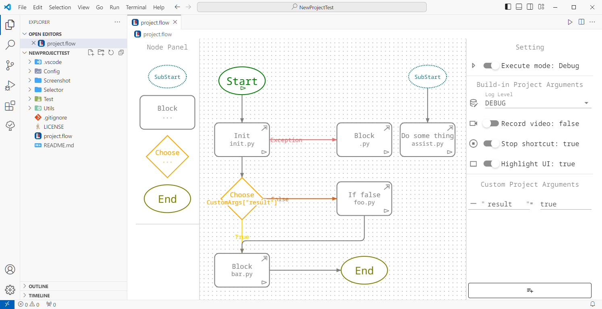

The `project.flow` file (in JSON format) contains:

* Flowchart information(nodes and lines)
* Project setting
* Built-in project arguments
* Custom project arguments

LiberRPA Flowchart is implemented as a [VS Code custom editor](https://code.visualstudio.com/api/extension-guides/custom-editors), so you can also open project.flow with the text editor and use features such as [VS Code Timeline](https://code.visualstudio.com/docs/sourcecontrol/overview#_timeline-view):

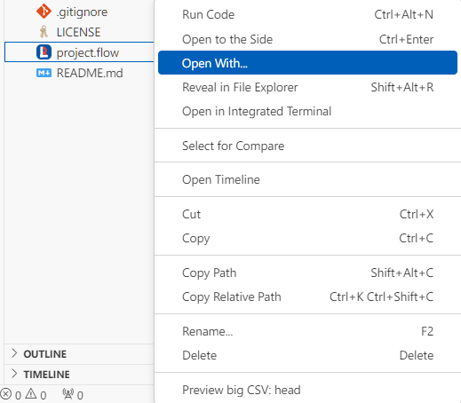

# Usage

## Set File Icon(optional)

1. Press `Ctrl+Shift+P` to open the Command Palette.
2. Execute the command `Preferences: File Icon Theme`
3. Select **VSCode Great Icons with LiberRPA Flowchart File**

This ensures that `.flow` files can display the correct icon.

> Note: This is purely a UI enhancement, the project will work correctly even if you skip this step.

## Manage Nodes and Lines

When you click or hover a node, four anchors appear.

Drag an anchor to another node to create a new line.

Ensure that the connection follows the [Link Rules](#link-rules).

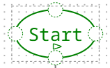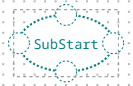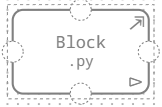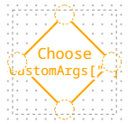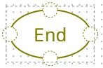

### Start Node

* **Purpose:**
  The unique Start node initiates the entire project. It can't be deleted.
* **Execution:**
  Click the `⊳` icon within the Start node to execute the whole project in a  **Python MainProcess** .

### SubStart Node

* **Create:**
  Drag a SubStart node from **Node Panel** into the middle area. This creates a new **subprocess** when the project executes.
* **Error Handling:**
  If a subprocess encounters an uncaught exception, it will exit without affecting the MainProcess.
* **Configuration:**
  Click the SubStart node to open **Node Info** panel where you can modify its description.
  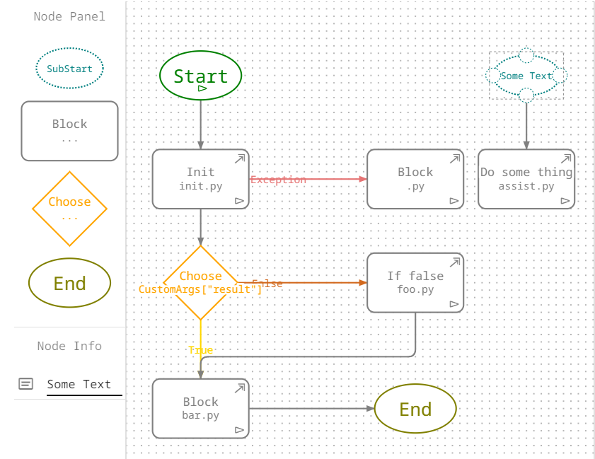

### Block Node

* **Create:**
  Drag a Block node from **Node Panel** into the middle area, then update its description and set the corresponding Python file path.
  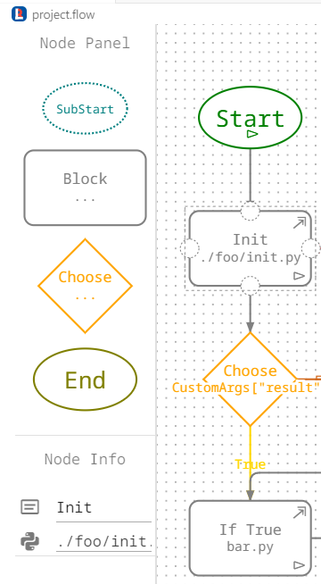
* **Python File Path Rules:**

  * Must be a relative path to a `.py` file.
  * The filename may contain only:

    * English letters (`a-z`, `A-Z`)
    * Numbers (`0-9`) (but cannot start with a number)
    * Underscores(`_`)
  * Use `"/"` as the folder separator.
  * The `"./"` prefix is optional.
  * Avoid risky Python module names:

    * The top-level file or folder name must not conflict with Python standard-library modules or reserved LiberRPA module names.
    * The Flowchart editor validates the path and displays an error when a risky module name is detected.

> ⚠️ Note: The Python file must have a `main` function because when you click `⊳` in the Start node to execute the whole project, LiberRPA will run the `main` function in each Block node's Python file.

* **File Creation:**
  Click  in a Block node to open the corresponding Python file, If the file does not exist, LiberRPA will create it and add a default script.
* **Execution:**
  Click  `⊳` in a Block node to Execute the corresponding Python file.
* **Connection Nodes:**
  Drag from a Block node to create either a **Common-line**(default) or an **Exception-line** (if a Common-line exists).

  * When the whole project executing, if the Block node's Python script runs successfully, LiberRPA follows the Common-line.
  * If an uncaught exception occurs, it follows the Exception-line.
    The exception will be stored in a global object `PrjArgs.errorObj`, [see more detail](https://github.com/HUHARED/LiberRPA/tree/main/condaLibrary#global-objects).
  * If neither lines is connected, an End node is executed automatically.
    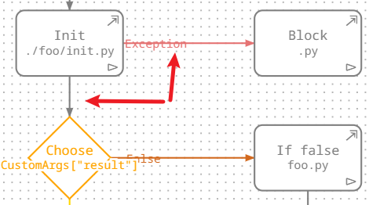

### Choose Node

* **Create:**
  Drag to create a Choose node and modify its description and condition. The condition will be evaluated using [eval()](https://docs.python.org/3/library/functions.html#eval).

  * When referring values in **Custom Project Argument**, use `CustomArgs["valueName"]`.
    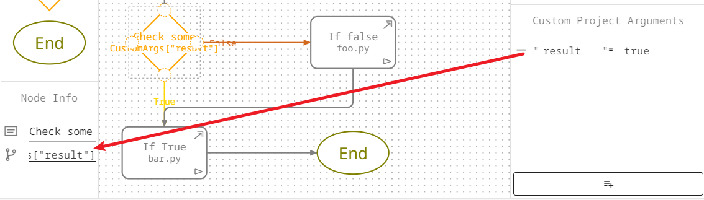
* Connection Nodes:
  Drag from a Choose node to create either a **True-line**(default) or a **False-line** (if a True-line exists).

  * When the whole project executing, if the condition is evaluated to `True`, the True-line is followed.
  * Otherwise, the False-line is used.
  * If neither lines is connected, an End node is executed automatically.
    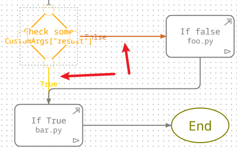

### End Node

* **Purpose:**
  Connecting any node to an End node will terminate the process when executing the whole project.
* **Behavior:**

  * For a  **MainProcess** , the entire program exits.
  * If a node has no connected next node, LiberRPA will automatically execute an End node.

### Link Rules

LiberRPA will check the rules when you attempt to create a new line.

If a rule is broken, an alert will appear.

* Nodes cannot link to a Start or SubStart node.
* A node cannot link to itself.
* Cannot create a connection from the same source anchor to the same target anchor.
* The next node of Start or SubStart node can only be a Block or Choose node.
* Start and SubStart node can only have one outgoing line.
* An End node cannot have outgoing lines.
* A Block node can have up to 2 outgoing lines(Common-line and Exception-line).
* A Choose node can  have up to 2 outgoing lines(True-line and False-line).

## Shortcuts for Node

| Shortcut      | Action                   |
| ------------- | ------------------------ |
| `Ctrl+C`    | Copy the selected node   |
| `Ctrl+V`    | Paste the copied node   |
| `Ctrl+Z`    | Undo                     |
| `Ctrl+Y`    | Redo                     |
| `Backspace` | Delete the selected node |
| `Delete`    | Delete the selected node |

## Setting

### Execute Mode

The `Execute Mode` setting controls how the Flow Project is executed when the `Start Node` is clicked:

- **Run**: Executes the Block or Flow Project without the Python debugger.
- **Debug**: Executes with the Python debugger enabled, allowing breakpoints, stepping, variable inspection, and other debugging features.

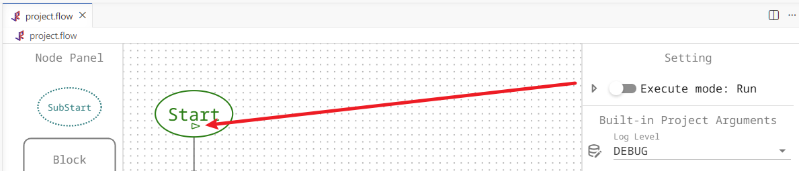

The setting does not affect the standard execution shortcuts. - When `project.flow` is the active editor, the entire Flow Project can also be executed with the standard VS Code shortcuts:

- **F5**: Debug the Flow Project.
- **Ctrl+F5**: Run the Flow Project without debugging.

These shortcuts apply only when `project.flow` is active. In Python editors, the normal VS Code/Python shortcut behavior is preserved.

When debugging an entire Flow Project, Block or Component exceptions may be caught by the Flow runtime so that the Flow can continue through an Exception Line.

To pause at the original exception location in this situation, open `Run and Debug → BREAKPOINTS` and enable `User Uncaught Exceptions`.

For normal Flow debugging, `Raised Exceptions` is not recommended because it may also pause on exceptions that are intentionally raised and handled internally.

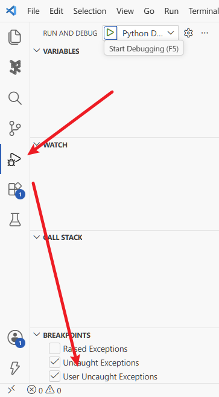

### Log Level

LiberRPA sets the log level (using `Log.set_level()`) according to the configuration when a project or Block node starts.

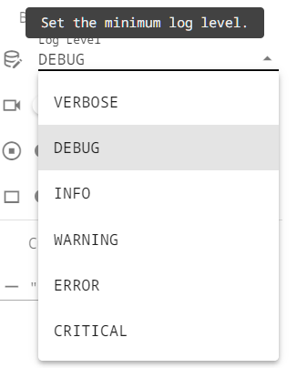

### Record Video

You can enable it to save an execution video(`video_record.mkv`) in the corresponding log folder.

The functionality relies on **[LiberRPA Local Server](https://github.com/HUHARED/LiberRPA?tab=readme-ov-file#liberrpa-local-server)**.

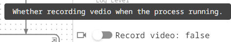

LiberRPA Local Server will also create a subtitle(`video_record.srt`) file for the video, generated automatically from  `human_read_MainProcess.log`.

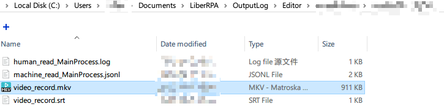

For log folder path configuration, see [Configuration](https://github.com/HUHARED/LiberRPA?tab=readme-ov-file#configuration).

### Stop Shortcut

If enable, when the whole project is running (not applicable for a single Block node), you can press `Ctrl+F12` to stop it forcibly.

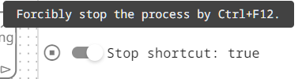

### Highlight UI

If enable, LiberRPA will briefly highlight the target elements before manipulating them.

It applies to most functions within the modules `Mouse`, `Keyboard`, `Window`, and `UiInterface`.

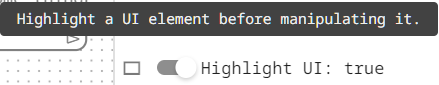

## Custom Project Arguments

You can define project arguments in **Custom Project Arguments** area.

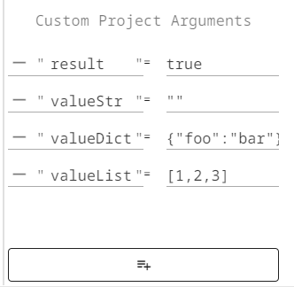

Each argument consists of a string key and a JSON-deserializable value.

Press Enter or leave the input field to apply a key or value change. Pressing
`Ctrl+S` while the input is still focused saves only the last applied value; it
does not apply the text currently being edited.

### Key

The key is stored as a string. It does not need to be a valid Python identifier.

The input field displays surrounding double quotes. You edit only the string content inside the quotes. JSON string escaping rules apply, so backslashes and double quotes must be escaped when necessary.

Empty-string keys are allowed.

Duplicate keys are also allowed while editing. The Flowchart highlights duplicate keys as a warning. At runtime, the last value with the same key takes effect.

### Value

The value must be JSON-deserializable. Supported values include strings, numbers, booleans, `null`, arrays, and objects.

### Using Custom Arguments in Python

Custom argument completions are provided by  **LiberRPA Snippets Tree** .

When editing a Python file, type `CustomArgs` or one of the following forms to display the available keys:

```
CustomArgs
CustomArgs[
CustomArgs["
CustomArgs['
```

The completion list is generated from the current `project.flow` document, including changes that have not yet been saved to disk.

Selecting a completion also adds `CustomArgs` to the LiberRPA managed import block when necessary.

For example:

```
customer_name = CustomArgs["customerName"]
```

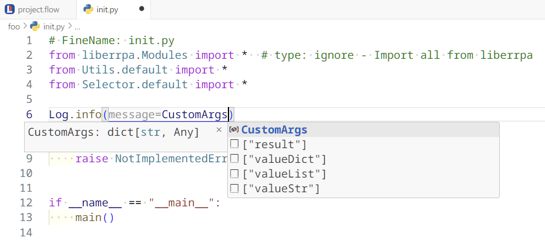

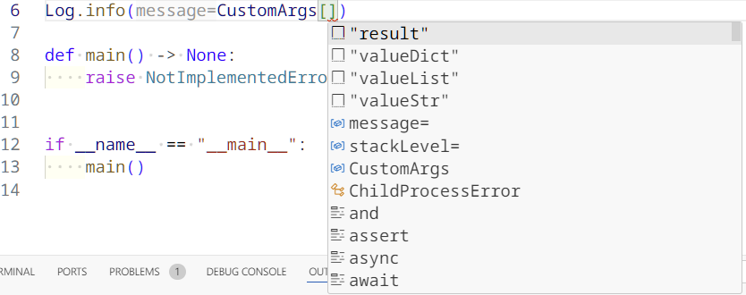

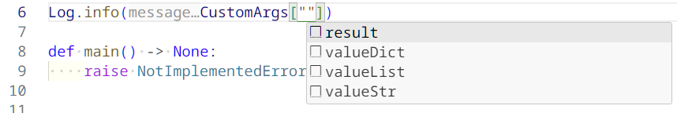

## Resize

Adjust the width of the right panels by dragging the divider.

This allows for wider input boxes so that you can view more content.

If you need to edit extensive content, it may be more convenient to edit it elsewhere and then paste it here.

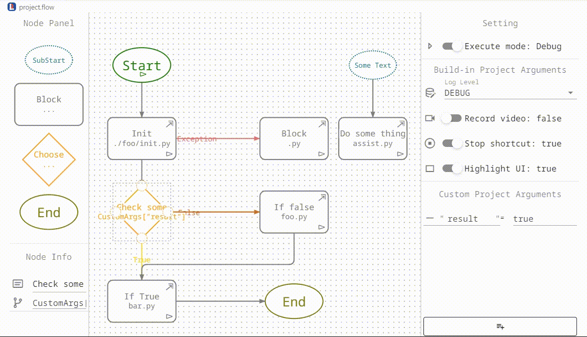

# Known Issues

* Drag a node from Node Panel may occasionally fail.
* Shortcuts for node may unresponsive.

> Known issues about occasional drag failure and unresponsive shortcuts have been improved by avoiding repeated LogicFlow initialization and duplicated drag event listeners.
>
> If drag or shortcuts still feel unstable, click the flowchart canvas once to refocus it.

* Text in a node and inputbox can't display optimally if it is not very short, due to the nodes and inputboxes all have a limited width.
* Flow Project debugging may not stop on Block exceptions
  * When debugging an entire Flow Project, exceptions raised by a Block or Component may be caught by the LiberRPA Flow runtime so that the Flow can continue through an Exception Line. Because the exception is handled by the runtime, VS Code may not pause at the original error location by default.
  * To pause on these exceptions, open `Run and Debug` **→** `BREAKPOINTS` and enable `User Uncaught Exceptions` for the Python debugger.
  * `Raised Exceptions` is not recommended for normal Flow debugging because it also pauses on exceptions that are intentionally raised and handled internally by Python, third-party libraries, or LiberRPA.
