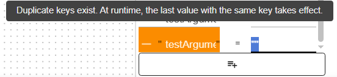

# LiberRPA Flowchart

If the images are not displayed, [view this README on GitHub](https://github.com/HUHARED/LiberRPA/blob/main/vscodeExtensions/liberrpa-flowchart/README.md).

**LiberRPA Flowchart** is the visual high-level process editor for a LiberRPA Flow Project. It stores the Flow structure, Project Arguments, and execution settings in `project.flow`, while detailed implementation remains in ordinary Python files.

> **Note:**
>
> Screenshots and animations in this document are provided for reference. As LiberRPA evolves, the current interface may differ slightly in appearance or wording, but these minor differences do not affect the documented workflow or functionality.
>
> For example, the icon has changed from  to .

> **Extension logs:**
>
> This extension writes diagnostic messages to the `liberrpa-flowchart` channel in the VS Code Output panel.
>
> Open `View > Output` and select the channel, or run `Output: Show Output Channels` from the Command Palette.
>
> For troubleshooting, run `Developer: Set Log Level...`, select `liberrpa-flowchart`, and choose `Debug` or `Trace`. `Info` is normally sufficient for routine use.
>
> This setting does not change the Python runtime log level used by a Flow Project or an individual Block.


The `project.flow` JSON document stores:

- Flowchart nodes and lines;
- Flow execution settings;
- Built-in Project Arguments;
- Custom Project Arguments.

LiberRPA Flowchart is implemented as a [VS Code custom editor](https://code.visualstudio.com/api/extension-guides/custom-editors). You can also open `project.flow` with the text editor and use normal VS Code features such as [Timeline](https://code.visualstudio.com/docs/sourcecontrol/overview#_timeline-view).


## Contents

- [Usage](#usage)
- [Node Types and Lines](#node-types-and-lines)
- [Node Shortcuts](#node-shortcuts)
- [Settings](#settings)
- [Custom Project Arguments](#custom-project-arguments)
- [Resize](#resize)
- [Known Issues](#known-issues)

---

## Usage

### Set the File Icon (Optional)

1. Press `Ctrl+Shift+P` to open the Command Palette.
2. Run `Preferences: File Icon Theme`.
3. Select **VSCode Great Icons with LiberRPA Flowchart File**.

This gives `.flow` files the LiberRPA Flowchart icon. It is only a visual enhancement and does not affect Project behavior.

---

## Node Types and Lines

When you click or hover over a node, four anchors appear.

Drag an anchor to another node to create a line. The connection must follow the [Link Rules](#link-rules).


### Start Node

The unique `Start` node initiates MainProcess and cannot be deleted.

Click the `⊳` icon in the Start node to run or debug the complete Flow Project according to the current [Execute Mode](#execute-mode).

### SubStart Node

Drag a `SubStart` node from the **Node Panel** into the Flowchart.

Each SubStart creates a separate auxiliary Python process when the complete Flow Project runs.

Click the node to open **Node Info** and edit its description.


A SubStart process has its own memory. Changes to `CustomArgs` and other ordinary Python objects are not automatically synchronized with MainProcess.

If an uncaught exception leaves a Block in a SubStart process:

- the subprocess follows the Block's Exception Line when one exists;
- otherwise, that subprocess stops;
- the failure does not automatically fail MainProcess or change the Executor Run result.

During normal Project exit, unfinished SubStart processes are terminated rather than allowed to keep the Project open. Do not rely on a SubStart reaching its End node or completing a `finally` block after the main Flow ends. Work that must complete successfully before the Project can be considered successful belongs in the main Flow.

### Block Node

Drag a `Block` node from the **Node Panel** into the Flowchart, then edit its description and Python file path.


#### Python file path rules

The path must:

- be relative to the Flow Project root;
- end with `.py`;
- remain inside the Project directory;
- use `/` as the folder separator;
- optionally begin with `./`.

Every folder name and the Python filename stem in the relative path must be a valid Python identifier. In practice, use letters, digits that do not appear first, and underscores.

The top-level file or folder name must not conflict with risky Python standard-library module names or reserved LiberRPA module names. The Flowchart validates the path and displays an error when a risky module name is detected.

A Block Python file must expose:

```python
def main() -> None:
    ...
```

When the Flow reaches the Block, LiberRPA imports the Python module and calls `main()`.

#### Open or create the Python file

Click  in a Block node to open its Python file.

If the file does not exist, LiberRPA creates it with a default script containing `main()`.

#### Run a single Block

Click `⊳` in a Block node to run or debug only that Block according to the current [Execute Mode](#execute-mode).

#### Block lines

A Block can have:

- one **Normal Line**;
- one **Exception Line**.

When the complete Flow Project runs:

- successful Block execution follows the Normal Line;
- an uncaught Block exception follows the Exception Line when one exists;
- the exception is stored in `PrjArgs.errorObj`;
- if no applicable next line exists, that process ends automatically.

See [Project Context](../../condaLibrary/README.md#project-context) for `PrjArgs` and `CustomArgs`.


### Choose Node

Drag a `Choose` node from the **Node Panel**, then edit its description and condition.

The condition is evaluated as a Python expression through [`eval()`](https://docs.python.org/3/library/functions.html#eval).

Use `CustomArgs["key"]` to access a Custom Project Argument.


A Choose node can have:

- one **True Line**;
- one **False Line**.

When the complete Flow Project runs:

- a true condition follows the True Line;
- a false condition follows the False Line;
- if the corresponding line does not exist, that process ends automatically.


### End Node

Connecting a node to an `End` node terminates the current Flow process.

- In MainProcess, Project-level cleanup runs and the complete Flow Project ends.
- In a SubStart process, only that subprocess ends and MainProcess continues.
- If a node has no applicable next line, LiberRPA ends that process automatically.

### Link Rules

LiberRPA validates a line when it is created. If a rule is broken, the Flowchart displays an alert.

- A node cannot link to a Start or SubStart node.
- A node cannot link to itself.
- The same source anchor cannot create the same connection to the same target anchor more than once.
- The next node after Start or SubStart must be a Block or Choose node.
- Start and SubStart can each have only one outgoing line.
- End cannot have outgoing lines.
- Block can have up to two outgoing lines: Normal and Exception.
- Choose can have up to two outgoing lines: True and False.

---

## Node Shortcuts

| Shortcut      | Action                   |
| ------------- | ------------------------ |
| `Ctrl+C`    | Copy the selected node   |
| `Ctrl+V`    | Paste the copied node   |
| `Ctrl+Z`    | Undo                     |
| `Ctrl+Y`    | Redo                     |
| `Backspace` | Delete the selected node |
| `Delete`    | Delete the selected node |

---

## Settings

The Flowchart stores these values in `project.flow`.

Project Manager includes them in the Package as initial defaults. Executor can then save local Run Settings for each installed Project version and separate Run Options and Custom Arguments for each Schedule without changing the packaged source Project.

### Execute Mode

`Execute Mode` controls the action of the `⊳` button on Start and Block nodes:

- **Run** — execute without the Python debugger;
- **Debug** — execute with the Python debugger, allowing breakpoints, stepping, and variable inspection.


This setting does not change the standard VS Code shortcuts used while `project.flow` is the active editor:

- `F5` — debug the complete Flow Project;
- `Ctrl+F5` — run the complete Flow Project without debugging.

In a Python editor, the normal VS Code/Python shortcut behavior remains unchanged.

When debugging a complete Flow Project, a Block or Component exception may be caught by the Flow runtime so that execution can continue through an Exception Line.

To pause at the original exception location, open `Run and Debug → BREAKPOINTS` and enable `User Uncaught Exceptions`.

`Raised Exceptions` is not recommended for normal Flow debugging because it can also pause on exceptions intentionally raised and handled inside Python, third-party libraries, or LiberRPA.


### Log Level

`Log Level` controls the Python runtime log level applied when a complete Flow Project or an individual Block starts.

LiberRPA applies the selected value through `Log.set_level()`.

This setting is separate from the diagnostic log level of the VS Code extension.

> **Logging and sensitive information:**
>
> Detailed runtime logging, especially at `DEBUG` or `VERBOSE`, can include function calls, Flow transitions, subprocess names, and initial Custom Argument values.
>
> Logging is not a secret-redaction mechanism. Executor startup can record applied arguments before the final runtime log level is applied. Selecting a less verbose level therefore does not guarantee that argument values are absent from logs.
>
> Choose a level that balances troubleshooting and confidentiality. Restrict access to logs and recordings, and inspect them before sharing. For stricter requirements, customize the relevant logging statements instead of relying on the log level alone.


### Record Video

Enable `Record Video` to save:

```text
video_record.mkv
```

in the Run log folder.

Recording is provided by [LiberRPA Local Server](../../docs/LocalServer.md#execution-recording).


When the required Project log is available, Local Server also generates:

```text
video_record.srt
```

from `human_read_MainProcess.log`.


The Editor log root is configured through `configFiles/basic.jsonc`. Executor can use that default or select another Project Log Folder.

After the Flow finishes, Local Server may spend additional time compressing the recording. This can use significant CPU, especially for long recordings or on lower-performance systems.

### Stop Shortcut

When enabled for a complete Flow Project, press `Ctrl+F12` to terminate the running Flow.

This option does not apply to running an individual Block.


### Highlight UI

When enabled, LiberRPA briefly highlights supported target elements before manipulating them.

It applies to most functions in `Mouse`, `Keyboard`, `Window`, and `UiInterface`.


---

## Custom Project Arguments

Define arguments in the **Custom Project Arguments** area.


Each argument consists of a string key and a JSON-deserializable value.

Press Enter or leave the input field to apply a key or value change. Pressing `Ctrl+S` while an argument input is focused first applies the current edit and then saves `project.flow`.

### Key

The key is stored as a string and does not need to be a valid Python identifier.

The input displays surrounding double quotes. Edit only the string content inside the quotes. JSON string escaping rules apply, so backslashes and double quotes must be escaped when necessary.

Empty-string keys are allowed.

Duplicate keys are also allowed while editing. The Flowchart highlights duplicates as a warning. At runtime, the last value with the same key takes effect.



### Value

The value must be JSON-deserializable.

Supported values include strings, numbers, booleans, `null`, arrays, and objects.

### Use Custom Arguments in Python

Custom Argument completions are provided by **LiberRPA Snippets Tree**.

While editing a Python file, type `CustomArgs` or one of these forms:

```python
CustomArgs
CustomArgs[
CustomArgs["
CustomArgs['
```

The completion list is generated from the current `project.flow` document, including unsaved changes.

Selecting a completion also adds `CustomArgs` to the LiberRPA Managed Import block when necessary.

For example:

```python
customer_name = CustomArgs["customerName"]
```


---

## Resize

Drag the panel divider to adjust the width of the right-side panels.

Use a wider panel for longer descriptions, conditions, paths, keys, or values. For extensive text, editing elsewhere and pasting the result may be more convenient.


---

## Known Issues

- Dragging a node from the Node Panel may occasionally fail.
- Node shortcuts may occasionally be unresponsive.

These issues have been reduced by avoiding repeated LogicFlow initialization and duplicated drag listeners. If dragging or shortcuts still feel unstable, click the Flowchart canvas once to restore focus.

- Long node text and input values may be truncated because nodes and input fields have limited width.
- Orthogonal lines may not always be routed as cleanly as expected, and overlapping lines can reduce readability. Prefer straight connections where practical. When a Flow is difficult to read, reposition the nodes or use different connection anchors.
- Flow Project debugging may not pause on Block exceptions by default:
  - a Block or Component exception may be caught by the Flow runtime so that the Flow can continue through an Exception Line;
  - enable `User Uncaught Exceptions` under `Run and Debug → BREAKPOINTS` when you need to inspect such exceptions;
  - `Raised Exceptions` is not recommended for normal Flow debugging because it can also pause on intentionally handled exceptions;
  - `User Uncaught Exceptions` may occasionally pause inside generated or third-party code that the debugger classifies as user code;
  - when an internal handled exception pauses execution, press `F5` to continue.
