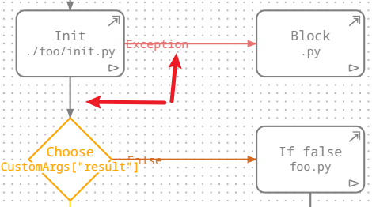

# LiberRPA Flowchart

This extension is a part of LiberRPA to manage the overall flow of an RPA project, including project arguments and settings.

The `project.flow` file (in JSON format) contains:

* Flowchart information(nodes and lines)
* Project setting
* Build-in project arguments
* Custom project arguments

Since LiberRPA Flowchart is actually a [VS Code custom editor](https://code.visualstudio.com/api/extension-guides/custom-editors), so you can open the `project.flow` with another editor and take advantage of [VS Code Timeline](https://code.visualstudio.com/docs/sourcecontrol/overview#_timeline-view):

# Usage

## Set File Icon(optional)

1. Press `Ctrl+Shift+P` to open the Command Palette.
2. Execute the command `Preferences: File Icon Theme`
3. Select **VSCode Great Icons with LiberRPA Flowchart File**

This ensure that `.flow` files can display the correct icon.

> Note: This is purely a UI enhancement, the project will work correctly even if you skip this step.

## Manage Nodes and Lines

When you click or hover a node, four anchors appear.

Drag an anchor to another node to create a new line.

Ensure that the line follow the [Link Rules](##link-rules).

### Start Node

* **Purpose:**
  The unique Start node initiates the entire project. It can't be deleted.
* **Execution:**
  Click the `⊳` icon within the Start node to execute the whole project in a  **Python MainProcess** .

### SubStart Node

* **Create:**
  Drag a SubStart node from **Node Panel** into the middle area. This creates a new **subprocess** when the project executes.
* **Error Handling:**
  If a subprocess encounters an uncaught exception, it will exit without affecting the MainProcess.
* **Configuration:**
  Click the SubStart node to open **Node Info** panel where you can modify its description.
  

### Block Node

* **Create:**
  Drag a Block node from **Node Panel** into the middle area, then update its description and set the corresponding Python file path.
  
* **Python File Path Rules:**

  * Must be a relative path to a `.py` file.
  * The filename may only contain only:

    * English letters (`a-z`, `A-Z`)
    * Numbers (`0-9`) (but cannot start with a number)
    * Underscores(`_`)
  * Use `"/"` as the folder separator.
  * The `"./"` prefix is optional.
  * Avoid using LiberRPA built-in module names: ["Mouse", "Keyboard", "Window", "UiInterface", "Browser", "Excel", "Outlook", "Application", "Database", "Data", "Str", "List", "Dict", "Regex", "Math", "Time", "File", "OCR", "Web", "Mail", "FTP", "Clipboard", "System", "Credential", "ScreenPrint", "Dialog"]

> The Python file must have a `main` function because when you clicking `⊳` in the Start node to execute the whole project, LiberRPA will run the `main` function in each Block node's Python file.

* **File Creation:**
  Click  in a Block node to open the corresponding Python file, If the file does not exist, LiberRPA will create it and add a default script.
* **Execution:**
  Click  `⊳` in a Block node to Execute the corresponding Python file.
* **Connection Nodes:**
  Drag from a Block node to create either a **Common-line**(default) or an **Exception-line** (if a Common-line exists).

  * When the whole project executing, if the Block node's Python script runs successfully, LiberRPA follows the Common-line.
  * If an uncaught exception occurs, it follows the Exception-line.
    The exception will be stored in a global object `PrjArgs.errorObj`, [see more detail](https://github.com/HUHARED/LiberRPA/condaLibrary/README.md/#global-objects).(TODO: test the link later.)
  * If neither lines is connected, an End node is executed automatically.
    

### Choose Node

* **Create:**
  Drag to create a Choose node and Modify it description and condition. The condition will be evaluated using [eval()](https://docs.python.org/3/library/functions.html#eval).

  * When referring values in **Custom Project Argument**, use `CustomArgs["valueName"]`.
    
* Connection Nodes:
  Drag from a Choose node to create either a **True-line**(default) or a **False-line** (if a True-line exists).

  * When the whole project executing, if the condition is evaluated to `True`, the True-line is followed.
  * Otherwise, the False-line is used.
  * If neither lines is connected, an End node is executed automatically.
    

### End Node

* **Purpose:**
  Connecting any node to an End node will terminate the process when executing the whole project.
* **Behavior:**

  * For a  **MainProcess** , the entire program exits.
  * If a node has no connected next node, LiberRPA will automatically execute an End node.

### Link Rules

LiberRPA will check the rules when you attempt to create a new line.

If a rule is broken, an alert will appear.

* Nodes cannot link to a Start or SubStart node.
* A node cannot link to itself.
* Cannot create a connection from the same source anchor to the same target anchor.
* The next node of Start or SubStart node can only be a Block or Choose node.
* Start and SubStart node can only have one outgoing line.
* An End node cannot have outgoing lines.
* A Block node can have up to 2 outgoing lines(Common-line and Exception-line).
* A Choose node can  have up to 2 outgoing lines(True-line and False-line).

## Shortcuts for Node

| Shortcut      | Action                   |
| ------------- | ------------------------ |
| `Ctrl+C`    | Copy the selected node   |
| `Ctrl+V`    | Paste the copied node   |
| `Ctrl+Z`    | Undo                     |
| `Ctrl+Y`    | Redo                     |
| `Backspace` | Delete the selected node |
| `Delete`    | Delete the selected node |

## Setting

### Execute Mode

Execute the whole project or a Block node in **Debug** or **Run** mode.

### Log Level

LiberRPA sets the log level (using `Log.set_level()`) according to the configuration when a project or Block node starts.

### Record Video

You can enable it to save an execution video(`video_record.mkv`) in the corresponding log folder.

The functionality relies on **[LiberRPA Local Server](https://github.com/HUHARED/LiberRPA?tab=readme-ov-file#liberrpa-local-server)**.(TODO: test the link later)

LiberRPA Local Server will also create a subtitle(`video_record.srt`) file for the video, generated automatically from  `human_read_MainProcess.log`.

For log folder path configuration, see [Configuration](https://github.com/HUHARED/LiberRPA?tab=readme-ov-file#configuration).(TODO: test the link later)

### Stop Shortcut

If enable, when the whole project is running (not applicable for a single Block node), you can press `Ctrl+F12` to stop it forcibly.

### Highlight UI

If enable, LiberRPA will briefly highlight the target elements before manipulating them.

It applies to most functions within the modules `Mouse`, `Keyboard`, `Window`, and `UiInterface`.

## Custom Project Arguments

You can define project arguments in **Custom Project Arguments** area.

When editing a Python script, typing `CustomArgs`, `CustomArgs[` or `CustomArgs["` will prompty an [IntelliSense](https://code.visualstudio.com/docs/editor/intellisense) list showing the available arguments.

> Note:
>
> There is an issue now, the values in **Custom Project Arguments** will not appear when you first type `CustomArgs`.
>
> Anyway, use `CustomArgs[` and `CustomArgs["` will be better.

## Resize

Adjust the width of the right panels by dragging the divider.

This allows for wider input boxes so that you can view more content.

If you need to edit extensive content, it may be more convenient to edit it elsewhere and then paste it here.

<video width="1170" controls>
  <source src="./md_images/resize.mp4" type="video/mp4">
  Your browser not supports video in Markdown.
</video>

# Known Issues

* Drag a node from Node Panel may occasionally fail, please try again.
* Text in a node and inputbox can't display optimally if it is not very short, due to the nodes and inputboxes all have a limited width.
* The values in **Custom Project Arguments** will not appear when you first type `CustomArgs` in a Python script.
* Shortcuts for node often unresponsive.
