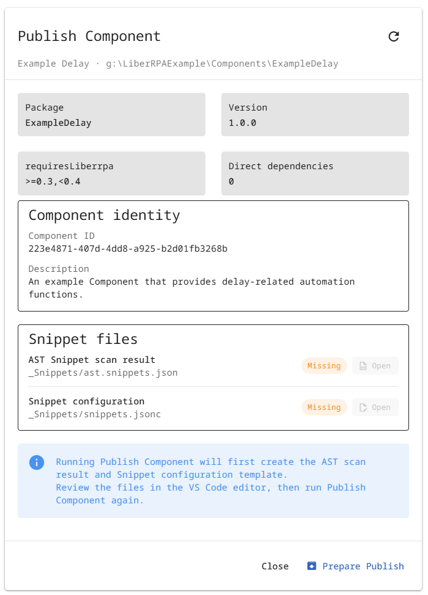
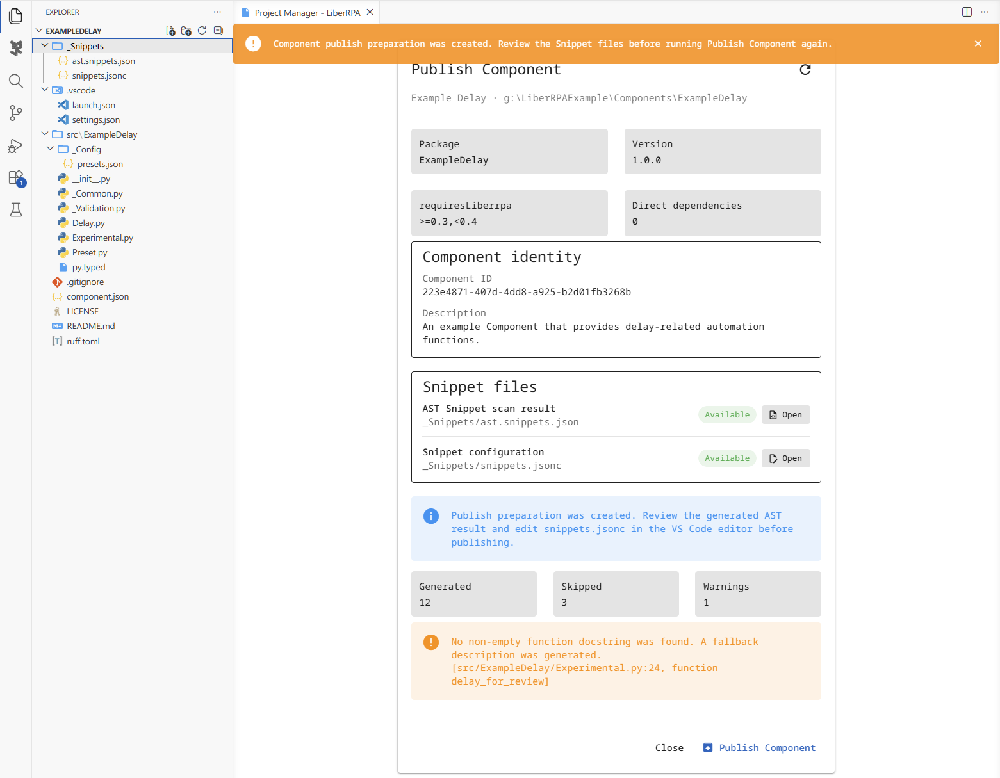
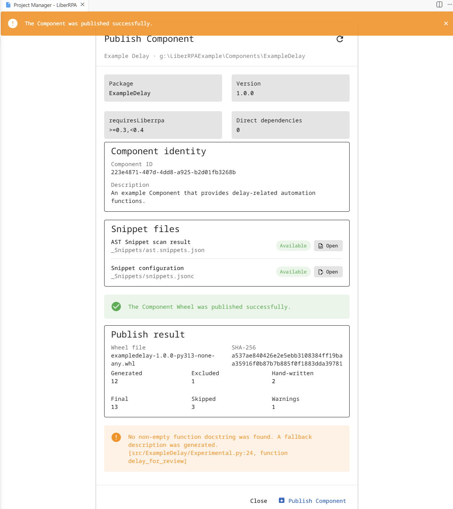
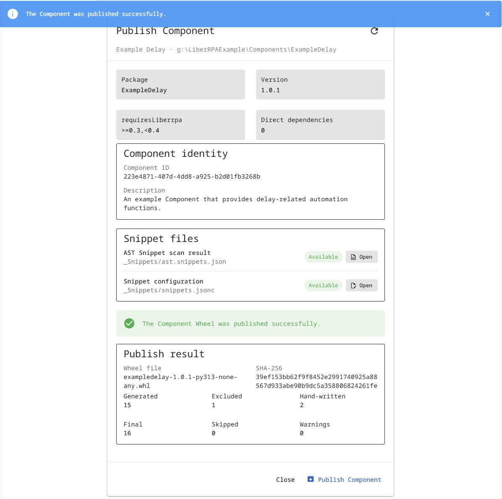

# Example Delay Component

`ExampleDelay` is a practical LiberRPA Component example and publication walkthrough. It intentionally combines clean public APIs with a small diagnostic module so that the first Publish Preparation demonstrates all three AST outcomes:

```text
generated
skipped
warning
```

The example is intended for learning and integration testing. Remove or rewrite the intentional diagnostic functions before using the Component in production.

Example snapshots:

- [ExampleDelay-1.0.0.zip](./Example/ExampleDelay-1.0.0.zip): the initial Project before the first Publish Preparation.
- [ExampleDelay-1.0.1.zip](./Example/ExampleDelay-1.0.1.zip): the Project prepared for the clean `1.0.1` publication.

> **Note:**
>
> Screenshots and animations in this document are provided for reference. As LiberRPA evolves, the current interface may differ slightly in appearance or wording, but these minor differences do not affect the documented workflow or functionality.

## What this example demonstrates

- Source code under `src/ExampleDelay/`.
- Public PascalCase modules directly under the Component package.
- Private helper modules whose names start with `_`.
- Managed imports from `liberrpa.Modules`.
- Public functions with parameters, defaults, keyword-only parameters, `Literal` choices, and return values.
- Package resources resolved with `get_component_resource_path()` instead of the current working directory.
- The first Publish Preparation and the user-maintained `_Snippets/snippets.jsonc` file.
- Generated, skipped, warning, excluded, overridden, and hand-written Snippets.
- A version update from `1.0.0` to `1.0.1`.

## Project structure

```text
ExampleDelay
├── .vscode
│   ├── launch.json
│   └── settings.json
├── docs
│   └── snippets.example.jsonc
├── src
│   └── ExampleDelay
│       ├── _Config
│       │   └── presets.json
│       ├── __init__.py
│       ├── _Validation.py
│       ├── Delay.py
│       ├── Experimental.py
│       ├── Preset.py
│       └── py.typed
├── .gitignore
├── component.json
├── LICENSE
├── README.md
└── ruff.toml
```

The downloadable archives omit `.git` to keep them compact. When Project Manager creates a Project from a template that contains `.gitignore`, it initializes `.git` if Git is available.

Do not rename `src`. Keep the package folder name synchronized with `component.json.packageName`.

## Public modules

### `Delay`

Provides ordinary delay functions, fixed-duration helpers, a keyword-only parameter, and `Literal` choices. All public top-level functions in this module are valid automatic Snippet candidates.

### `Preset`

Loads `_Config/presets.json` from the Component package and demonstrates the correct way to resolve Component-owned resources:

```python
# <LiberRPA imports: managed>
# This block is managed by LiberRPA. Do not edit it manually.
# ruff: isort: off
from liberrpa.Modules import (
    get_component_resource_path,
)
# ruff: isort: on
# </LiberRPA imports: managed>

strConfigPath = get_component_resource_path(
    relativePath="_Config/presets.json",
)
```


Do not use `os.getcwd()` to find Component resources. The process working directory belongs to the running Project, not to an individual Component.

### `Experimental`

Version `1.0.0` intentionally contains diagnostic cases:

| Function                        | First Publish result     | Reason                                                                                          |
| ------------------------------- | ------------------------ | ----------------------------------------------------------------------------------------------- |
| `delay_for_review`            | Generated with a warning | It intentionally has no docstring.                                                              |
| `delay_cooperatively`         | Skipped                  | Async functions are not converted automatically.                                                |
| `delay_sequence`              | Skipped                  | Signatures with `*args` or `**kwargs` are not supported.                                    |
| `delay_with_default`          | Skipped                  | Its default value is calculated by a function call rather than represented by a static literal. |
| `function_with_nested_helper` | Generated                | The public top-level function is scanned; its nested helper is ignored.                         |

Private functions, private modules, classes, class methods, and nested functions are not automatic Snippet candidates.

## Run the Component during development

The generated VS Code launch configuration adds these paths to `PYTHONPATH`:

```text
src
_Components
Project root
```

Open a public module such as `Delay.py` or `Preset.py`, select the LiberRPA `default` Python environment, and run `Python Debugger: current file` with `F5`. Use `Ctrl+F5` to run without debugging.

## First Publish: create the Snippet preparation

1. Save the Component source files.
2. Open the VS Code Command Palette.
3. Run `LiberRPA: Publish Component`.
4. On the Publish Component page, review the Project information and source scan summary.
   
5. Click `Publish Component`.
   
6. Confirm that the status is `Preparation Created`, then inspect the two files opened by LiberRPA:

```text
_Snippets/
├── ast.snippets.json
└── snippets.jsonc
```

For version `1.0.0`, the expected AST summary is:

```text
generated: 12
skipped:   3
warnings:  1
```

LiberRPA regenerates `ast.snippets.json`; do not edit it manually.

`snippets.jsonc` belongs to the Component developer and should be kept under version control.

## Apply the example Snippet configuration

After the first Publish Preparation, review the generated file, then copy or merge the contents of:

```text
docs/snippets.example.jsonc
```

into:

```text
_Snippets/snippets.jsonc
```

For the complete field reference, see [Component Snippet Configuration](./ComponentSnippetConfiguration.md).

The example configuration demonstrates:

- adding icons for `Preset` and `Experimental`;
- excluding `ExampleDelay_Delay.sec_20`;
- overriding an AST-generated description;
- changing an AST-generated label;
- adding a multi-line hand-written demo Snippet;
- adding a cursor-mode expression Snippet;
- adding imports from both `liberrpa.Modules` and another public module in this Component.

## Second Publish: publish version 1.0.0

Run `LiberRPA: Publish Component` again, review the updated summary, and click `Publish Component`.



With the supplied example configuration, the expected summary is:

```text
generated:    12
excluded:      1
hand-written:  2
final:        13
skipped:       3
warnings:      1
```

The operation creates a Wheel in the configured Component Repository and displays its filename and SHA-256 hash.

Publishing the same Component ID and version again with identical content reports `alreadyPublished`. Publishing different content with the same Component ID and version is rejected.

## Publish the clean 1.0.1 update

`ExampleDelay-1.0.1.zip` is a complete Project snapshot prepared for the next publication. Compared with `ExampleDelay-1.0.0.zip`, the intended source and Manifest changes are limited to:

```text
component.json
src/ExampleDelay/Experimental.py
```

The archive also retains `_Snippets/snippets.jsonc` from the `1.0.0` walkthrough. Its generated `ast.snippets.json` represents the previous scan until the next Publish operation regenerates it.

The update:

- adds the missing docstring;
- converts the async example into a synchronous function;
- replaces `*args` with `list[float]`;
- replaces the dynamic default with a static literal;
- changes the Component version to `1.0.1`.

Run `LiberRPA: Publish Component` again, review the summary, and click `Publish Component`.



The expected AST summary becomes:

```text
generated: 15
skipped:    0
warnings:   0
```

The existing `_Snippets/snippets.jsonc` remains in place. The final Catalog contains 16 Snippets because one AST Snippet remains excluded and two hand-written Snippets remain included.

This update verifies that:

- `snippets.jsonc` is preserved between publications;
- `ast.snippets.json` follows the current source code after publication;
- a new immutable Wheel is added for version `1.0.1`;
- previously skipped functions can become automatic Snippets after their signatures are changed to supported forms.

## Key Component rules

- Keep Component source code under `src/<PackageName>/`.
- Keep `component.json.packageName` synchronized with the package folder under `src`.
- Use PascalCase for public module filenames.
- Prefix internal modules and functions with `_`.
- Use public top-level synchronous functions for automatic Snippets.
- Give public functions useful type annotations and docstrings.
- Prefer static literal default values in automatic Snippet candidates.
- Use `snippets.jsonc` for exclusions, overrides, and hand-written Snippets.
- Never edit `ast.snippets.json` manually.
- Increase `component.json.version` before publishing changed content.
- Do not change the Component ID after publication.
- Resolve Component resources relative to the Component package, not the process working directory.
