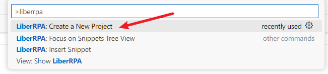
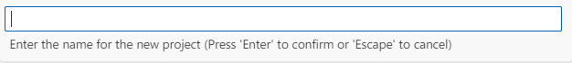
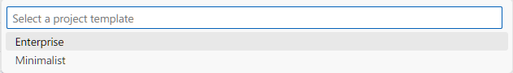
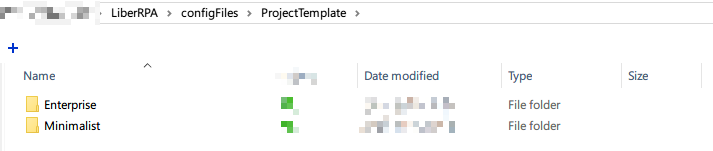

# LiberRPA Project Manager

This extension is a part of LiberRPA to create new RPA projects.

It offers multiple templates to choose from, and you can customize the templates to fit your needs.

# Usage

## Create a Project

1. **Open Command Palette:**
   Press `Ctrl+Shift+P` to open the Command Palette.
2. **Run Command:**
   Execute the command `LiberRPA: Create a New Project` to start a new RPA project.
   
3. **Select Destination Folder:**
   A window will appear asking you to select the folder where the new RPA project will be created.
4. **Enter Project Name:**
   Provide a name for your project.
   
5. **Select a template:**
   Choose from the available templates.
   
   If the selected template includes a `.gitignore` file, LiberRPA will automatically try to run `git init` command.
6. **Launch VS Code:**
   A new instance of VS Code will open with your new project.

## Customize Templetes

Templates are stored at the following path：

`LiberRPA/configFiles/ProjectTemplate`

To create a new template, simply copy an existing one and modify it as needed.

# Requirements

If you choose a template that contains a `.gitignore` file, ensure that [Git](https://git-scm.com/) is installed on your computer.
