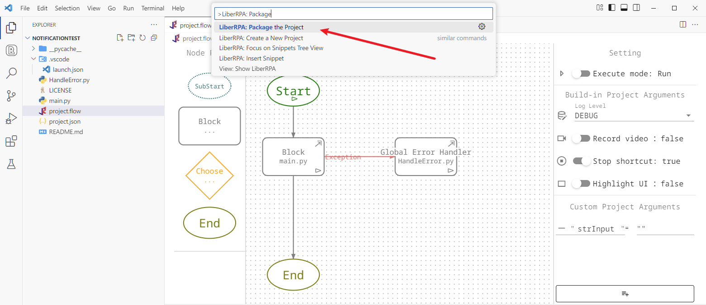
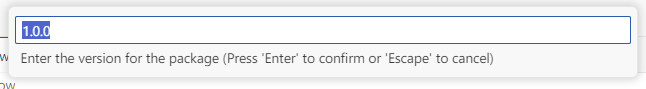
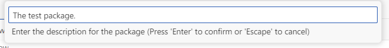
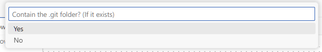

# LiberRPA Project Manager

If the images are not displayed, [view this README on GitHub](https://github.com/HUHARED/LiberRPA/blob/main/vscodeExtensions/liberrpa-project-manager/README.md).

**LiberRPA Project Manager** is part of LiberRPA. It helps you create LiberRPA Projects, publish reusable Components, manage Component dependencies, and package Flow Projects for LiberRPA Executor.

# Usage

## Create a Project

1. **Open the Command Palette:**
   Press `Ctrl+Shift+P`.
2. **Run the Command:**
   Run `LiberRPA: Create a New Project`.
   
3. **Select a Destination Folder:**
   Choose the parent folder in which the new LiberRPA Project folder will be created.
   
4. **Configure the Project:**
   Select the Project type and template, then enter the Project folder name, version, and description. For a Component Project, also enter the Component package name and display name.
   
5. **Create the Project:**
   Review the settings and click `Confirm`. LiberRPA validates the settings and creates the Project from the selected template.
   If the selected template contains a `.gitignore` file and Git is available, LiberRPA also initializes a Git repository.
6. **Open the Project:**
   After the Project is created, it opens in a new VS Code window.
   

## Customize Templates

Project templates are stored at:

`LiberRPA/configFiles/ProjectTemplate/`

The safest way to create a custom template is to copy an existing default template and modify the copy.

The template folder name must retain the appropriate Project type prefix:

* `FlowProject-` for a Flow Project template, for example `FlowProject-MyTemplate`.
* `ComponentProject-` for a Component Project template, for example `ComponentProject-MyTemplate`.

LiberRPA Project Manager ignores template folders that do not use one of these recognized prefixes.

Keep the required Project files and directory structure for the selected Project type. Other files and folders may be added or modified as needed.


## Develop a Component Project

A Component Project contains reusable Python functions that can be published as a Component Wheel and installed into other LiberRPA Projects.

### Project Structure

Component source code must be placed under:

```text
src/<PackageName>/
```

For example, a Component whose `packageName` is `ExampleDelay` uses this structure:

```text
ExampleDelay/
├── src/
│   └── ExampleDelay/
│       ├── __init__.py
│       ├── py.typed
│       └── Preset.py
├── component.json
└── ...
```

Do not rename the `src` folder.

The Python package folder directly under `src` must match `packageName` in `component.json`. Changing only the folder name or only the Manifest field makes the Component Project invalid.

Keep the generated `__init__.py` and `py.typed` files. Additional Python modules and package resources may be added under the Component package folder.

### Public Component Functions

LiberRPA generates Component Snippets from public top-level synchronous functions in public modules directly under:

```text
src/<PackageName>/
```

For example:

```python
# FileName: Preset.py
# <LiberRPA imports: managed>
# This block is managed by LiberRPA. Do not edit it manually.
from liberrpa.Modules import (
    delay,
)
# </LiberRPA imports: managed>


def delay_seconds(seconds: float) -> None:
    """
    Delay for the specified number of seconds.

    Parameters:
        seconds: The non-negative number of seconds to delay.
    """
    delay(round(seconds * 1000))
```

The following are not included in the automatically generated Component Snippet Catalog:

* Functions defined in `__init__.py`.
* Modules whose names start with `_`.
* Functions whose names start with `_`.
* Async functions.
* Nested functions.
* Class methods.
* Functions inside nested subpackages.

Private modules, helper functions, classes, and nested packages may still be used internally by the Component; they are simply not exposed as automatic Component Snippets.

### Component resources

Do not use `os.getcwd()` to locate files owned by a Component. The process working directory belongs to the running Project, not to an individual Component.

Store Component resources under the Component package and resolve them with `get_component_resource_path()`:

```python
# <LiberRPA imports: managed>
# This block is managed by LiberRPA. Do not edit it manually.
from liberrpa.Modules import (
    get_component_resource_path,
)
# </LiberRPA imports: managed>

strConfigPath = get_component_resource_path(
    relativePath="_Config/presets.json",
)
```

### Component Metadata

The Component Manifest is stored in:

```text
component.json
```

Important fields include:

* `id`: The permanent identity of the Component. Do not change it after the Component has been published.
* `packageName`: The top-level Python package name. It must match the package folder under `src`.
* `displayName`: The readable Component name shown in LiberRPA Project Manager and Snippets Tree.
* `version`: A Python PEP 440 version.
* `description`: A short description of the Component.
* `requiresLiberrpa`: The supported `liberrpa` version range.
* `componentDependencies`: The direct Component dependency requirements.

Use LiberRPA Project Manager to add, update, change, or remove Component dependencies instead of manually editing dependency state files.

### Versions

Increment the Component version before publishing changed content.

Common versions include:

```text
1.0.0
1.0.1
1.1.0
2.0.0
```

Versions and version requirements follow Python PEP 440.

A published Wheel is immutable. Publishing different content with the same Component ID and version is rejected.

### Before Publishing

Before publishing a Component:

* Keep all required source files under `src/<PackageName>/`.
* Make sure public modules and functions use the intended names.
* Add clear type annotations and docstrings to functions that should appear as Snippets.
* Update the Component version when published content has changed.
* Save all modified files.
* Resolve any Component dependency problems reported by Project Manager.

## Publish a Component

When the Component is ready, open the VS Code Command Palette and run `LiberRPA: Publish Component`.


LiberRPA uses a two-step process for the first publication so that the generated Snippets can be reviewed and customized before the Component Wheel is created.

### First Publish: Prepare Snippets

The command opens the Publish Component page. Review the Project information and source scan summary, then click `Publish Component`.


When publishing a Component for the first time, LiberRPA scans the public Python modules and functions under:

```text
src/<PackageName>/
```

If `_Snippets/snippets.jsonc` does not exist, LiberRPA creates the Snippet preparation files and stops before building the Wheel:

```text
_Snippets/
├── ast.snippets.json
└── snippets.jsonc
```

`ast.snippets.json` contains the Snippets automatically generated from the current Component source code. LiberRPA regenerates this file during publication, so do not edit it manually.

`snippets.jsonc` is maintained by the Component developer. It is created only during the first Publish Preparation and is not automatically overwritten afterward.

Use `snippets.jsonc` to:

* exclude automatically generated Snippets;
* override selected properties of automatically generated Snippets;
* add hand-written Snippets;
* add additional imports required by a Snippet.

Review the generated Snippets, edit `snippets.jsonc` if necessary, and save the file.

No Component Wheel is created and the Component Repository is not modified during the preparation step.

### Publish the Component Wheel

After reviewing the Snippet configuration, run `LiberRPA: Publish Component` again, review the updated summary, and click `Publish Component`.

LiberRPA then:

1. saves and validates the current Component Project;
2. regenerates `ast.snippets.json` from the current source code;
3. validates `snippets.jsonc`;
4. merges the generated and user-configured Snippets;
5. builds the Component Wheel;
6. validates the generated Wheel;
7. publishes it to the configured Component Repository.

After a successful publication, Project Manager displays the Component version, Snippet counts, warnings, Wheel filename, and SHA-256 hash.

Review any reported warnings. Additional diagnostic information is available in the LiberRPA Project Manager output and the Component Management diagnostic log.

### Publish Updated Versions

If the Component source code, resources, Snippets, or other published content changes, update `version` in `component.json` before publishing the new release.

For example:

```text
1.0.0 → 1.0.1
```

or:

```text
1.0.0 → 1.1.0
```

Each Publish operation regenerates `ast.snippets.json`, while the existing `snippets.jsonc` is preserved.

If the same Component version has already been published with identical content, LiberRPA reports `alreadyPublished` instead of creating a duplicate Wheel. Publishing different content with the same Component ID and version is rejected.

### Complete example

See the [Example Delay Component walkthrough](./ExampleDelayComponent.md) for a complete publication example that covers generated, skipped, warning, excluded, overridden, and hand-written Snippets.

## Package a Flow Project

TODO: update here later. Reference content:

```
Use Project Manager to create an `.rpa.zip` package for installation and execution in LiberRPA Executor.

1. Open a Flow Project in VS Code.
2. Open the Command Palette and run `LiberRPA: Package Project`.
3. Review the Project metadata loaded from `flow.json`.
4. Check the Component dependency state. Packaging is blocked if the lock, `_Components`, or current `liberrpa` environment is incompatible with the Project.
5. Select the output folder.
6. Choose whether to include `.vscode` and `.git`. Both are excluded by default.
7. Review the generated Package filename and click `Package Project`.
8. After packaging succeeds, review the file and folder counts and archive size, then use `Reveal` to show the Package in File Explorer.

Existing `.rpa.zip` files are never overwritten. Change the Project name or version in `flow.json`, or select another output folder, before creating another Package with the same filename.

The generated `.rpa.zip` file can then be installed in LiberRPA Executor.

# Requirements

Run `InitLiberRPA.exe` before using LiberRPA Project Manager so that the LiberRPA environment variable, default directories, and Component Repository root are initialized.

Git is optional. It is only required when you want Project Manager to initialize a Git repository for a template that contains a `.gitignore` file.

```

When you completed a project and you want it to run in Executor, you can package it by the following steps to generate a `.rpa.zip` file.

1. **Open Command Palette:**
   Press `Ctrl+Shift+P` to open the Command Palette.
2. **Run Command:**
   Execute the command `LiberRPA: Package the Project`
   
3. **Enter Package Version:**
   
4. **Enter Package Description:
   **
5. **Choose Whether to Contain Git Folder:
   **
6. **Select Destination Folder:**
   A window will appear asking you to select the folder where the package file will be saved.
7. **Package Created:**
   Once you completed the previous steps, your package will appear in the selected folder. It will be a `.rpa.zip` file.
8. **[Use Executor to Import The Package.](../../electronApplications/executor/README.md)**

# Requirements

If you choose a template that contains a `.gitignore` file, ensure that [Git](https://git-scm.com/) is installed on your computer.
