# LiberRPA Project Manager

If the images are not displayed, [view this README on GitHub](https://github.com/HUHARED/LiberRPA/blob/main/vscodeExtensions/liberrpa-project-manager/README.md).

**LiberRPA Project Manager** is part of LiberRPA. It helps you create LiberRPA Projects, publish reusable Components, manage Component dependencies, and package Flow Projects for LiberRPA Executor.

> **Note:**
>
> Screenshots and animations in this document are provided for reference. As LiberRPA evolves, the current interface may differ slightly in appearance or wording, but these minor differences do not affect the documented workflow or functionality.

> **Extension logs:**
>
> This extension writes diagnostic messages to the `liberrpa-project-manager` channel in the VS Code Output panel.
>
> Open `View > Output` and select the channel, or run `Output: Show Output Channels` from the Command Palette.
>
> For troubleshooting, run `Developer: Set Log Level...`, select `liberrpa-project-manager`, and choose `Debug` or `Trace`. `Info` is normally sufficient for routine use.
>
> This setting does not change the Python runtime log level used by a Flow Project or an individual Block.

## Usage

### Create a Project

1. Press `Ctrl+Shift+P` and run `LiberRPA: Create a New Project`.
   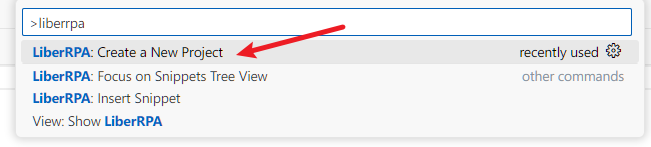
2. Select the parent folder in which the new Project folder will be created.
   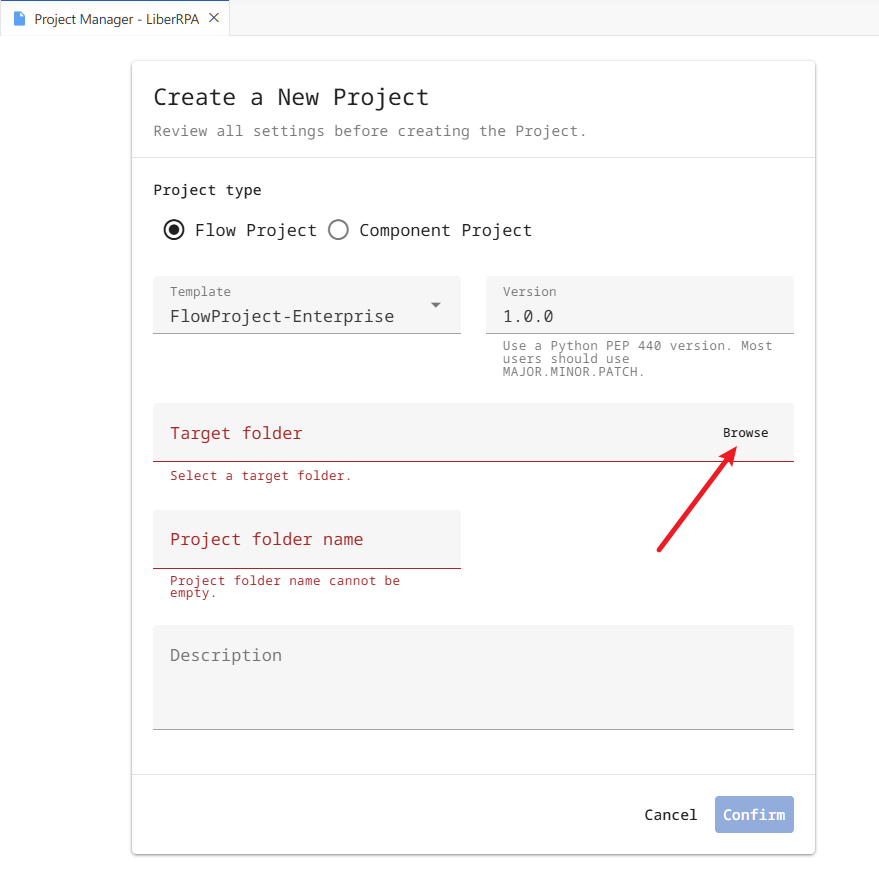
3. Select the Project type and template, then enter the required Project information.
   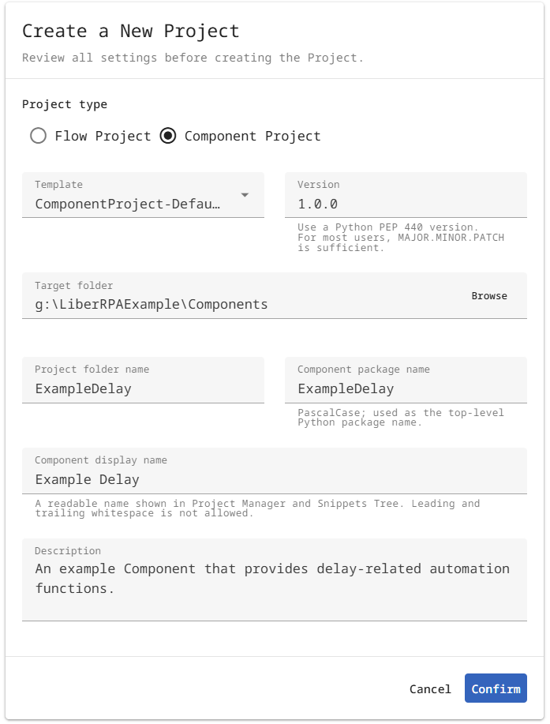
4. Review the settings and click `Confirm`.
5. The new Project opens in a separate VS Code window.
   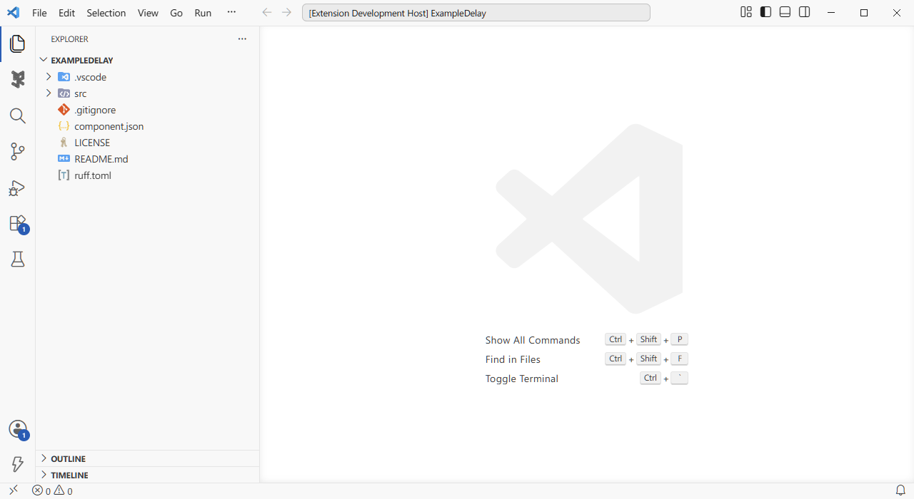

If the selected template contains `.gitignore` and Git is available, Project Manager also initializes a Git repository.

### Customize Templates

Project templates are stored at:

```text
LiberRPA/configFiles/ProjectTemplate/
```

The safest way to create a custom template is to copy an existing template and modify the copy.

The template folder name must keep the matching prefix:

* `FlowProject-` for a Flow Project template, for example `FlowProject-MyTemplate`.
* `ComponentProject-` for a Component Project template, for example `ComponentProject-MyTemplate`.

Keep the required Project files and structure for the selected Project type. Other files and folders may be added as needed.

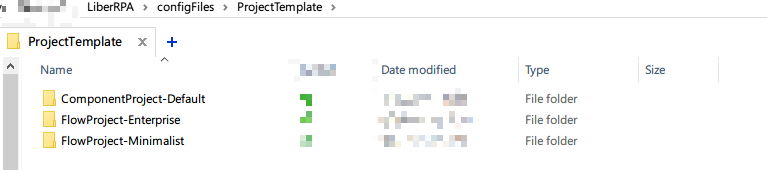

### Component Repository

LiberRPA Project Manager uses a local Component Repository to store Component Wheels published locally or imported from external sources.

The same Repository is shared by LiberRPA Projects that use the current LiberRPA installation. It is not stored inside an individual Flow Project or Component Project.

The default location is:

```text
C:/Users/<UserName>/Documents/LiberRPA/ComponentRepository/
```

The path is configured by `componentRepositoryPath` in:

```text
%LiberRPA%/configFiles/basic.jsonc
```

Running `InitLiberRPA.exe` creates the default Repository folder. A custom path must be an absolute path to an existing directory.

Use Project Manager commands to publish, import, and rebuild Repository content. Do not manually edit the Repository during normal use.

### Develop a Component Project

A Component Project contains reusable Python code that can be published as a Component Wheel and added to other LiberRPA Projects.

#### Project Structure

Component source code must be placed under:

```text
src/<PackageName>/
```

For example:

```text
ExampleDelay/
├── src/
│   └── ExampleDelay/
│       ├── __init__.py
│       ├── py.typed
│       └── Preset.py
├── component.json
└── ...
```

The package folder directly under `src` must match `packageName` in `component.json`. Keep the generated `__init__.py` and `py.typed` files.

#### Public Component Functions

LiberRPA can generate Component Snippets from public top-level synchronous functions in public modules directly under `src/<PackageName>/`.

```python
# FileName: Preset.py
# <LiberRPA imports: managed>
# This block is managed by LiberRPA. Do not edit it manually.
# ruff: isort: off
from liberrpa.Modules import (
    delay,
)

# ruff: isort: on
# </LiberRPA imports: managed>


def delay_seconds(seconds: float) -> None:
    """
    Delay for the specified number of seconds.

    Parameters:
        seconds: The non-negative number of seconds to delay.
    """
    delay(round(seconds * 1000))
```

Automatic Snippets are not generated from private modules or functions, async functions, nested functions, class methods, functions in `__init__.py`, or functions in nested subpackages. These objects may still be used internally by the Component.

#### Component Resources

Store Component-owned resources under the Component package and resolve them with `get_component_resource_path()`:

```python
# <LiberRPA imports: managed>
# This block is managed by LiberRPA. Do not edit it manually.
# ruff: isort: off
from liberrpa.Modules import (
    get_component_resource_path,
)

# ruff: isort: on
# </LiberRPA imports: managed>

strConfigPath = get_component_resource_path(
    relativePath="_Config/presets.json",
)
```

Do not use `os.getcwd()` to locate Component-owned files. The process working directory belongs to the running Project.

#### Component Metadata and Versions

The Component Manifest is stored in `component.json`. It defines the Component identity, package name, display name, version, description, supported `liberrpa` range, and direct Component dependencies.

Keep `packageName` synchronized with the package folder under `src`. Do not change the Component ID after the Component has been published.

Versions and version requirements follow Python PEP 440. Increase `version` before publishing changed content. Published Component versions are immutable.

Before publishing, save the Project, review public names and docstrings, and resolve any dependency problems reported by Project Manager.

### Publish a Component

Open the Command Palette and run `LiberRPA: Publish Component`.

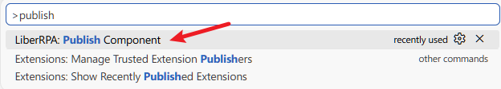

The first publication uses two steps so that generated Snippets can be reviewed before the Wheel is created.

#### First Publish: Prepare Snippets

Review the Project and source scan summary, then click `Publish Component`.

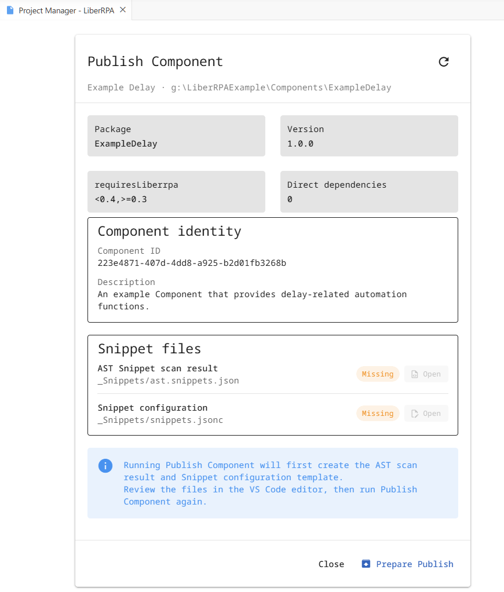

If `_Snippets/snippets.jsonc` does not exist, LiberRPA creates:

```text
_Snippets/
├── ast.snippets.json
└── snippets.jsonc
```

* `ast.snippets.json` is regenerated from the current source code. Do not edit it manually.
* `snippets.jsonc` belongs to the Component developer and is preserved during later publications.

No Wheel is created during this preparation step. Review the generated Snippets and edit `snippets.jsonc` when customization is needed.

The final Snippet Catalog must contain at least one Snippet. When no supported public function produces an AST-generated Snippet, add a hand-written Snippet associated with an existing public Component Module before publishing the Wheel.

#### Publish the Component Wheel

Run `LiberRPA: Publish Component` again. Project Manager regenerates and validates the Snippets, builds and validates the Wheel, and publishes it to the configured Component Repository.

After publication, review the Component version, Snippet summary, warnings, Wheel filename, and SHA-256 shown on the page. Detailed diagnostics are available in the Project Manager Output channel and the Component Management diagnostic log.

#### Configure Component Snippets

Use `_Snippets/snippets.jsonc` to:

* assign icons to Component categories;
* exclude selected generated Snippets;
* override selected generated Snippets;
* add hand-written Snippets;
* add imports required by those Snippets.

See [Component Snippet Configuration](./ComponentSnippetConfiguration.md) for the complete field reference and validation rules.

See the [Example Delay Component walkthrough](./ExampleDelayComponent.md) for a working publication example.

#### Publish Updated Versions

When published source code, resources, or Snippets change, increase `version` in `component.json` and publish again.

`ast.snippets.json` is regenerated during publication, while `snippets.jsonc` is preserved.

Publishing identical content with the same Component ID and version reports `alreadyPublished`. Publishing different content with the same ID and version is rejected.

### Import Component Wheels

Use `LiberRPA: Import Component Wheels` to copy external LiberRPA Component Wheels into the configured local Component Repository.

Import and Add are separate operations:

* **Import Component Wheels** makes an external Wheel available in the local Repository.
* **Add** records a Component as a dependency of the current Project.

Importing a Wheel does not modify the current Project.

#### Import the Wheels

1. Run `LiberRPA: Manage Components` and click `Import Wheels`.
   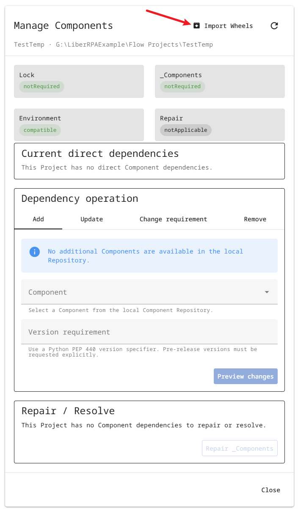
   You can also run `LiberRPA: Import Component Wheels` directly.
   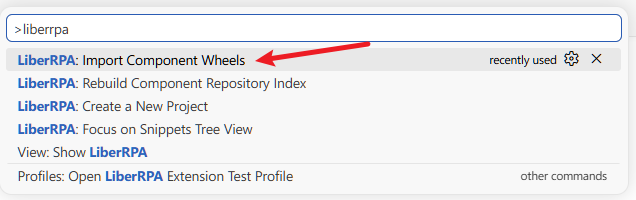
2. Select one or more Wheel files stored outside the active Component Repository.
   Example Wheels:
   * [`exampledelay-1.0.0-py313-none-any.whl`](./Example/exampledelay-1.0.0-py313-none-any.whl)
   * [`exampledelay-1.0.1-py313-none-any.whl`](./Example/exampledelay-1.0.1-py313-none-any.whl)
3. Confirm the file selection and review the result.

When Import is started from Manage Components, the Repository Catalog refreshes automatically.

Multiple versions of the same Component can coexist in the Repository. Importing the exact same Wheel again is safe and does not create a duplicate entry. Different content cannot replace an already published Component ID and version.

After importing, use [Add](#add) when the Component should become a dependency of the current Project.

### Rebuild Component Repository Index

Component Wheels are the authoritative Repository artifacts. `repository.json` is a derived index that can be rebuilt from those Wheels.

Run `LiberRPA: Rebuild Component Repository Index` when Project Manager reports that the index is missing, invalid, or inconsistent with the stored Wheels.

1. Open the Command Palette.
2. Run `LiberRPA: Rebuild Component Repository Index`.
   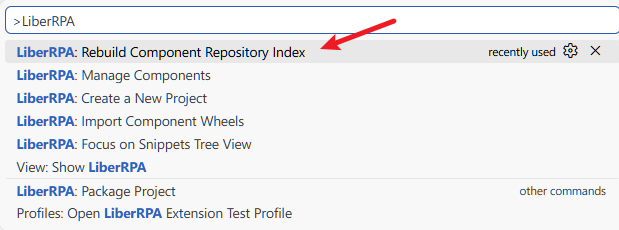
3. Review the completion message and any warnings.
4. Refresh or reopen Manage Components if it is already open.

Rebuild validates the stored Wheels and replaces `repository.json`. It does not import external Wheels, remove valid Wheels, or change any Project dependency files.

### Manage Components in a Project

Project Manager manages Component dependencies for Flow Projects and Component Projects.

The Project Manifest (`flow.json` or `component.json`) stores direct requirements. Project Manager resolves them into exact versions in `components.lock.json` and rebuilds `_Components` from the selected Wheels.

Do not edit `components.lock.json` or `_Components` manually.

#### Open Manage Components

1. Press `Ctrl+Shift+P` and run `LiberRPA: Manage Components`.
   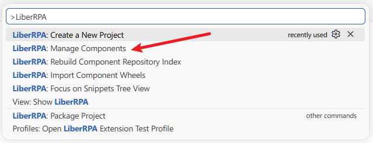
   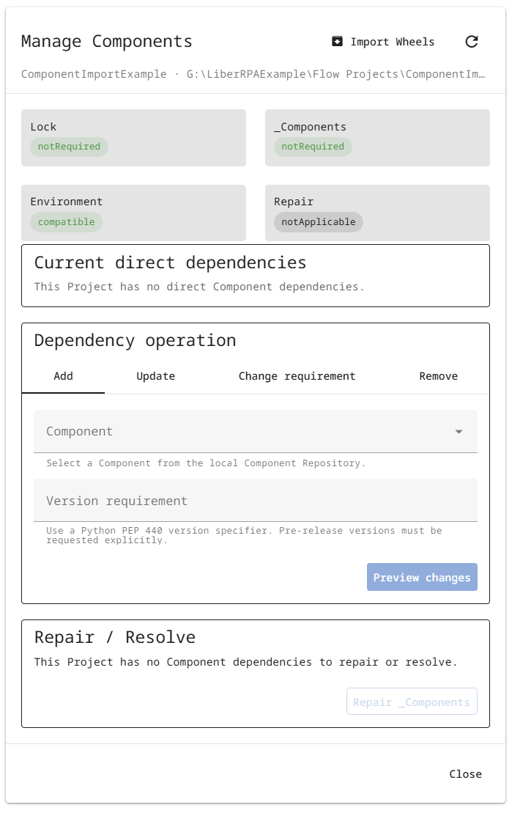
2. Review the lock, `_Components`, environment, repair, and direct dependency states shown on the page.

The `Import Wheels` button opens the Repository operation described in [Import Component Wheels](#import-component-wheels).

#### Preview and Confirm Changes

Add, Update, Change Requirement, and Remove use the same workflow:

1. Select the operation and enter its input.
2. Click `Preview changes`.
3. Review direct requirement changes and exact resolved Component changes.
4. Click `Back` to revise the operation or `Confirm changes` to apply it.

If Repository content changes after preview, Project Manager asks you to preview the plan again.

#### Add

Use `Add` to add a new direct Component dependency.

1. Select the Component and review its PEP 440 `Version requirement`.
2. Click `Preview changes`.
   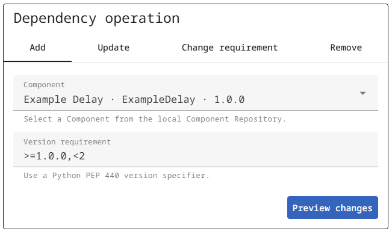
3. Review the plan and click `Confirm changes`.
   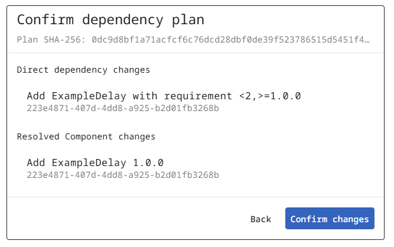

Project Manager records the direct requirement, resolves a compatible dependency closure, and rebuilds `_Components`.

Pre-release versions are selected only when the requirement explicitly permits a pre-release, for example `==1.2.0rc1`.

#### Update

Use `Update` to search for newer versions that still satisfy the current requirements.

1. Select one or more Components.
2. Click `Preview changes`.
   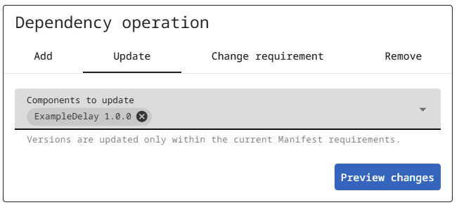
3. Review the resolved version changes and click `Confirm changes`.
   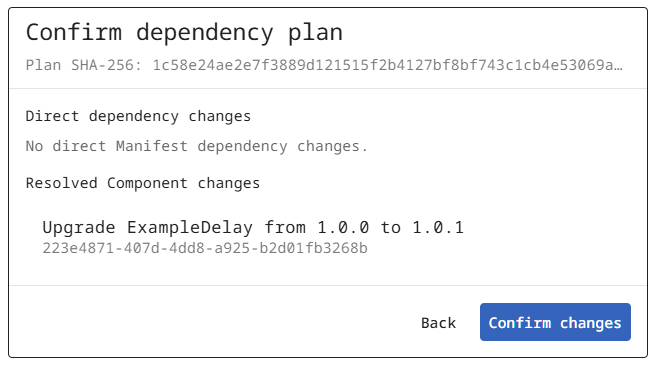

`Update` does not change the version requirements stored in the Project Manifest.

#### Change Requirement

Use `Change requirement` to edit the allowed PEP 440 range of a direct dependency.

1. Select a direct dependency and enter the new requirement.
   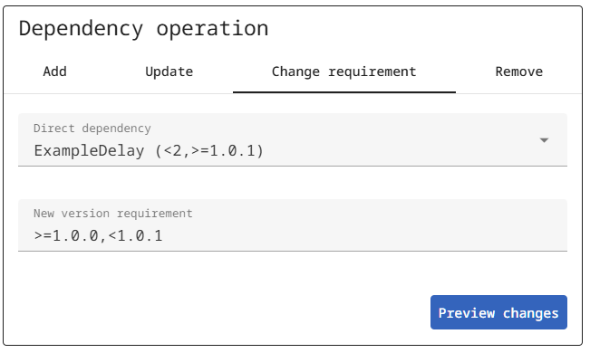
2. Click `Preview changes`.
3. Review the requirement and resolved version changes, then click `Confirm changes`.
   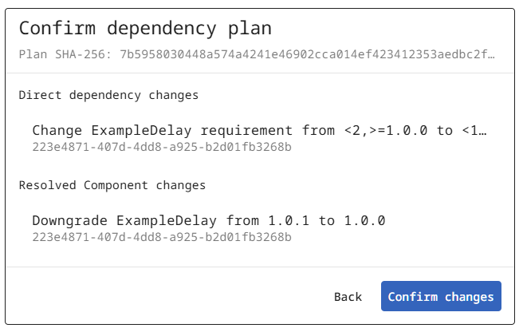

Changing a requirement may keep, upgrade, or downgrade the resolved version. If the current version remains valid, use `Update` afterward when you explicitly want a newer permitted version.

#### Remove

Use `Remove` to remove a direct Component dependency.

1. Select the dependency.
   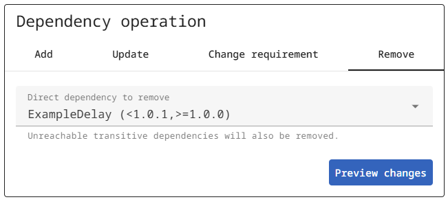
2. Preview the changes.
3. Review the direct and resolved removals, then click `Confirm changes`.
   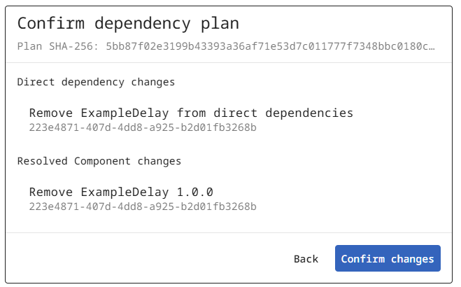

Transitive Components that are no longer required are removed automatically. Existing Python imports and calls are not removed; update affected source files yourself.

#### Repair `_Components`

Use `Repair _Components` when `components.lock.json` is valid but `_Components` is missing or damaged.

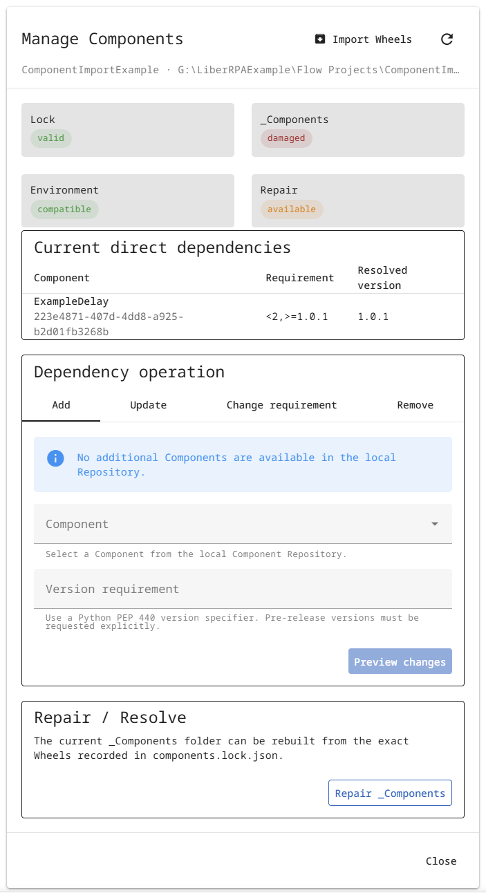

Repair rebuilds `_Components` from the exact Wheels and SHA-256 values recorded in the lock file. It does not change the Project Manifest, lock file, or resolved versions.

#### Resolve Dependencies

Use `Resolve dependencies` when `components.lock.json` is missing, invalid, or stale.

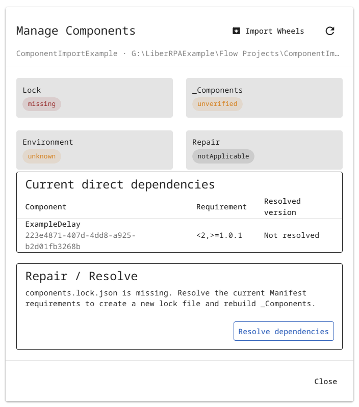

Project Manager resolves the current Manifest requirements again, creates a new lock file, and rebuilds `_Components`.

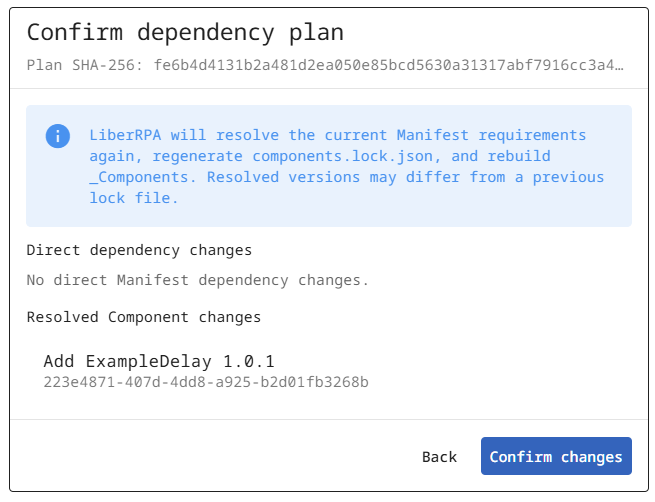

The new resolved versions may differ from an older lock file because resolution uses the current Component Repository.

#### Use an Added Component

Import an added Component through its public package:

```python
from ExampleDelay import (
    Delay as ExampleDelay_Delay,
)
```

Do not import through `_Components`:

```python
## Do not use this form.
from _Components.ExampleDelay import Delay
```

`_Components` is generated Project state and may be completely replaced by dependency operations. Do not edit it, copy files into it, or hard-code paths into it.

Use [LiberRPA Snippets Tree](https://github.com/HUHARED/LiberRPA/blob/main/vscodeExtensions/liberrpa-snippets-tree/README.md) to insert Component Snippets and maintain imports. A Snippet is a development convenience; excluding a Snippet does not remove the underlying Python API.

Access Component resources through the Component's public API. Do not construct paths into `_Components` from the Flow Project.

> If Pylance temporarily reports a newly added Component as unresolved, run `Python: Restart Language Server` from the Command Palette. This refreshes Pylance's import analysis and does not affect the Project's Component state.

##### Complete Example

[`ComponentUsageExample-0.1.0.zip`](./Example/ComponentUsageExample-0.1.0.zip) is a final-state Flow Project that uses `ExampleDelay 1.0.1`.

The example demonstrates generated and hand-written Snippets, Component resources, public APIs without Snippets, and exception handling through a Flowchart Exception Line.

To run it:

1. Extract the archive to a folder.
2. Open the extracted folder in VS Code.
3. Select a compatible LiberRPA Python environment.
4. Open `project.flow`.
5. [Debug or run the Project](https://github.com/HUHARED/LiberRPA/blob/main/vscodeExtensions/liberrpa-flowchart/README.md#execute-mode).

The archive is a final-state snapshot. It does not replay Add, Update, Change Requirement, or Remove operations.

When debugging the expected Component error, enable `User Uncaught Exceptions`, press `F5` after the debugger pauses, and allow the Flowchart to continue through its Exception Line.

`Repair _Components` requires the exact Wheel recorded in `components.lock.json`. `Resolve dependencies` resolves the current requirement again and may select another compatible version.

### Package a Flow Project

Use LiberRPA Project Manager to create an `.rpa.zip` deployment Package from the current Flow Project.

The generated Package contains the Flow Project files required for installation and execution in LiberRPA Executor. The Project contents are stored directly at the archive root.

#### Create the Package

1. Open the Flow Project as the only workspace folder.
2. Run `LiberRPA: Package Project`.
   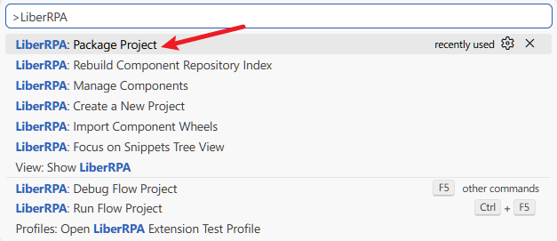
   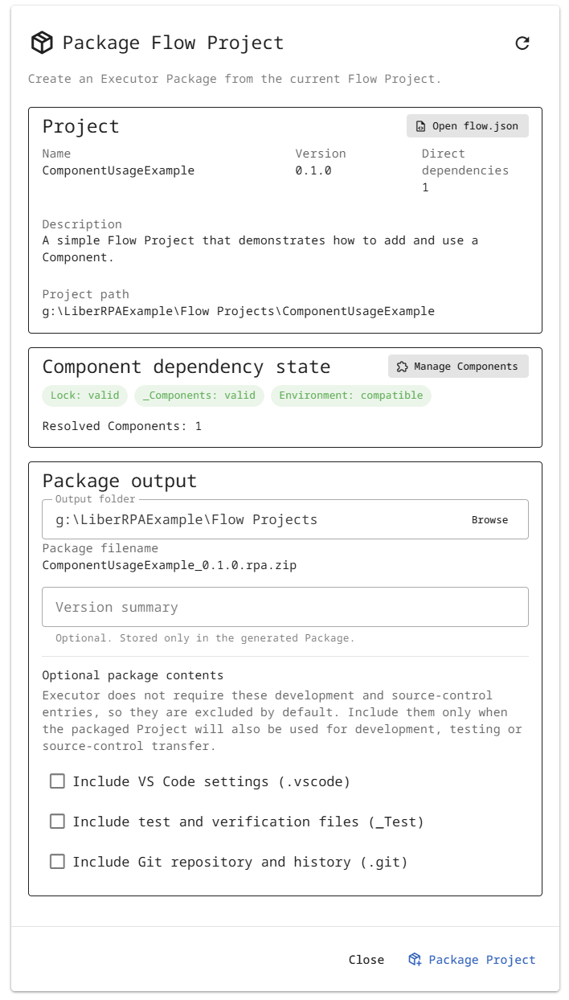
3. Review the Project information and Component dependency state. Resolve any blocking issue shown on the page.
4. Optionally enter a one-line `Version summary`. It is stored only in the generated Package and does not modify `flow.json`.
5. Review the output folder. The default is the parent folder of the current Flow Project; click `Browse` to select another existing folder.
6. Choose whether to include the optional Project-root entries described below.
7. Review the generated `<name>_<version>.rpa.zip` filename and click `Package Project`.
8. Review the file count, folder count, uncompressed size, and archive size. Click `Reveal` to show the Package in File Explorer.

Project Manager validates the Project, dependency state, environment, output folder, and target filename before packaging.

Treat the generated Package as an immutable deployment artifact. Executor installs Packages by Project name and version and does not overwrite an existing name/version pair. After changing the Project, increase `flow.json.version` and create another Package.

#### Optional Package Contents

The following Project-root entries are excluded by default because Executor does not require them:

| Entry        | Include it when                                                                                                                                      |
| ------------ | ---------------------------------------------------------------------------------------------------------------------------------------------------- |
| `.vscode/` | The packaged Project will also be opened in VS Code and should retain Project-specific editor and run/debug settings.                                |
| `_Test/`   | Test scripts, sample data, or verification files are required for deployment validation or troubleshooting.                                          |
| `.git`     | An intentional source-control transfer is required.`.git` may contain the complete Repository history and substantially increase the Package size. |

Review `_Test` for credentials, customer data, and environment-specific values before including it.

Including or excluding these entries changes only the generated Package. Before adding large models, videos, datasets, or other heavyweight resources, review the [Executor Package Limits](../../electronApplications/executor/README.md#package-limits).

#### Package Rules

Project Manager excludes caches, compiled Python files, internal operation files, existing `.rpa.zip` files, and any root-level Package metadata from the source Project. Symbolic links inside the Project are not supported.

The output folder must exist, use an absolute path, and be outside the source Project.

Project Manager never overwrites an existing `.rpa.zip`. Change the Project name or version, select another output folder, or move the previous Package when another archive is required.

After the Package is created, it can be installed and executed through [LiberRPA Executor](../../electronApplications/executor/README.md).

## Requirements

Run `InitLiberRPA.exe` before using LiberRPA Project Manager so that the LiberRPA environment variable, default directories, and Component Repository root are initialized.

[Git](https://git-scm.com/) is optional. It is needed only when Project Manager should initialize a Git repository for a template containing `.gitignore`.
