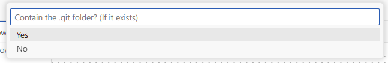

# LiberRPA Project Manager

(If you can't see the images in the document, have a look on [GitHub](https://github.com/HUHARED/LiberRPA/blob/main/vscodeExtensions/liberrpa-project-manager/README.md).)

The **LiberRPA Project Manager** extension is part of LiberRPA. It helps you create and manage RPA projects efficiently.

You can choose from multiple templates, customize them, and package your projects for use with the LiberRPA Executor.

# Usage

## Create a Project

1. **Open Command Palette:**
   Press `Ctrl+Shift+P` to open the Command Palette.
2. **Run Command:**
   Execute the command `LiberRPA: Create a New Project` to start a new RPA project.
   
3. **Select Destination Folder:**
   A window will appear asking you to select the folder where the new RPA project will be created.
4. **Enter Project Name:**
   Provide a name for your project.
   
5. **Select a template:**
   Choose from the available templates.
   
   If the selected template includes a `.gitignore` file, LiberRPA will automatically try to run `git init` command.
6. **Launch VS Code:**
   A new instance of VS Code will open with your new project.

## Customize Templates

Templates are stored at the following path：

`LiberRPA/configFiles/ProjectTemplate`

To create a new template, simply copy an existing one and modify it as needed.

## Package a Project

When you completed a project and you want it to run in Executor, you can package it by the following steps to generate a `.rpa.zip` file.

1. **Open Command Palette:**
   Press `Ctrl+Shift+P` to open the Command Palette.
2. **Run Command:**
   Execute the command `LiberRPA: Package the Project`
   
3. **Enter Package Version:**
   
4. **Enter Package Description:
   **
5. **Choose Whether to Contain Git Folder:
   **
6. **Select Destination Folder:**
   A window will appear asking you to select the folder where the package file will be saved.
7. **Package Created:**
   Once you completed the previous steps, your package will appear in the selected folder. It will be a `.rpa.zip` file.
8. **[Use Executor to Import The Package.](../../electronApplications/executor/README.md)**

# Requirements

If you choose a template that contains a `.gitignore` file, ensure that [Git](https://git-scm.com/) is installed on your computer.
