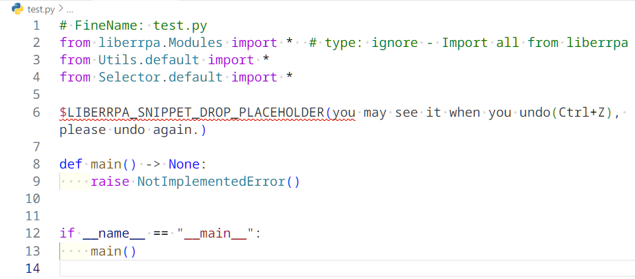

# LiberRPA Snippets Tree

(If you can't see the images in the document, have a look on [GitHub](https://github.com/HUHARED/LiberRPA/blob/main/vscodeExtensions/liberrpa-snippets-tree/README.md).)

This extension is a part of LiberRPA to displays built-in and user-defined [code snippets](https://code.visualstudio.com/docs/editor/userdefinedsnippets).

With it, you don't need to memorize the entire [LiberRPA API](https://github.com/HUHARED/LiberRPA/tree/main/condaLibrary#api).

> Note: The gray icon in the VS Code activity bar still uses the previous LiberRPA icon because the newest gray icon doesn't look good in it.

# Usage

## Insert Snippets

You can add code snippets to your Python files in the editor using these methods:

1. **Click:**
   Simply click an item in LiberRPA Snippets Tree with your mouse.
   If the current line of cursor is not empty, the snippets will be insert to the next line with the same indent.


1. **Drag and Drop:**
   Drag an item from LiberRPA Snippets Tree into your editor.


1. **Type the Prefix:**
   Type the corresponding code snippet prefix in the editor, the snippets will appear in [IntelliSense](https://code.visualstudio.com/docs/editor/intellisense).


## Use Secondary Side Bar

When developing a new RPA project, you might need to switch between [VS Code Explorer](https://code.visualstudio.com/docs/getstarted/userinterface#_explorer-view) and LiberRPA Snippets Tree. To streamline your workflow, it is recommended to move LiberRPA Snippets Tree into [VS Code Secondary Sidebar](https://code.visualstudio.com/api/ux-guidelines/sidebars#secondary-sidebar).

You can open the Secondary Sidebar, then drag the LiberRPA Snippets Tree icon from [VS Code Activity Bar](https://code.visualstudio.com/api/ux-guidelines/activity-bar) into the Secondary Sidebar.


Alternatively, drag the LiberRPA Snippets Tree icon from the Activity Bar and drop it at the right region of [VS Code Editor](https://code.visualstudio.com/api/ux-guidelines/overview#editor).


You can also move LiberRPA Snippets Tree back to Activity Bar.


## User-defined Code Snippets

You can define frequently used snippets in:

```text
C:/Users/<username>/Documents/LiberRPA/snippets_favorite.jsonc
```

Favorite snippets use the same snippet-item structure as `assets/snippets_catalog.json`. You can copy a complete entry from the catalog's `snippets` object, or create your own entry. The optional `imports` field lists names that should be added to the LiberRPA managed import block.

After editing the file, run `Developer: Reload Window` in VS Code.

```jsonc
{
  "schemaVersion": 1,
  "snippets": {
    "Custom Delay": {
      "prefix": "custom_delay",
      "body": ["delay(${1:1000})", "$0"],
      "description": "Wait for a specified time, in milliseconds.",
      "imports": {
        "liberrpa.Modules": ["delay"]
      }
    }
  }
}
```

LiberRPA Snippets Tree will display these snippets in a `Favorite` category at the top:


# Known Issues

* If you drag and drop a LiberRPA snippet and then undo(press `Ctrl+Z`) the editing twice consecutively, you can see a placeholder text:
  `$LIBERRPA_SNIPPET_DROP_PLACEHOLDER(you may see it when you undo(Ctrl+Z), please undo again.) `
  This placeholder is used by LiberRPA to locate the drop position due to a limitation in VS Code.
  Simply press Ctrl+Z once more to remove it.

  
* LiberRPA Snippets Tree doe not support searching for snippets. To locate snippets, please refer to the [LiberRPA API](https://github.com/HUHARED/LiberRPA/tree/main/condaLibrary#api).
