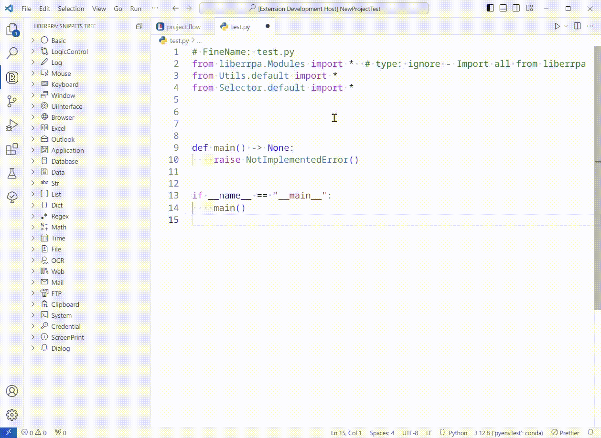
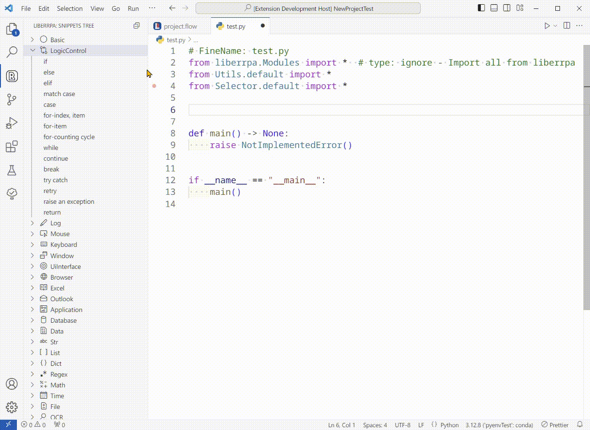
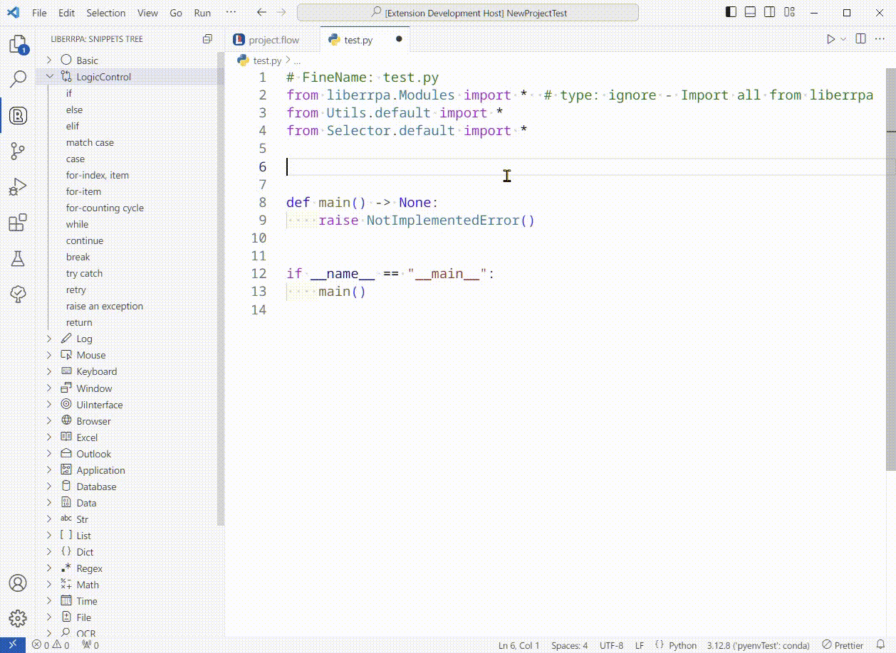
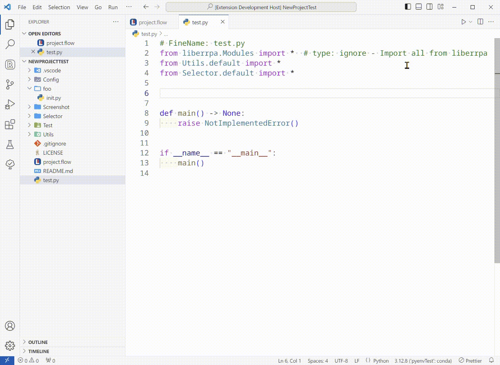
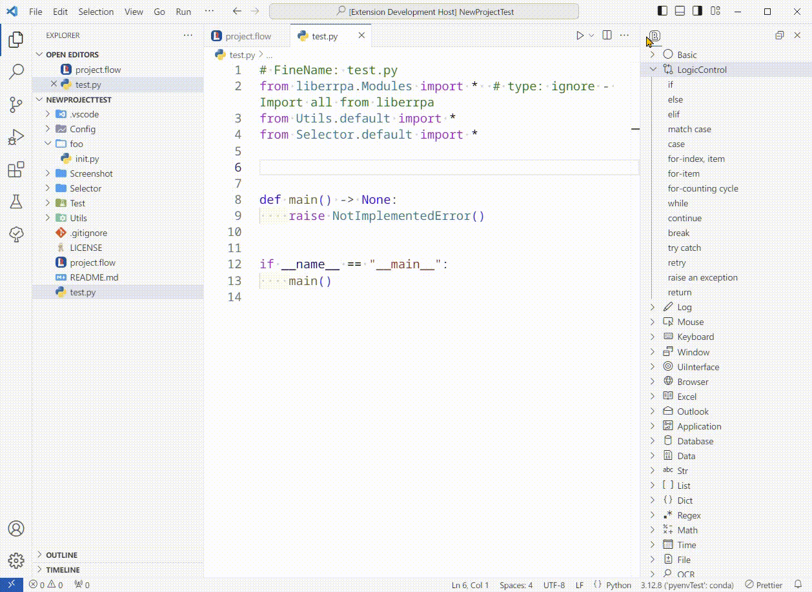
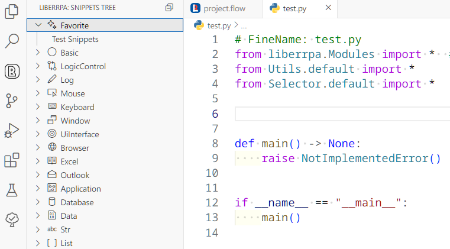

# LiberRPA Snippets Tree

If the images are not displayed, [view this README on GitHub](https://github.com/HUHARED/LiberRPA/blob/main/vscodeExtensions/liberrpa-snippets-tree/README.md).

**LiberRPA Snippets Tree** displays built-in, Favorite, and Component Snippets and inserts them into Python files together with their required imports.

You do not need to memorize the complete [LiberRPA Code Reference](../../docs/Reference.md).

> **Note:**
>
> Screenshots and animations in this document are provided for reference. As LiberRPA evolves, the current interface may differ slightly in appearance or wording, but these minor differences do not affect the documented workflow or functionality.
> For example:
>
> * The icon has changed from  to .
> * The current interface and Managed Import Block structure may differ slightly from what is shown.

> **Extension logs:**
>
> This extension writes diagnostic messages to the `liberrpa-snippets-tree` channel in the VS Code Output panel.
>
> Open `View > Output` and select the channel, or run `Output: Show Output Channels` from the Command Palette.
>
> For troubleshooting, run `Developer: Set Log Level...`, select `liberrpa-snippets-tree`, and choose `Debug` or `Trace`. `Info` is normally sufficient for routine use.
>
> This setting does not change the Python runtime log level used by a Flow Project or an individual Block.

## Usage

### Insert Snippets

LiberRPA Snippets can be inserted into Python files by clicking, dragging, or using IntelliSense. All three methods update the Managed Import block when imports are required.

#### Click a Tree Node

Click a Snippet in **LiberRPA Snippets Tree**.

Statement Snippets are inserted on the current empty line or on a new line with matching indentation. Expression Snippets, such as Project Values, are inserted at the cursor or replace the current selection.



#### Drag and Drop

Drag a Snippet from the Tree to the required editor position.



#### IntelliSense

Type a Snippet prefix or a meaningful part of its API name in a Python file, then select the LiberRPA completion.

LiberRPA Snippet completions supplement normal Python IntelliSense, so local variables, functions, types, and other Python completions remain available.

| Search                    | Example completion            |
| ------------------------- | ----------------------------- |
| `deb`                   | `Log.debug`                 |
| `ini`                   | `File.ini_get_all_sections` |
| `upper` or `to_upper` | `Str.case_to_upper`         |
| `exop`                  | `Excel.open_excel_file`     |
| `Excel.op`              | `Excel.open_excel_file`     |

You can search by the beginning of an API name, a meaningful word within the name, or a short abbreviation built from consecutive parts of the API name. Adding the module name, such as `Excel.op`, limits the search to that LiberRPA module.

LiberRPA only adds Snippet suggestions when the current text is relevant to a known Snippet. Unrelated Python identifiers continue to use normal Python IntelliSense.

The completion details show the Snippet body and description before insertion.



#### Snippet Placeholders

After insertion, use `Tab` and `Shift+Tab` to move between editable Snippet fields.

While editing a Python Snippet field, `Tab` first moves past a closing bracket or quote automatically added while editing that field. Repeated presses can move through nested closing characters. When there is no closing character to move past, `Tab` advances to the next field.

For example, `|` represents the cursor below:

```python
listRow[0|]
```

The first `Tab` moves past `]`; the next `Tab` continues to the next Snippet field.

`Shift+Tab` moves to the previous field. Outside active Snippet fields, `Tab` keeps the normal LiberRPA Editor behavior.

Some parameters provide a predefined list of valid values. To enter a variable or another expression instead, press `Esc` twice: the first press closes the choice list, and the second exits the active Snippet placeholder mode so normal Python IntelliSense can resume.

After exiting placeholder mode, `Tab` no longer moves through the remaining Snippet fields.

### Managed Imports

LiberRPA maintains a Managed Import block in Python files:

```python
# <LiberRPA imports: managed>
# This block is managed by LiberRPA. Do not edit it manually.
# ruff: isort: off
from liberrpa.Modules import (
    Mouse,
    PrjArgs,
)

# ruff: isort: on
# </LiberRPA imports: managed>
```

Required imports are merged, deduplicated, and ordered according to the loaded Snippet Catalogs.

Do not manually edit content inside the Managed Import block. Imports outside the block are not modified.

When a file does not yet contain the block, LiberRPA inserts it after the module header, module docstring, and any `__future__` imports.

### Project Values

The **Project Values** Category contains expression Snippets supplied by the current RPA Project, for example:

```python
PrjArgs.elapsedTime
PrjArgs.errorObj
PrjArgs.projectPath
```

Dynamic `CustomArgs` keys are provided through IntelliSense and are read from the current `project.flow`, including unsaved editor changes:

```python
CustomArgs["customerName"]
```

Selecting a Project Value or CustomArgs completion also adds its required import.

### Use the Secondary Sidebar

To keep VS Code Explorer and LiberRPA Snippets Tree visible at the same time, move the Snippets Tree view to the [Secondary Sidebar](https://code.visualstudio.com/api/ux-guidelines/sidebars#secondary-sidebar).

Drag its icon from the Activity Bar into the Secondary Sidebar:



You can also drag it to the right side of the editor:


Move it back to the Activity Bar when needed:



### Favorite Snippets

Frequently used Snippets can be added to:

```text
C:/Users/<UserName>/Documents/LiberRPA/snippets_favorite.jsonc
```

If the file does not exist, LiberRPA Snippets Tree creates it from the bundled template when the extension loads. Run `InitLiberRPA.exe` first so that the required LiberRPA folders exist.

Favorite Snippets appear in the `Favorite` Category, are available through IntelliSense, and use the same click, drag-and-drop, and Managed Import workflows as other Snippets.



The easiest way to create a Favorite is to copy an entry from the built-in [Snippet Catalog](https://github.com/HUHARED/LiberRPA/blob/main/vscodeExtensions/liberrpa-snippets-tree/assets/snippets_catalog.json), then edit its title, prefix, body, label, or description.

After saving the file, run `Developer: Reload Window` to reload Favorite Snippets.

See [Favorite Snippet Configuration](./FavoriteSnippetConfiguration.md) for the complete file structure, field definitions, imports, insertion modes, and examples.

## Known Issues

* The TreeView does not provide a search box. Use IntelliSense to search by prefix or a meaningful part of the API name, or refer to the [LiberRPA Code Reference](../../docs/Reference.md).
* After deleting an invalid extra character while IntelliSense is open, VS Code may not immediately request the expected suggestions again. Press `Ctrl+Space` to refresh the suggestions. If they still do not reappear, retype the current search text or insert the Snippet through the Tree or drag-and-drop. The Tree and drag-and-drop workflows are unaffected.
